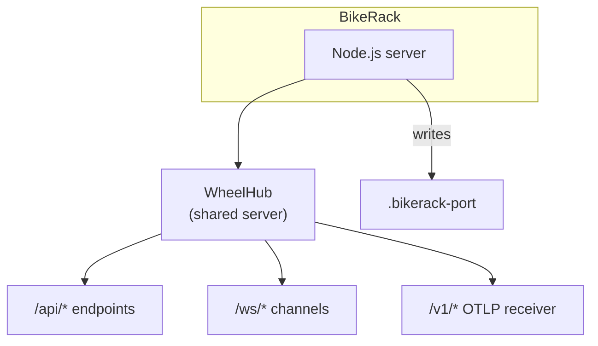

# Pennyfarthing

**v12.6.2** | *The outer loop goes once, the inner loop goes many times.*


A Claude Code agent orchestration framework built around three pillars: a flexible development platform, scientific personality research, and streamlined integrations.

---

## What is Pennyfarthing?

### 1. Development Platform

A multi-agent system with customizable BikeLane workflows for structured software development:

- **11 Coordinated Agents** - SM, TEA, Dev, Reviewer, Architect, PM, Tech Writer, UX Designer, DevOps, Orchestrator, BA
- **35 BikeLane Workflows** - 14 local (TDD, BDD, Trivial, 2pTDD, TDD-Tandem, BDD-Tandem, TDD-Team, BDD-Team, Review-Tandem, Patch, Agent-Docs, Architecture, Release, Git Cleanup) + 21 reference workflows (PRD, Sprint Planning, UX Design, Research, and more)
- **37 Slash Commands** - Entry points for agent activation and workflows
- **22 Skills** - Reusable knowledge domains (testing, code-review, jira, settings, mermaid, etc.)
- **Prime Context System** - Tiered context injection assembles agent definition, persona, session state, and sidecar memory
- **Automatic Handoffs** - Context-aware agent transitions via subagent delegation
- **Agent Sidecars** - Persistent learning files where agents record patterns, gotchas, and decisions across stories

### 2. Personality Research

A scientific study of how strong personalities affect AI agent behavior:

- **OCEAN Profiling** - Big Five personality scores for every character
- **TRAIL Framework** - Categorizing errors (reasoning, planning, execution) and correlating with personality
- **Benchmarking System** - `/solo`, `/benchmark-control`, `/benchmark` for statistical evaluation
- **JobFair** - Discovering which characters excel at roles beyond their native specialization

The 100 persona themes (Discworld, Star Trek, Breaking Bad, etc.) are instruments of inquiry, not decoration. Early findings show character expertise often trumps abstract personality scores.

### 3. Integration & Tooling

- **BikeRack** - Dashboard panel viewer for CLI-first developers — browser GUI or terminal TUI alongside Claude Code
- **Jira Integration** - Bidirectional sync, epic auto-creation, sprint velocity
- **Sprint Management** - Story tracking with `current-sprint.yaml`
- **Codebase Analysis** - Hotspots, complexity, dead code, dependencies, code markers, and health score via `pf debug`

---

## Quick Start

Three paths depending on who you are:

### Path A: Join a project that already uses Pennyfarthing

Someone on your team already ran `/pf-setup`. You just need the CLI and to clone.

```bash
# 1. Install the CLI (pick one)
pipx install "git+https://github.com/1898andCo/pennyfarthing.git"
# or: uv tool install "pennyfarthing-scripts @ git+https://github.com/1898andCo/pennyfarthing.git"

# 2. Clone the project
git clone git@github.com:your-org/your-project.git && cd your-project

# 3. Start Claude Code — bootstrap runs automatically on first session
claude
```

That's it. The project's committed `bootstrap.sh` hook detects the first session, runs `pf init`, and sets everything up. You'll see agents, themes, and workflows immediately.

If `pf` isn't installed when you start Claude Code, the bootstrap will attempt to install it via uv, pipx, or pip automatically.

### Path B: Add Pennyfarthing to your own project

You're bringing Pennyfarthing into a repo for the first time.

```bash
# 1. Authenticate with GitHub (required — private repo)
gh auth login

# 2. Install the CLI (pick one)
pipx install "git+https://github.com/1898andCo/pennyfarthing.git"
# or: uv tool install "pennyfarthing-scripts @ git+https://github.com/1898andCo/pennyfarthing.git"
# or: curl -fsSL https://raw.githubusercontent.com/1898andCo/pennyfarthing/main/pennyfarthing-dist/scripts/install.sh | bash

# 3. Initialize your project
cd your-project
pf init

# 4. Verify
pf doctor

# 5. Start Claude Code and run interactive setup
claude
/pf-setup    # walks through repo discovery, CLAUDE.md, theme selection, Jira, etc.

# 6. Start working
/pf-work
```

`pf init` creates the `.pennyfarthing/` and `.claude/` directories. `/pf-setup` configures them interactively — repo topology, project context, theme, and optional integrations. After setup, teammates can follow Path A.

### Path C: Develop Pennyfarthing itself (dogfooding)

You're contributing to the framework using the orchestrator repo.

```bash
# 1. Clone the orchestrator (includes pennyfarthing/ as inlined subrepo)
git clone git@github.com:1898andCo/orc-penny.git && cd orc-penny

# 2. Setup — clones pennyfarthing/, installs deps, builds, installs pf CLI
just setup

# 3. Launch Claude Code with OTEL telemetry
just claude

# 4. Optional: interactive walkthrough
/guided-tour
```

Prerequisites: Python 3.11+, Node 18+, [pnpm](https://pnpm.io/) 9+, [just](https://github.com/casey/just), Claude Code CLI, Git SSH access to `1898andCo`.

The orchestrator has two git repos — `orc-penny/` (sprint files, sessions, docs, trunk-based on `main`) and `pennyfarthing/` (framework source, gitflow on `develop`). The `.pennyfarthing/` runtime directory symlinks to `pennyfarthing/pennyfarthing-dist/` so changes are live immediately.

> **Full walkthrough:** See [Getting Started](docs/GETTING-STARTED.md) for detailed installation, setup, and first work session guide.

### Display Modes

Pennyfarthing works in any terminal. Optional dashboards add real-time visibility into agent activity.

| I want to... | Mode | Command |
|--------------|------|---------|
| Just use agents in my terminal | **CLI only** | `claude` (no dashboard needed) |
| See dashboards in my browser | **BikeRack GUI** | `just gui` + `just claude` |
| Stay fully in the terminal | **BikeRack TUI** | `just tui` + `just claude` |
| One command, everything | **BikeRack all-in-one** | `pf bikerack start` |

> **See the full [BikeRack Guide](pennyfarthing-dist/guides/bikerack.md)** for setup, panels, and OTEL telemetry.

## Visual Dashboards

BikeRack provides 15 dashboard panels showing real-time agent activity:

### Panels

All panels are draggable, floatable, and splittable:

| Panel | Purpose |
|-------|---------|
| **Sprint** | Current sprint stories and progress |
| **Progress** | At-a-glance story dashboard |
| **BikeLane** | Workflow phase state and navigation |
| **AC** | Acceptance criteria checklist with progress |
| **Changed** | Files modified during the session |
| **Diffs** | Git diff viewer for current changes |
| **Git** | Branch management and status |
| **Todo** | Task list tracking |
| **Audit Log** | Timestamped tool use history |
| **Workflow** | Workflow navigation and status |
| **Hotspots** | Codebase health — dead code, complexity |
| **Settings** | Permission mode, relay mode, bell mode |
| **Debug** | Prime context inspection with token counts |
| **Background** | Background job monitoring |

### Architecture

BikeRack is powered by **WheelHub**, a local Express/WebSocket server that serves API endpoints, WebSocket channels, and the OTLP telemetry receiver:



### Tool Visualization

BikeRack renders tool use as human-readable summaries instead of raw JSON. Consecutive identical tool calls are stacked, and results are collapsible.

### Agent Portraits

Each of the 1101 persona characters across 100 themes has a unique portrait displayed in the conversation stream, making multi-agent workflows visually distinct.

### Workflow Modes

| Mode | Description |
|------|-------------|
| **Permission Mode** | `plan` / `manual` / `accept` — controls how much Claude can do without approval |
| **Relay Mode** | Automatic agent handoffs — detects `CYCLIST:HANDOFF` markers and runs the next agent |
| **Bell Mode** | Queue messages while Claude works — injected at next tool execution via hooks |

## Prime Context System

Prime assembles the full agent context at activation: agent definition, persona character, behavior guide, sprint state, active session, and sidecar memory. This is injected via `--append-system-prompt` so agents behave identically regardless of display mode.

Prime uses **tiered injection** to manage token overhead:

| Tier | Tokens | When |
|------|--------|------|
| **Full** | ~4000 | New session or new agent |
| **Refresh** | ~600 | Same agent, stale context |
| **Handoff** | ~700 | Agent-to-agent transition |
| **Minimal** | ~200 | Deep in same agent session |

## Agent Sidecars

Sidecars are persistent learning files where agents record what they discover during story work. Each agent maintains three files in `.pennyfarthing/sidecars/`:

- **`{agent}-patterns.md`** — Strategies and patterns that worked
- **`{agent}-gotchas.md`** — Mistakes and edge cases to avoid
- **`{agent}-decisions.md`** — Architecture decisions and rationale

Agents write to sidecars before every handoff. Prime loads them on activation, so agents build on previous experience instead of rediscovering the same issues.

## BikeLane Workflows

BikeLane is the umbrella workflow system supporting two types:

| Type | Description | Examples |
|------|-------------|----------|
| **Phased** | Agent-driven with automatic handoffs | tdd, bdd, trivial, agent-docs |
| **Stepped** | Progressive disclosure with user gates | architecture, release, git-cleanup |

### Example: TDD Workflow (Phased)

| Agent | Role | Phase |
|-------|------|-------|
| **SM** | Scrum Master | Story selection, session setup, completion |
| **TEA** | Test Engineer | Write failing tests (RED) |
| **Dev** | Developer | Make tests pass (GREEN) |
| **Reviewer** | Code Reviewer | Quality validation, approve/reject |

Use `/workflow list` to see all workflows. Use `/workflow start <name>` to begin any stepped workflow.

### Workflow Gates

Gates are conditional checks on phase transitions. When an agent finishes a phase, the gate evaluates whether the transition should proceed:

| Gate | Purpose |
|------|---------|
| `tests-pass` | Verify all tests pass before review |
| `tests-fail` | Verify tests are RED before implementation |
| `approval` | Verify reviewer has approved |
| `confidence-sm` | Check if user instruction is unambiguous |

Gates are defined in `pennyfarthing-dist/gates/` and referenced via `gate.file` in workflow YAML.

### Tandem Mode

Tandem workflows pair a background observer with the primary agent. The backseat watches the primary agent's work and injects observations:

- **TDD-Tandem** — Architect watches TEA, TEA watches Dev, PM watches Reviewer
- **BDD-Tandem** — Adds UX Designer watching Dev, Architect watching UX

For active questions (not passive observation), agents use the **Consultation Protocol** — synchronous Sonnet-powered request/response between agents.

## Benchmarking & Personality Research

Pennyfarthing includes a scientific benchmarking system for evaluating how personality affects agent performance:

```bash
# Run a single agent on a scenario
/solo theme:agent --scenario cache-invalidation

# Create a control baseline (10 runs)
/benchmark-control reviewer --scenario order-service

# Compare persona vs control with statistics
/benchmark breaking-bad reviewer --scenario order-service
```

**Key Findings:**
- Cohen's d effect sizes measure performance differences
- Multivariate OCEAN patterns predict better than individual traits
- Character expertise often trumps abstract personality scores
- The "Stoic Analyst" profile (Low O + High C + Low E + Low N) excels at code review

See [Benchmarking Documentation](docs/BENCHMARKING.md) for methodology.

## CLI Commands

| Command | Description |
|---------|-------------|
| `pf init` | Initialize Pennyfarthing in a project |
| `pf doctor` | Check installation health |
| `pf doctor --fix` | Auto-fix common issues |
| `pf validate` | Run all validators |
| `pf theme list` | Show available themes |
| `pf theme set <name>` | Change active theme |
| `pf package list` | Show installable theme plugins |
| `pf bikerack start` | Launch BikeRack dashboard |
| `pf sprint status` | Current sprint overview |
| `pf workflow list` | Show all workflows |
| `pf debug hotspots analyze` | Git change frequency analysis |
| `pf debug deadcode stale` | Find files with no recent commits |
| `pf debug healthscore analyze` | Composite codebase health score |
| `pf handoff marker <agent>` | Generate handoff marker |

## Documentation

### Guides (in `pennyfarthing-dist/guides/`)

| Guide | Description |
|-------|-------------|
| [BikeLane](pennyfarthing-dist/guides/bikelane.md) | Workflow engine — phased, stepped, procedural |
| [BikeRack](pennyfarthing-dist/guides/bikerack.md) | Standalone panel viewer for CLI-first development |
| [Gates](pennyfarthing-dist/guides/gates.md) | Workflow phase transition gates |
| [Handoff CLI](pennyfarthing-dist/guides/handoff-cli.md) | Phase transitions and marker generation |
| [Hooks](pennyfarthing-dist/guides/hooks.md) | Hook system configuration and reference |
| [Prime](pennyfarthing-dist/guides/prime.md) | Agent activation and context loading |
| [Bell Mode](pennyfarthing-dist/guides/bell-mode.md) | Message queue injection |
| [Relay Mode](pennyfarthing-dist/guides/relay-mode.md) | Automatic agent handoffs |
| [Reflector](pennyfarthing-dist/guides/reflector.md) | Agent-to-UI marker protocol |
| [TirePump](pennyfarthing-dist/guides/tirepump.md) | Context clearing system |
| [Tandem Protocol](pennyfarthing-dist/guides/tandem-protocol.md) | Background observer pairing |
| [Output Styles](pennyfarthing-dist/guides/output-styles.md) | Configurable response modes |
| [Brownfield Tools](pennyfarthing-dist/guides/brownfield-tools.md) | Codebase analysis CLI tools |
| [Benchmarks](packages/benchmark/docs/benchmarks-guide.md) | Persona evaluation system |

## Available Themes (100)

All 100 themes are bundled with `pf init` — no separate packages required. Themes span sci-fi, prestige TV, literature, mythology, comedy, history, and more:

`the-expanse`, `star-trek-tng`, `breaking-bad`, `discworld`, `fifth-element`, `succession`, `the-wire`, `mad-men`, `shakespeare`, `jane-austen`, `dune`, `game-of-thrones`, `the-office`, `monty-python`, `greek-mythology`, `blade-runner`, `doctor-who`, `harry-potter`, `foundation`, `ted-lasso`, and 80 more.

All themes include OCEAN (Big Five) personality profiles. See [Personas](docs/PERSONAS.md) for personality analysis.

### Setting a Theme

```bash
pf theme set the-expanse
```

Or configure directly in `.pennyfarthing/config.local.yaml`:
```yaml
theme: the-expanse
```

## Directory Structure

After initialization:

```
your-project/
├── .pennyfarthing/
│   ├── agents/               # Agent behavior definitions
│   ├── guides/               # Component documentation
│   ├── gates/                # Workflow transition gates
│   ├── output-styles/        # Response format definitions
│   ├── personas/             # Character and theme files
│   ├── scripts/              # Runtime scripts
│   ├── templates/            # Project templates
│   ├── workflows/            # BikeLane workflow definitions
│   ├── sidecars/             # Agent learning files (local, writable)
│   ├── config.local.yaml     # Theme, output style, modes
│   └── repos.yaml            # Multi-repo topology
├── .claude/
│   ├── commands/             # Slash commands for Claude Code discovery
│   └── skills/               # Skills for Claude Code discovery
├── sprint/
│   ├── current-sprint.yaml   # Active sprint
│   └── archive/              # Completed sessions
└── .session/
    └── {story-id}-session.md # Active work session
```

## What's New in v12.6.2

- **Gold standard calibration** — Benchmark scenarios support gold_standard references for judge calibration (MSSCI-16225)
- **Difficulty profile population** — Populate difficulty profiles from baseline benchmark data (MSSCI-16230)
- **TUI persona fix** — BikeRack TUI now correctly shows the active agent instead of defaulting to orchestrator

### Previous Highlights

- **v12.5** - Scenario Builder workflow, anchored judge rubrics, multi-judge /solo, pf CLI workflow engine, core API test coverage
- **v12.4** - SOUL.md bootstrap, PR title config, consumer gate extensions, in-review status, result objects
- **v12.0** - Python-first installation, monorepo consolidation, workflow gates, handoff CLI, tandem consultation, output styles, codebase analysis tools
- **v10.3** - BikeRack Dockview migration, BikeRack launcher CLI, repos topology system, BA agent
- **v10.2** - Tandem backseat protocol, tandem workflows (TDD/BDD-tandem), CI quality gates, schema validation
- **v10.1** - Codebase health dashboard, tool dialog system, 2party-TDD workflow, cross-file reference validator
- **v10.0** - Clean install consolidation, tool use approval system, plan mode exit UI
- **v9.3** - Theme expansion (100 themes bundled), release workflow, shadcn/ui migration
- **v9.0** - Dockview panel system, React 19 rewrite, tool visualization, prime context, bell/relay modes
- **v8.x** - BikeLane workflows, scientific benchmarking, JobFair, agent sidecars

See [CHANGELOG.md](CHANGELOG.md) for full details.

---

## License

Copyright 2025-2026 1898 & Co. All rights reserved.
