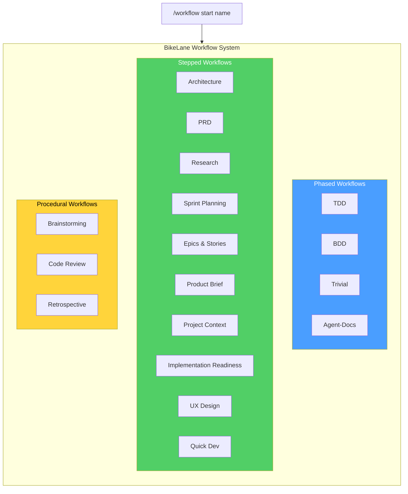
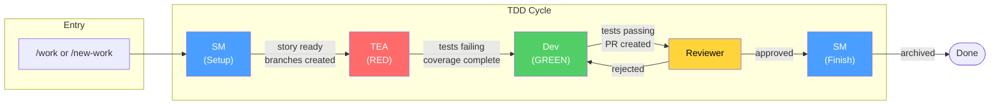
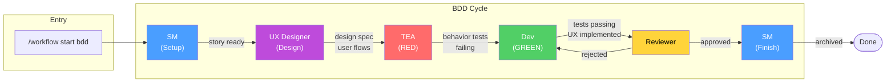
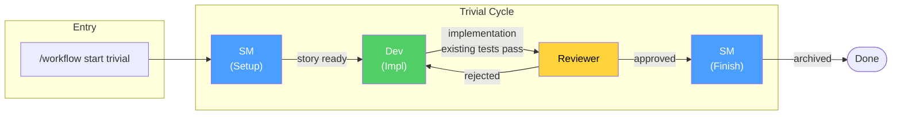
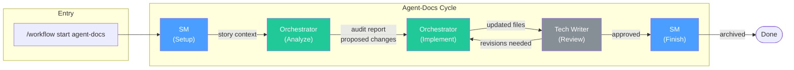
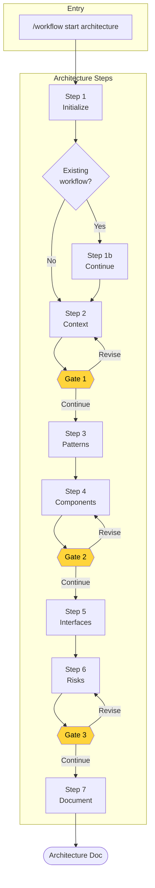
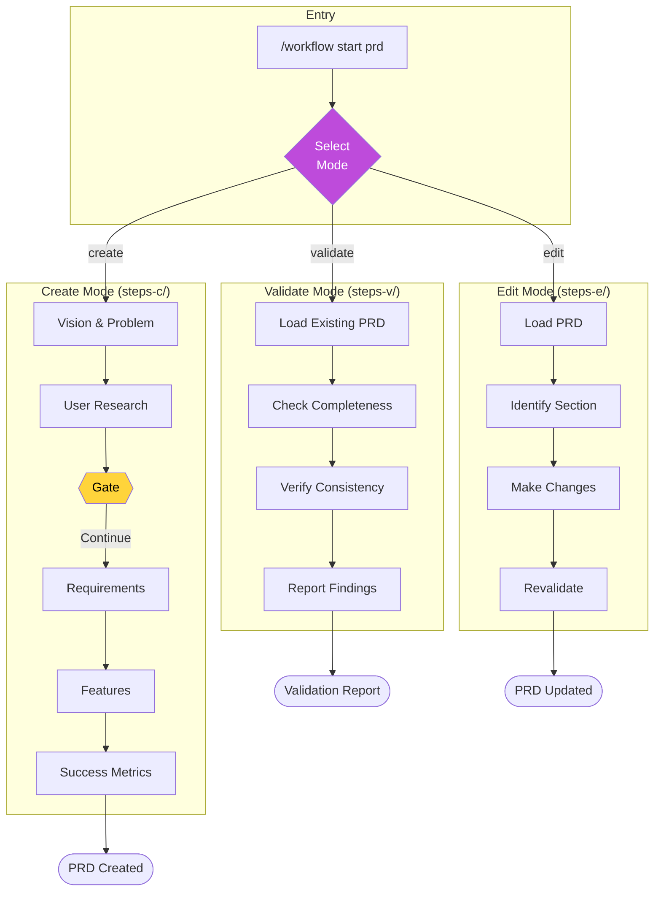
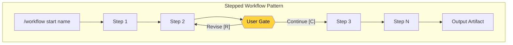
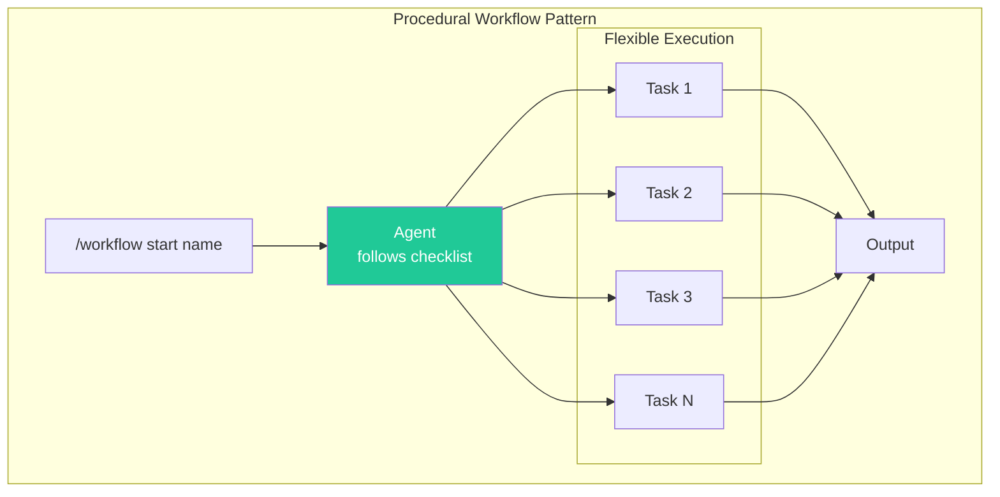
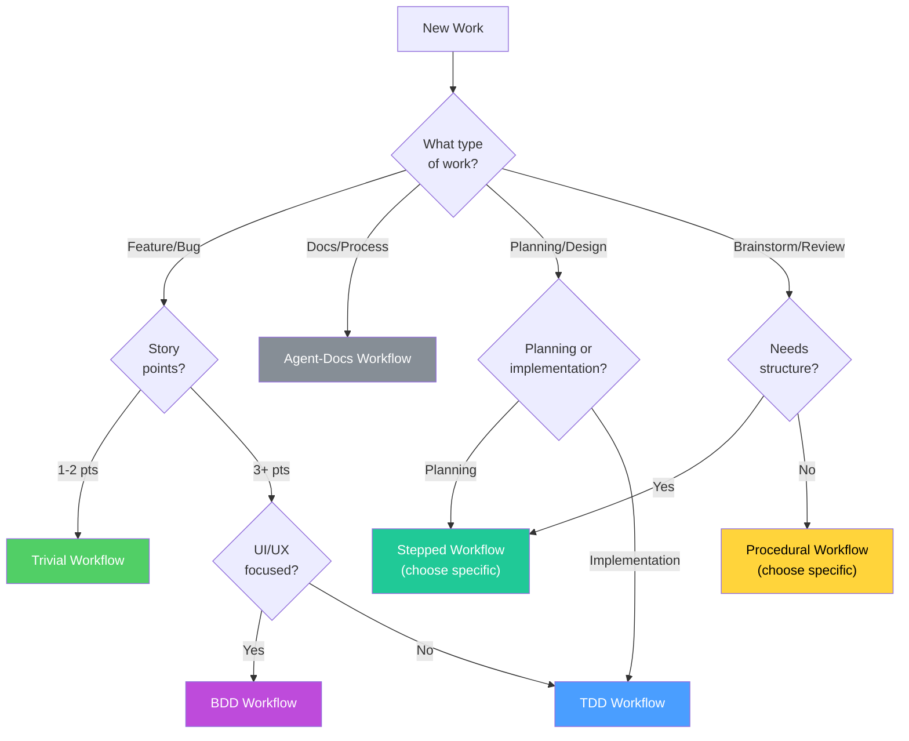

# BikeLane Workflow Diagrams

Visual documentation of all BikeLane workflows in Pennyfarthing.

## Table of Contents

1. [Workflow Overview](#workflow-overview)
2. [Phased Workflows](#phased-workflows)
   - [TDD Workflow](#tdd-workflow)
   - [BDD Workflow](#bdd-workflow)
   - [Trivial Workflow](#trivial-workflow)
   - [Agent-Docs Workflow](#agent-docs-workflow)
3. [Stepped Workflows](#stepped-workflows)
   - [Architecture Workflow](#architecture-workflow)
   - [PRD Workflow](#prd-workflow)
   - [Generic Stepped Flow](#generic-stepped-flow)
4. [Procedural Workflows](#procedural-workflows)
5. [Workflow Selection](#workflow-selection)

---

## Workflow Overview

BikeLane is the umbrella workflow system in Pennyfarthing, supporting three workflow types.

---

## Phased Workflows

Phased workflows are agent-driven development cycles with automatic handoffs between agents.

### TDD Workflow

The default workflow for feature development (3+ story points).

**Phases:**

| Phase | Agent | Gate Condition |
|-------|-------|----------------|
| setup | SM | Session file and branches created |
| red | TEA | All acceptance criteria have test coverage |
| green | Dev | All tests passing, no skipped tests |
| review | Reviewer | Code review approved |
| finish | SM | Session archived |

---

### BDD Workflow

Behavior-driven development with UX design phase for UI-focused features.

**Phases:**

| Phase | Agent | Gate Condition |
|-------|-------|----------------|
| setup | SM | Session file and branches created |
| design | UX Designer | UX spec defines user flows and behaviors |
| red | TEA | Behavior scenarios have test coverage |
| green | Dev | All tests passing, UX spec implemented |
| review | Reviewer | Code review approved, UX requirements met |
| finish | SM | Session archived |

---

### Trivial Workflow

Quick fixes without full TDD ceremony (1-2 story points).

**Phases:**

| Phase | Agent | Gate Condition |
|-------|-------|----------------|
| setup | SM | Session file and branches created |
| implement | Dev | Existing tests still pass |
| review | Reviewer | Code review approved |
| finish | SM | Session archived |

---

### Agent-Docs Workflow

For agent file creation, updates, and process improvements.

**Phases:**

| Phase | Agent | Gate Condition |
|-------|-------|----------------|
| setup | SM | Session file created |
| analyze | Orchestrator | Changes identified and documented |
| implement | Orchestrator | Agent files parse correctly |
| review | Tech Writer | Documentation quality approved |
| finish | SM | Session archived |

---

## Stepped Workflows

Stepped workflows provide progressive disclosure with user gates. They are BMAD 6.0 compatible.

### Architecture Workflow

Collaborative architectural decision-making with A/P/C collaboration menus.

**Agent:** Architect

**Collaboration Menus:**
- **A** - Advanced Elicitation (deeper discovery)
- **P** - Party Mode (multiple perspectives)
- **C** - Continue (save and proceed)
- **R** - Revise (gather more information)

---

### PRD Workflow

Tri-modal PRD workflow supporting Create, Validate, and Edit modes.

**Agent:** PM

**Modes:**
| Mode | Purpose | Steps Directory |
|------|---------|-----------------|
| create | Build new PRD from scratch | `steps-c/` |
| validate | Review existing PRD for completeness | `steps-v/` |
| edit | Modify specific sections | `steps-e/` |

---

### Generic Stepped Flow

All stepped workflows follow this pattern.

**Stepped Workflow Inventory:**

| Workflow | Agent | Steps | Description |
|----------|-------|-------|-------------|
| architecture | Architect | 7 | Architectural decisions with A/P/C menus |
| prd | PM | 12 | Product requirements (tri-modal) |
| research | PM | 8+ | Market/domain/technical research |
| sprint-planning | SM | 6 | Sprint planning facilitation |
| epics-and-stories | PM | 5 | Epic decomposition |
| product-brief | PM | 4 | Quick product briefs |
| project-context | Architect | 3 | Generate AI project context |
| implementation-readiness | Architect | 5 | Verify implementation readiness |
| ux-design | UX Designer | 6 | UX design workflow |
| quick-dev | Dev | 3 | Quick development steps |

---

## Procedural Workflows

Procedural workflows are flexible, agent-guided processes without strict step sequences.

**Procedural Workflow Inventory:**

| Workflow | Agent | Description |
|----------|-------|-------------|
| brainstorming | PM | 62 techniques, 100+ ideas goal |
| code-review | Reviewer | Structured code review process |
| retrospective | SM | Sprint retrospective facilitation |

---

## Workflow Selection

How to choose the right workflow.

---

## See Also

- [WORKFLOWS.md](WORKFLOWS.md) - Complete workflow documentation
- [BIKELANE.md](BIKELANE.md) - BikeLane system deep dive
- [bmad-compatibility-matrix.md](bmad-compatibility-matrix.md) - BMAD 6.0 compatibility
