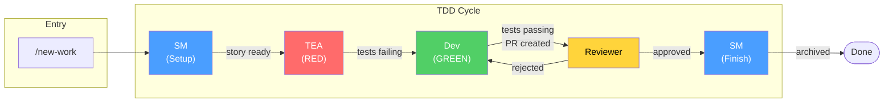
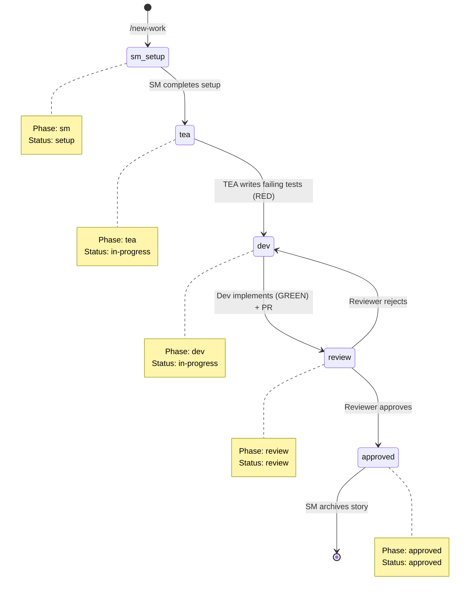
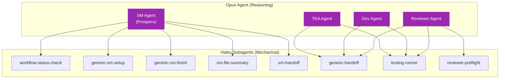
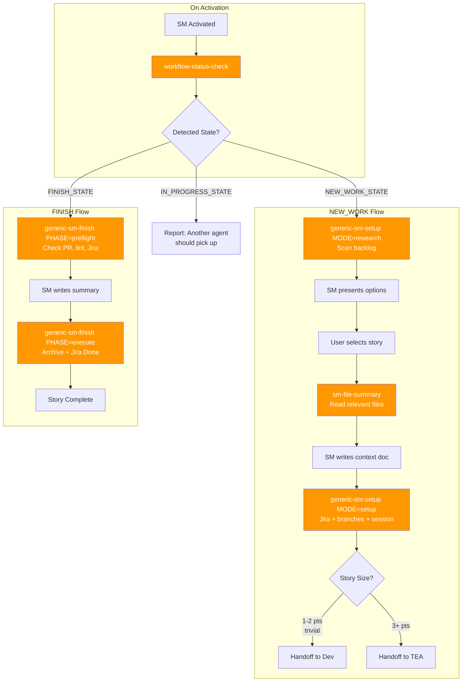
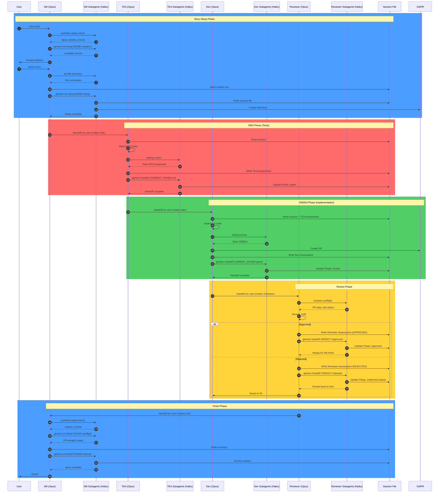
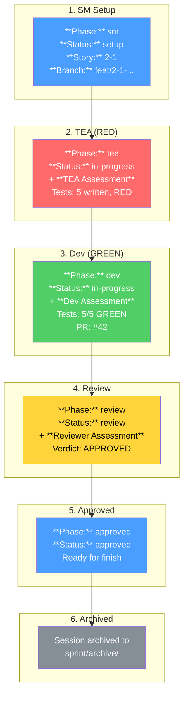
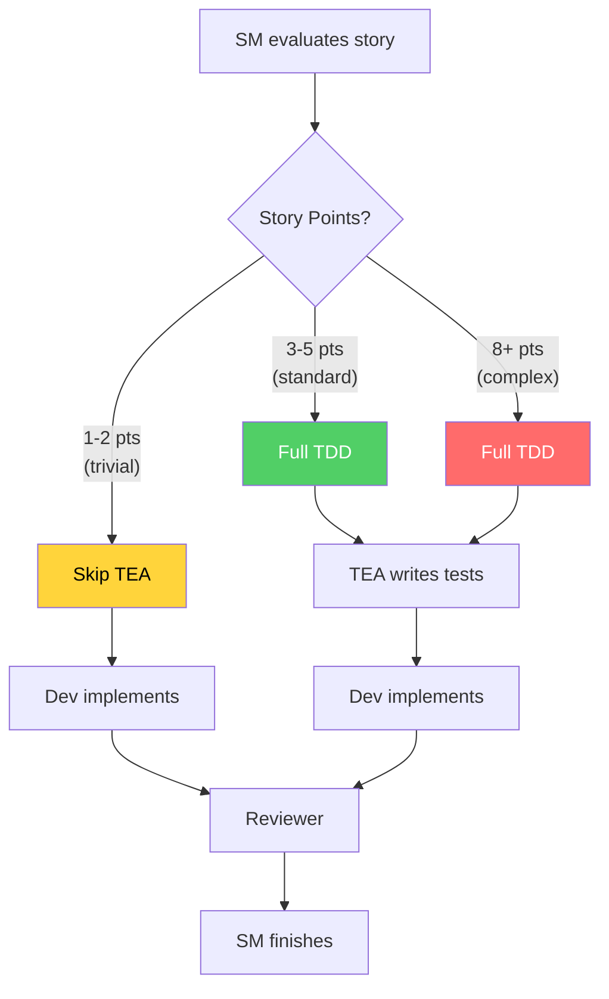
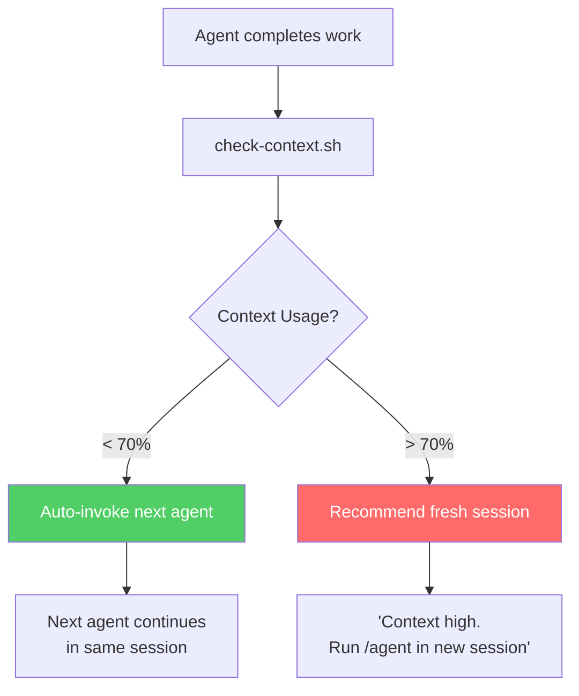
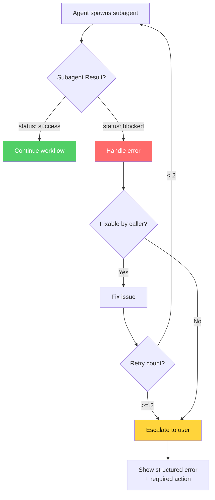

# TDD Flow Diagrams

Visual documentation of Pennyfarthing's blessed TDD path workflow.

## Table of Contents

1. [High-Level TDD Flow](#high-level-tdd-flow)
2. [Agent State Machine](#agent-state-machine)
3. [Subagent Delegation Pattern](#subagent-delegation-pattern)
4. [SM Workflow Detail](#sm-workflow-detail)
5. [Complete Handoff Sequence](#complete-handoff-sequence)
6. [Session File Lifecycle](#session-file-lifecycle)

---

## High-Level TDD Flow

The blessed path through the TDD workflow.



---

## Agent State Machine

Phase transitions tracked in the session file.



---

## Subagent Delegation Pattern

Opus agents delegate mechanical work to Haiku subagents.



---

## SM Workflow Detail

SM handles both story setup and story completion.



---

## Complete Handoff Sequence

Full sequence diagram showing agent interactions and subagent calls.



---

## Session File Lifecycle

How the session file evolves through each phase.



---

## Scale-Adaptive Routing

Story size determines workflow routing.



---

## Context-Aware Auto-Handoff

Agents check context usage before auto-invoking next agent.



---

## Error Recovery Flow

How handoff failures are handled.



---

## Subagent Inventory

Quick reference for all official subagents.

| Subagent | Purpose | Called By |
|----------|---------|-----------|
| `workflow-status-check` | Detect workflow state | SM, all agents |
| `generic-sm-setup` | Research backlog (MODE=research) or setup story (MODE=setup) | SM |
| `generic-sm-finish` | Preflight checks (PHASE=preflight) or execute finish (PHASE=execute) | SM |
| `sm-file-summary` | Summarize files for context | SM |
| `sm-handoff` | SM → TEA/Dev handoff with Jira/branch verification | SM |
| `testing-runner` | Run tests in any repo | TEA, Dev, Reviewer |
| `generic-handoff` | Workflow-driven phase transitions | TEA, Dev, Reviewer |
| `reviewer-preflight` | Gather PR data before review | Reviewer |

---

## Quick Reference

### Entry Point
```
/new-work  →  SM activates  →  workflow-status-check  →  route based on state
```

### Blessed Path
```
SM (setup) → TEA (RED) → Dev (GREEN) → Reviewer → SM (finish)
```

### Phase Values
| Phase | Agent | Next Agent |
|-------|-------|------------|
| `sm` | SM setup | TEA (or Dev if trivial) |
| `tea` | TEA writing tests | Dev |
| `dev` | Dev implementing | Reviewer |
| `review` | Reviewer reviewing | SM (approved) or Dev (rejected) |
| `approved` | Ready for finish | SM |

### Handoff Protocol
1. Agent completes work
2. Agent writes Assessment to session file
3. Agent spawns handoff subagent
4. Subagent updates Phase, workflow checkboxes
5. Agent offers next agent handoff (or defers if context > 70%)
