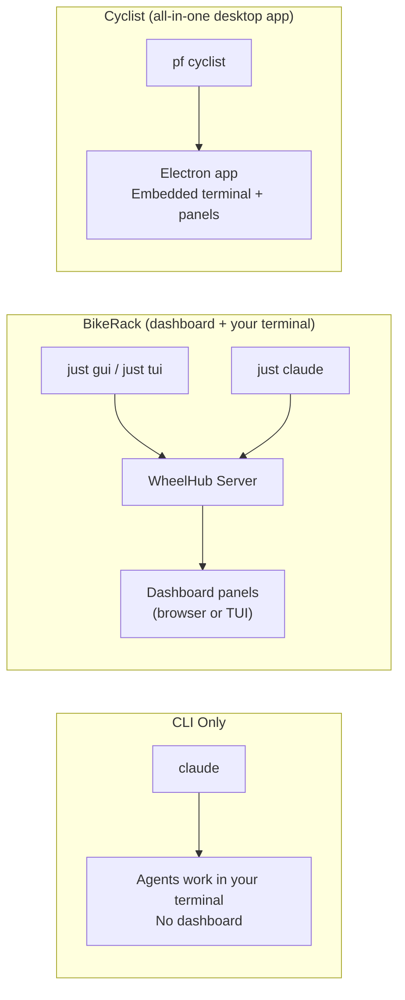
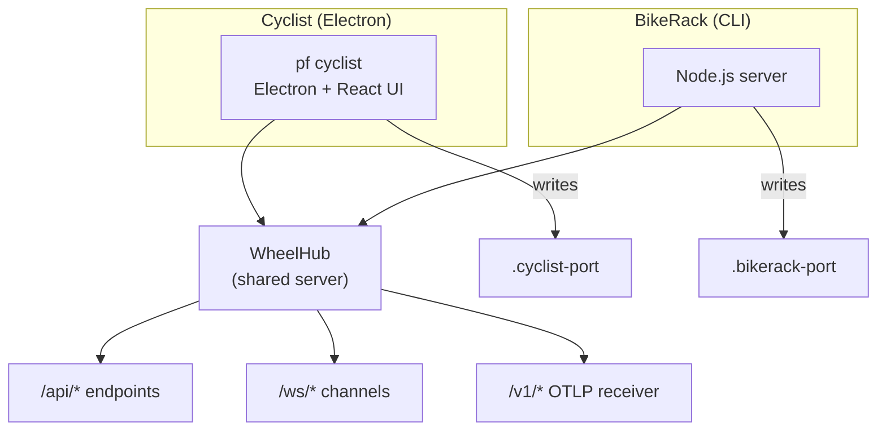

# Pennyfarthing User Guide

Complete guide to using Pennyfarthing, a Claude Code agent framework with BikeLane workflow system and persona themes.

**Version:** 11.2.1

---

## Table of Contents

1. [Introduction](#introduction)
2. [Installation](#installation)
3. [Quick Start](#quick-start)
4. [Choose How to Work](#choose-how-to-work)
5. [CLI Commands](#cli-commands)
6. [The Agent System](#the-agent-system)
7. [The BikeLane Workflow System](#the-bikelane-workflow-system)
8. [Slash Commands](#slash-commands)
9. [Configuration](#configuration)
10. [Persona Themes](#persona-themes)
11. [Project Structure](#project-structure)
12. [Skills](#skills)
13. [Troubleshooting](#troubleshooting)

---

## Introduction

Pennyfarthing is a shared agent orchestration framework for Claude Code projects. It provides:

- **Agent System** — 11 coordinated agents for multi-agent development
- **BikeLane Workflows** — 12 workflow options for different development scenarios (TDD, BDD, research, architecture, etc.)
- **Persona System** — 100 themed character personalities across 29 core themes (Discworld, Star Trek, The Expanse, etc.) plus 71 more via optional theme packs
- **Subagent Handoffs** — Automated state transitions between agents
- **Slash Commands** — 60 entry points for agent activation and workflows
- **Skills** — 22 reusable knowledge domains (testing, code-review, jira, mermaid, etc.)
- **Sprint Management** — Story tracking and workflow coordination
- **Prime Context System** — Tiered context injection assembles agent definition, persona, session state, and sidecar memory
- **Scientific Benchmarking** — TRAIL framework for evaluating code review effectiveness

### Core Philosophy

> "The outer loop goes once, the inner loop goes many times."

Strategic planning happens occasionally. Tactical execution (story implementation) happens iteratively through the appropriate BikeLane workflow.

---

## Installation

### Prerequisites

- Node.js 18+
- Git
- Claude Code CLI installed
- `yq` (YAML processor) — `brew install yq`
- `jq` (JSON processor) — `brew install jq`

### Install via NPM

```bash
# Install as dev dependency (recommended)
npm install --save-dev @pennyfarthing/core
```

**Optional:** For the Cyclist visual terminal with agent portraits:

```bash
npm install --save-dev @pennyfarthing/cyclist
```

### Initialize a Project

```bash
cd your-project

# Install first
npm install --save-dev @pennyfarthing/core

# Initialize with project name
pf setup my-project

# Or let it detect from directory name
pf setup
```

The init command:
1. Creates `.pennyfarthing/` directory structure with symlinks to `node_modules/@pennyfarthing/core/pennyfarthing-dist/`
2. Creates `.claude/commands/` and `.claude/skills/` symlinks for Claude Code discovery
3. Sets up `.pennyfarthing/sidecars/` for agent learning files
4. Configures session hooks for environment setup
5. Creates `sprint/` and `.session/` directories

### Verify Installation

```bash
pf doctor
```

This checks:
- All required files are present
- Hooks are properly configured
- Permissions are correct
- No integrity issues

Use `--fix` to auto-repair common issues:

```bash
pf doctor --fix
```

---

## Quick Start

### 1. Configure Your Project

After initialization, edit these files:

**`.claude/project/docs/shared-context.md`** — Project overview:
```markdown
# Shared Agent Context - my-project

## Project Overview
- **Name:** my-project
- **Type:** Web application
- **Sprint Status:** `sprint/current-sprint.yaml`

## Tech Stack
| Repo | Language | Framework |
|------|----------|-----------|
| api  | Go       | Chi       |
| ui   | TypeScript | React   |

## Commands
### Development
```bash
# Start dev servers
just dev

# Run tests
just test
```
```

**`.pennyfarthing/config.local.yaml`** — Choose a theme:
```yaml
theme: discworld  # 100 themes available - see THEME-COMPARISON.md for full list
```

### 2. Start Your First Work Session

In Claude Code:

```
/pf-work
```

This activates the SM (Scrum Master) agent who will:
1. Check for any in-progress work
2. Show available stories from the sprint backlog
3. Help you select a story
4. Set up the work session
5. Hand off to the appropriate workflow

Alternatively, use `/pf-session new` to explicitly start a new story, or `/pf-session continue` to resume from a checkpoint.

### 3. Choose Your Workflow

BikeLane provides different workflows for different scenarios. You can:

- Let agents automatically select a workflow based on the task
- Explicitly start a workflow with `/pf-workflow start <name>`
- View available workflows with `/pf-workflow list`
- Check current progress with `/pf-workflow status`

Common workflows include:
- **tdd** — Test-driven development (RED-GREEN-REFACTOR)
- **bdd** — Behavior-driven development
- **trivial** — Quick fixes and simple changes
- **agent-docs** — Documentation work
- **architecture** — System design and planning (stepped)
- **release** — Release preparation (stepped)

See [The BikeLane Workflow System](#the-bikelane-workflow-system) for complete details.

---

## Choose How to Work

Pennyfarthing works in any terminal, but optional dashboards give you real-time visibility into what agents are doing.

| I want to... | Mode | Command |
|--------------|------|---------|
| Just use agents in my terminal | **CLI only** | `claude` (no dashboard needed) |
| See dashboards in my browser | **BikeRack GUI** | `just gui` + `just claude` |
| Stay fully in the terminal | **BikeRack TUI** | `just tui` + `just claude` |
| One command, everything | **BikeRack all-in-one** | `pf bikerack start` |
| Full desktop app with embedded terminal | **Cyclist** | `pf cyclist` |



### Why `just claude` instead of bare `claude`?

Claude Code's OTEL SDK initializes before session hooks run. The `CLAUDE_ENV_FILE` mechanism injects vars into Bash subshells, not into Claude's own process. `just claude` sets all 5 OTEL env vars in the process environment *before* `exec claude`, ensuring the SDK picks them up at startup.

`pf bikerack start` handles this automatically.

> **See the full [BikeRack Guide](../pennyfarthing-dist/guides/bikerack.md)** for detailed quickstart paths, OTEL telemetry setup, and command reference.

### Cyclist vs BikeRack

| | Cyclist | BikeRack |
|---|---------|----------|
| **Runtime** | Electron desktop app | Node.js server + browser/TUI |
| **Terminal** | Embedded (node-pty) | Your own terminal |
| **Conversation UI** | Built-in MessagePanel | Not included (by design) |
| **Dashboard panels** | 17 Dockview panels | Same 17 panels |
| **OTEL telemetry** | Automatic | Via `just claude` or `pf bikerack start` |
| **Install** | `npm i @pennyfarthing/cyclist` | Included in `@pennyfarthing/core` |

### Architecture

Both Cyclist and BikeRack are wrappers around **WheelHub**, the shared Express/WebSocket server:



WheelHub never writes a port file — the wrapper does. OTEL auto-configuration checks `.cyclist-port` then `.bikerack-port` with socket liveness checks, skipping stale files from crashed processes.

> **See [Cyclist Architecture](CYCLIST-ARCHITECTURE.md)** for the full component breakdown and codename glossary.

---

## CLI Commands

### `pf setup [project-name]`

Initialize Pennyfarthing in a project.

```bash
pf setup my-project
pf setup                    # Auto-detect from directory
pf setup -f                 # Force, skip prompts
pf setup --dry-run          # Preview changes
pf setup --skip-templates   # Skip template generation
```

**What it creates:**
- `.pennyfarthing/agents/`, `guides/`, `gates/`, `output-styles/`, `personas/`, `scripts/`, `templates/`, `workflows/` → symlinks to `node_modules/@pennyfarthing/core/pennyfarthing-dist/`
- `.claude/commands/`, `.claude/skills/` → symlinks for Claude Code discovery
- `.pennyfarthing/sidecars/` — Agent learning files (local, writable)
- `.pennyfarthing/config.local.yaml` — Theme and mode configuration
- `sprint/` — Sprint tracking
- `.session/` — Work session files

### `pf setup`

Update Pennyfarthing to the latest version.

```bash
# Update via npm
npm update @pennyfarthing/core

# Or check current version
pf version
```

**Behavior:**
- Symlinks automatically point to updated package
- No file copying or overwriting needed
- `.pennyfarthing/sidecars/` and project customizations always preserved
- Run `pf doctor` after major version updates

### `pf doctor`

Check installation health and diagnose issues.

```bash
pf doctor
pf doctor --fix            # Auto-apply fixes
pf doctor --json           # Output as JSON
pf doctor --quiet          # Only show errors
```

**Checks performed:**
- Manifest exists and is valid
- Core directories present
- File integrity (no missing files)
- Hooks configured correctly
- SessionStart hooks present (critical for `$PROJECT_ROOT`)
- Scripts are executable

### `pf version`

Show version information.

```bash
pf version
```

### `pf uninstall`

Remove Pennyfarthing from the project for a clean reinstall.

```bash
pf uninstall
pf uninstall --force       # Skip confirmation
pf uninstall --all         # Also remove project files
pf uninstall --dry-run     # Preview what would be removed
```

### Other CLI Commands

| Command | Description |
|---------|-------------|
| `pf theme list` | Show available themes |
| `pf theme set <name>` | Change active theme |
| `pf cyclist` | Launch Cyclist visual terminal |
| `pf bikerack start` | Launch BikeRack dashboard |
| `pf debug hotspots analyze` | Git change frequency analysis |
| `pf debug complexity analyze` | Code complexity metrics |
| `pf debug deadcode stale` | Find files with no recent commits |
| `pf debug healthscore analyze` | Composite codebase health score |
| `pf handoff marker <agent>` | Generate handoff marker |
| `pf validate` | Run all validators |

---

## The Agent System

Pennyfarthing uses specialized agents for different aspects of development:

### Tactical Agents (Development Flow)

| Agent | Command | Role |
|-------|---------|------|
| **SM** | `/pf-sm` | Story coordination, session management |
| **TEA** | `/pf-tea` | Test writing, TDD guidance |
| **Dev** | `/pf-dev` | Feature implementation |
| **Reviewer** | `/pf-reviewer` | Code review, quality gates |

### Strategic Agents

| Agent | Command | Role |
|-------|---------|------|
| **PM** | `/pf-pm` | Strategic planning, prioritization |
| **Architect** | `/pf-architect` | System design, architecture |
| **DevOps** | `/pf-devops` | Infrastructure, deployment |
| **Tech Writer** | `/pf-tech-writer` | Documentation |
| **UX Designer** | `/pf-ux-designer` | UI/UX design |
| **BA** | `/pf-ba` | Business analysis, requirements discovery |
| **Orchestrator** | `/pf-orchestrator` | Meta-operations, process improvement |

### Agent Sidecars

Each agent maintains persistent learning files in `.pennyfarthing/sidecars/`:

```
.pennyfarthing/sidecars/
├── dev-patterns.md      # Implementation patterns discovered
├── dev-gotchas.md       # Common mistakes to avoid
├── dev-decisions.md     # Past architectural decisions
├── tea-patterns.md
├── tea-gotchas.md
└── ...
```

Agents write to sidecars before every handoff. Prime loads them on activation, so agents build on previous experience instead of rediscovering the same issues.

---

## The BikeLane Workflow System

BikeLane is Pennyfarthing's flexible workflow system that adapts to different development scenarios. It offers workflows organized into two categories.

### Workflow Categories

#### 1. Phased Workflows (Agent-Driven)

Agent-driven workflows where agents hand off between phases:

| Workflow | Purpose | Flow |
|----------|---------|------|
| **tdd** | Test-driven development | SM → TEA → Dev → Reviewer → SM |
| **bdd** | Behavior-driven development | SM → UX → TEA → Dev → Reviewer → SM |
| **trivial** | Quick fixes (1-2 pts) | SM → Dev → Reviewer → SM |
| **2party-tdd** | Two-party TDD | SM → TEA → Dev → Reviewer → SM |
| **tdd-tandem** | TDD with observers | SM → TEA+Architect → Dev+TEA → Reviewer+PM → SM |
| **bdd-tandem** | BDD with observers | SM → UX+Architect → TEA → Dev+UX → Reviewer+PM → SM |
| **agent-docs** | Documentation work | SM → Orchestrator → Tech Writer → SM |
| **patch** | Interrupt-driven fix | SM → Dev → Reviewer → SM |

#### 2. Stepped Workflows (Progressive Disclosure)

Structured workflows with gates and checkpoints:

| Workflow | Purpose |
|----------|---------|
| **architecture** | System design |
| **release** | Release preparation |
| **git-cleanup** | Repository maintenance |

### BikeLane Quick Reference

```bash
# List all available workflows
/pf-workflow list

# Start a specific workflow
/pf-workflow start tdd
/pf-workflow start architecture

# Check current workflow progress
/pf-workflow status

# Resume an interrupted workflow
/pf-workflow resume
```

### Workflow Gates

Gates are conditional checks on phase transitions:

| Gate | Purpose |
|------|---------|
| `tests-pass` | Verify all tests pass before review |
| `tests-fail` | Verify tests are RED before implementation |
| `approval` | Verify reviewer has approved |
| `confidence-sm` | Check if user instruction is unambiguous |

### Tandem Mode

Tandem workflows pair a background observer with the primary agent:

- **TDD-Tandem** — Architect watches TEA, TEA watches Dev, PM watches Reviewer
- **BDD-Tandem** — Adds UX Designer watching Dev, Architect watching UX

For active questions (not passive observation), agents use the **Consultation Protocol** — synchronous Sonnet-powered request/response between agents.

### Scale-Adaptive Routing

BikeLane can automatically select workflows based on story size:

| Story Size | Points | Suggested Workflow |
|------------|--------|-------------------|
| Trivial | 1-2 | trivial |
| Standard | 3-5 | tdd or bdd |
| Complex | 8+ | tdd with architecture spike |

---

## Slash Commands

All Pennyfarthing slash commands use the `/pf-` prefix.

### Core Workflow Commands

| Command | Purpose |
|---------|---------|
| `/pf-work` | Smart entry point — resumes existing work or starts new |
| `/pf-session new` | Start a new work session from backlog |
| `/pf-session continue` | Resume from a checkpoint |

### Agent Commands

| Command | Purpose |
|---------|---------|
| `/pf-sm` | Activate Scrum Master |
| `/pf-tea` | Activate Test Engineer |
| `/pf-dev` | Activate Developer |
| `/pf-reviewer` | Activate Code Reviewer |
| `/pf-pm` | Product Manager — strategic planning |
| `/pf-architect` | System design and architecture |
| `/pf-devops` | Infrastructure and deployment |
| `/pf-tech-writer` | Documentation creation |
| `/pf-ux-designer` | UI/UX design |
| `/pf-ba` | Business analysis and requirements |
| `/pf-orchestrator` | Meta-operations, process improvement |

### Workflow Commands

| Command | Purpose |
|---------|---------|
| `/pf-workflow list` | Show all available workflows |
| `/pf-workflow start <name>` | Start a specific workflow |
| `/pf-workflow status` | Check current workflow progress |
| `/pf-workflow resume` | Resume an interrupted workflow |

### Sprint & Planning Commands

| Command | Purpose |
|---------|---------|
| `/pf-sprint status` | Sprint status overview |
| `/pf-sprint backlog` | View story backlog |
| `/pf-epic start` | Start an epic with technical context |
| `/pf-epic close` | Close a completed epic |
| `/pf-retro` | Run a sprint retrospective |

### Repository & Quality Commands

| Command | Purpose |
|---------|---------|
| `/pf-git status` | Check git status of all repos |
| `/pf-git cleanup` | Repository maintenance workflow |
| `/pf-git release` | Release management |
| `/pf-ci` | Run CI checks locally |
| `/pf-check` | Run quality gates before handoff |
| `/pf-health-check` | Check Pennyfarthing installation |

### Utility Commands

| Command | Purpose |
|---------|---------|
| `/pf-brainstorming` | Structured problem-solving session |
| `/pf-party-mode` | Free-form creative brainstorming |
| `/pf-theme list` | List available themes |
| `/pf-theme set <name>` | Change active theme |
| `/pf-help` | Context-aware help |

---

## Configuration

### Hooks

Hooks are configured in `.claude/settings.local.json` and managed by `pf hooks`:

```json
{
  "hooks": {
    "SessionStart": [
      {
        "hooks": [
          {
            "type": "command",
            "command": "pf hooks session-start"
          }
        ]
      }
    ],
    "PreToolUse": [
      {
        "matcher": "Edit|Write",
        "hooks": [
          {
            "type": "command",
            "command": "pf hooks pre-edit-check"
          }
        ]
      }
    ]
  }
}
```

See the [Hooks Guide](../pennyfarthing-dist/guides/hooks.md) for the full hook reference.

### Environment Variables

Set by `pf hooks session-start`:

| Variable | Purpose |
|----------|---------|
| `PROJECT_ROOT` | Project root directory |
| `SESSION_ID` | Current Claude Code session ID |

Set by OTEL auto-configuration (when WheelHub is running):

| Variable | Purpose |
|----------|---------|
| `CLAUDE_CODE_ENABLE_TELEMETRY` | Enable telemetry |
| `OTEL_EXPORTER_OTLP_PROTOCOL` | Protocol (http/protobuf) |
| `OTEL_EXPORTER_OTLP_ENDPOINT` | Server endpoint URL |
| `OTEL_LOGS_EXPORTER` | Logs exporter type |
| `OTEL_METRICS_EXPORTER` | Metrics exporter type |

### Repository Configuration

`.pennyfarthing/repos.yaml`:

```yaml
version: "1.0"

repos:
  my-api:
    path: "my-api"
    type: api
    language: go
    test_command: "just test"
    build_command: "just build"

  my-ui:
    path: "my-ui"
    type: ui
    language: typescript
    test_command: "npm run test -- --run"
    build_command: "npm run build"

build_order:
  - my-api
  - my-ui
```

### Workflow Modes

| Mode | Description |
|------|-------------|
| **Permission Mode** | `plan` / `manual` / `accept` — controls how much Claude can do without approval |
| **Relay Mode** | Automatic agent handoffs — detects `CYCLIST:HANDOFF` markers and runs the next agent |
| **Bell Mode** | Queue messages while Claude works — injected at next tool execution via hooks |

Configure in `.pennyfarthing/config.local.yaml`:

```yaml
theme: the-expanse
bell_mode: false
relay_mode: false
permission_mode: manual
```

---

## Persona Themes

Pennyfarthing includes themed character personalities that give agents distinct behavior:

### Available Themes (100)

Core includes 29 themes. Optional theme packs add 71 more:

| Package | Themes | Examples |
|---------|--------|----------|
| `@pennyfarthing/core` (included) | 29 | `the-expanse`, `star-trek-tng`, `breaking-bad`, `discworld`, `fifth-element` |
| `@pennyfarthing/themes-prestige-tv` | 17 | `succession`, `the-wire`, `mad-men`, `fargo`, `the-sopranos` |
| `@pennyfarthing/themes-literary` | 15 | `shakespeare`, `jane-austen`, `sherlock-holmes`, `1984`, `great-gatsby` |
| `@pennyfarthing/themes-realistic` | 14 | `ancient-philosophers`, `jazz-legends`, `film-auteurs`, `software-pioneers` |
| `@pennyfarthing/themes-comedy` | 8 | `the-office`, `parks-and-rec`, `ted-lasso`, `monty-python`, `futurama` |
| `@pennyfarthing/themes-scifi` | 9 | `foundation`, `snow-crash`, `neuromancer`, `babylon-5` |
| `@pennyfarthing/themes-mythology-fantasy` | 4 | `greek-mythology`, `norse-mythology`, `his-dark-materials`, `the-witcher` |
| `@pennyfarthing/themes-superheroes` | 4 | `marvel-mcu`, `avatar-the-last-airbender`, `legion-of-doom` |

All themes include OCEAN (Big Five) personality profiles. See [Personas](PERSONAS.md) for personality analysis.

### Setting a Theme

Edit `.pennyfarthing/config.local.yaml`:

```yaml
theme: star-trek-tos
```

Or use slash commands in Claude Code:

```
/pf-theme set star-trek-tos
/pf-theme list
```

Or the CLI:

```bash
pf theme set star-trek-tos
pf theme list
```

### Installing Theme Packs

```bash
# Install individual packs
npm install --save-dev @pennyfarthing/themes-prestige-tv

# Or install all theme packs at once
npm install --save-dev @pennyfarthing/themes-{comedy,literary,mythology-fantasy,prestige-tv,realistic,scifi,superheroes}
```

---

## Project Structure

After initialization:

```
your-project/
├── .pennyfarthing/
│   ├── agents/               # → symlink to @pennyfarthing/core
│   ├── guides/               # → symlink to @pennyfarthing/core
│   ├── gates/                # → symlink to @pennyfarthing/core
│   ├── output-styles/        # → symlink to @pennyfarthing/core
│   ├── personas/             # → symlink to @pennyfarthing/core
│   ├── scripts/              # → symlink to @pennyfarthing/core
│   ├── templates/            # → symlink to @pennyfarthing/core
│   ├── workflows/            # → symlink to @pennyfarthing/core
│   ├── sidecars/             # Agent learning files (local, writable)
│   ├── config.local.yaml     # Theme, output style, modes
│   └── repos.yaml            # Multi-repo topology
├── .claude/
│   ├── commands/             # → symlinks for Claude Code discovery
│   ├── skills/               # → symlinks for Claude Code discovery
│   └── project/
│       ├── docs/
│       │   └── shared-context.md  # Project overview (you edit this)
│       └── hooks/
│           └── setup-env.sh       # Project-specific env vars
├── sprint/
│   ├── current-sprint.yaml   # Active sprint
│   ├── archive/              # Completed sessions
│   └── context/              # Story summaries
└── .session/
    └── {story-id}-session.md # Active work session
```

---

## Skills

Skills are reusable knowledge domains that agents can reference. All skills use the `/pf-` prefix.

### Built-in Skills

| Skill | Command | Purpose |
|-------|---------|---------|
| Sprint | `/pf-sprint` | Sprint status and backlog |
| Testing | `/pf-testing` | Test patterns and TDD workflow |
| Code Review | `/pf-code-review` | Review guidelines |
| Workflow | `/pf-workflow` | BikeLane workflow management |
| Context Engineering | `/pf-context-engineering` | Context window optimization |
| Agentic Patterns | `/pf-agentic-patterns` | Agent reasoning patterns |
| Systematic Debugging | `/pf-systematic-debugging` | Debugging methodology |
| Jira | `/pf-jira` | Jira CLI usage |
| Just | `/pf-just` | Justfile task runner |
| yq | `/pf-yq` | YAML processing |
| Mermaid | `/pf-mermaid` | Diagram generation |
| Changelog | `/pf-changelog` | Release notes maintenance |
| OTEL | `/pf-otel` | Telemetry format documentation |
| Prime | `/pf-prime` | Agent context loading |

### Project Skills

Add project-specific skills in `.claude/project/skills/`:

```
.claude/project/skills/my-domain/
├── SKILL.md          # Skill definition
└── references/       # Supporting docs
```

---

## Troubleshooting

### Common Issues

#### "no such file or directory" for hooks or scripts

**Cause:** `$PROJECT_ROOT` environment variable not set, or hooks not configured.

**Fix:**
```bash
pf doctor --fix
```

This repairs missing SessionStart hooks in `settings.local.json`.

#### Agent Not Loading or Missing Persona

**Cause:** Theme not set or symlinks broken.

**Fix:**
1. Run `pf doctor --fix`
2. Check `.pennyfarthing/config.local.yaml` has a valid `theme:` setting
3. Restart Claude Code session

#### "Pennyfarthing not initialized"

**Fix:**
```bash
pf setup
```

#### OTEL Telemetry Not Flowing to Dashboard

**Cause:** Claude started without OTEL env vars.

**Fix:** Use `just claude` instead of bare `claude`, or use `pf bikerack start` which handles OTEL automatically.

#### Stale Port File (Dashboard Won't Connect)

**Cause:** WheelHub crashed without cleaning up `.cyclist-port` or `.bikerack-port`.

**Fix:**
```bash
# Check if port is actually alive
just wheelhub status

# If stale, stop and restart
just wheelhub stop
just wheelhub start
```

The OTEL auto-configuration hook now includes socket liveness checks, so stale port files are automatically skipped.

### Diagnostic Commands

```bash
# Full health check
pf doctor

# Check what version is installed
pf version

# Check environment variables
echo $PROJECT_ROOT
echo $SESSION_ID

# Server status
just wheelhub status
```

### Getting Help

- In Claude Code: `/pf-help`
- GitHub Issues: https://github.com/1898andCo/pennyfarthing/issues

---

## Appendix: Quick Reference

### Workflow Cheat Sheet

```bash
# Start new work
/pf-work

# Or explicitly
/pf-session new

# List available workflows
/pf-workflow list

# Start specific workflow
/pf-workflow start tdd
/pf-workflow start architecture

# Check workflow progress
/pf-workflow status

# Switch agents manually
/pf-tea        # Switch to Test Engineer
/pf-dev        # Switch to Developer
/pf-reviewer   # Switch to Reviewer

# Sprint status
/pf-sprint status

# Planning
/pf-epic start

# Quality check before handoff
/pf-check

# Finish work (SM handles automatically, or manually)
/pf-sm         # SM can finish approved work
```

### File Locations

| Purpose | Location |
|---------|----------|
| Agent definitions | `.pennyfarthing/agents/` (symlink) |
| Slash commands | `.claude/commands/` (symlink) |
| Skills | `.claude/skills/` (symlink) |
| Project docs | `.claude/project/docs/` |
| Agent sidecars | `.pennyfarthing/sidecars/` |
| Sprint data | `sprint/` |
| Active session | `.session/{story-id}-session.md` |
| Theme config | `.pennyfarthing/config.local.yaml` |
| Guides | `.pennyfarthing/guides/` (symlink) |

### Environment Variables

| Variable | Set By | Purpose |
|----------|--------|---------|
| `PROJECT_ROOT` | `pf hooks session-start` | Project root path |
| `SESSION_ID` | `pf hooks session-start` | Claude session ID |
| `CLAUDE_PROJECT_DIR` | Claude Code | Project directory |

---

*Documentation updated for Pennyfarthing v11.2.1.*
