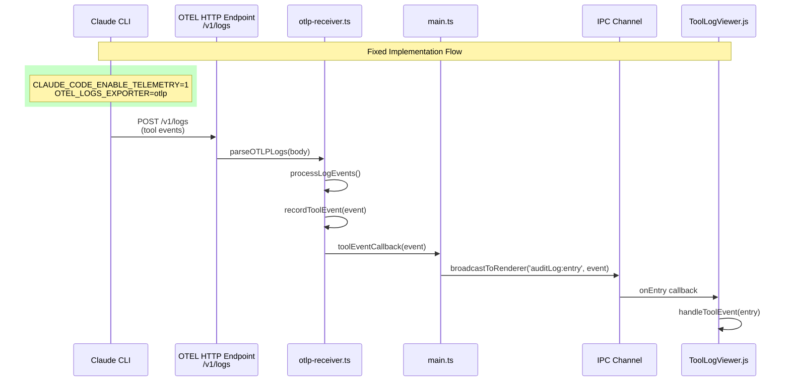
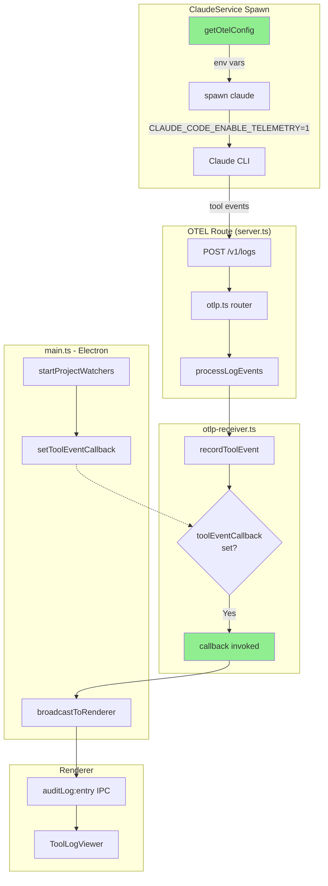

# Tool Panel Data Flow Analysis

Investigation into why tool events are not appearing in the tool panel.

## Root Cause Found

**Claude Code telemetry is opt-in!** The following environment variables were missing:

```bash
CLAUDE_CODE_ENABLE_TELEMETRY=1   # Required to enable telemetry
OTEL_LOGS_EXPORTER=otlp          # Required for tool events
OTEL_METRICS_EXPORTER=otlp       # Required for token metrics
```

The fix was applied in `packages/cyclist/src/server.ts` - `getOtelConfig()` now returns all required env vars.

See: [Claude Code Monitoring Docs](https://code.claude.com/docs/en/monitoring-usage)

## Sequence Diagram - Fixed Flow



## Architecture Diagram - Fixed



## Key Files

| File | Role |
|------|------|
| `packages/cyclist/src/server.ts` | Express server, mounts OTEL route, **getOtelConfig()** |
| `packages/cyclist/src/api/otlp.ts` | POST /v1/logs handler |
| `packages/cyclist/src/otlp-receiver.ts` | Parses OTEL, stores events, has callback |
| `packages/cyclist/src/main.ts` | Electron main, sets callback in startProjectWatchers() |
| `packages/cyclist/src/preload.ts` | IPC bridge, exposes auditLog.onEntry |
| `packages/cyclist/src/public/js/components/ToolLogViewer.js` | Renders tool events |

## Fix Applied

In `server.ts`, `getOtelConfig()` now returns:

```typescript
{
  CLAUDE_CODE_ENABLE_TELEMETRY: '1',
  OTEL_LOGS_EXPORTER: 'otlp',
  OTEL_METRICS_EXPORTER: 'otlp',
  OTEL_EXPORTER_OTLP_PROTOCOL: 'http/json',
  OTEL_EXPORTER_OTLP_ENDPOINT: `http://localhost:${port}`,
}
```

These are passed to `ClaudeService` constructor and merged into the spawn environment.
