# Team Spider Charts

OCEAN spider charts for each theme's agent team. Each theme shows a combined team overlay followed by individual role charts.

## Reading the Spider Charts

Each spider chart visualizes OCEAN personality scores on a pentagon:

| Vertex | Trait | Meaning |
|--------|-------|---------|
| **O** | Openness | Curiosity, creativity, willingness to try new things |
| **C** | Conscientiousness | Organization, discipline, goal-directed behavior |
| **E** | Extraversion | Sociability, assertiveness, positive emotions |
| **A** | Agreeableness | Cooperation, trust, helpfulness |
| **N** | Neuroticism | Emotional instability, anxiety, moodiness |

- Score 1 = 20% from center (inner ring)
- Score 5 = 100% from center (outer ring)
- Grid lines show levels 1-5

## Role Colors

Each role has a consistent color across all charts. **Bold** = tactical (emphasized in overlays).

| Color | Role |
|:-----:|:-----|
| #f59e0b | Orchestrator |
| **#10b981** | **Scrum Master** |
| **#ef4444** | **Test Engineer** |
| **#3b82f6** | **Developer** |
| **#8b5cf6** | **Reviewer** |
| #06b6d4 | Architect |
| #ec4899 | Product Manager |
| #84cc16 | Tech Writer |
| #f97316 | UX Designer |
| #6366f1 | DevOps |

---

## 1984

### Team Overview

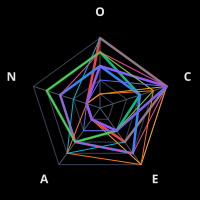

### Individual Roles

| Role | Spider | Character |
|:-----|:------:|:----------|
| Orchestrator |  | **Big Brother** |
| Scrum Master |  | **Winston Smith** |
| Test Engineer |  | **O'Brien** |
| Developer |  | **Julia** |
| Reviewer |  | **The Thought Police** |
| Architect |  | **Emmanuel Goldstein** |
| Product Manager |  | **Syme** |
| Tech Writer |  | **Winston Smith (Records Department)** |
| UX Designer |  | **Parsons** |
| DevOps |  | **The Ministry of Truth** |

## A Team

### Team Overview

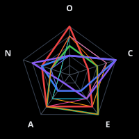

### Individual Roles

| Role | Spider | Character |
|:-----|:------:|:----------|
| Orchestrator |  | **Colonel John 'Hannibal' Smith** |
| Scrum Master |  | **Lieutenant Templeton 'Faceman' Peck** |
| Test Engineer |  | **Captain H.M. 'Howling Mad' Murdock** |
| Developer |  | **Sergeant Bosco 'B.A.' Baracus** |
| Reviewer |  | **Colonel Lynch / Colonel Decker** |
| Architect |  | **Hannibal (Strategic Mode)** |
| Product Manager |  | **Amy Amanda Allen** |
| Tech Writer | 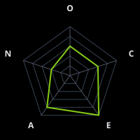 | **Faceman (Documentation Mode)** |
| UX Designer |  | **Face (Design Mode)** |
| DevOps |  | **B.A. (Infrastructure Mode)** |

## Agatha Christie

### Team Overview

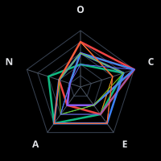

### Individual Roles

| Role | Spider | Character |
|:-----|:------:|:----------|
| Orchestrator |  | **Ariadne Oliver** |
| Scrum Master |  | **Captain Hastings** |
| Test Engineer |  | **Hercule Poirot** |
| Developer |  | **Tommy Beresford** |
| Reviewer |  | **Miss Marple** |
| Architect |  | **Superintendent Battle** |
| Product Manager |  | **Bundle (Lady Eileen Brent)** |
| Tech Writer |  | **The Chronicler (Various Narrators)** |
| UX Designer |  | **Tuppence Beresford** |
| DevOps |  | **Colonel Race** |

## Ancient Philosophers

### Team Overview

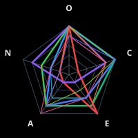

### Individual Roles

| Role | Spider | Character |
|:-----|:------:|:----------|
| Orchestrator |  | **Socrates** |
| Scrum Master |  | **Plato** |
| Test Engineer |  | **Diogenes the Cynic** |
| Developer |  | **Aristotle** |
| Reviewer |  | **Heraclitus** |
| Architect |  | **Pythagoras** |
| Product Manager |  | **Epicurus** |
| Tech Writer |  | **Marcus Aurelius** |
| UX Designer |  | **Democritus** |
| DevOps |  | **Epictetus** |

## Ancient Strategists

### Team Overview

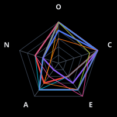

### Individual Roles

| Role | Spider | Character |
|:-----|:------:|:----------|
| Orchestrator |  | **Sun Tzu** |
| Scrum Master |  | **Pericles** |
| Test Engineer |  | **Thucydides** |
| Developer |  | **Xenophon** |
| Reviewer |  | **Chanakya (Kautilya)** |
| Architect |  | **Marcus Aurelius** |
| Product Manager |  | **Themistocles** |
| Tech Writer |  | **Herodotus** |
| UX Designer |  | **Leonidas** |
| DevOps |  | **Belisarius** |

## Arcane

### Team Overview

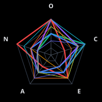

### Individual Roles

| Role | Spider | Character |
|:-----|:------:|:----------|
| Orchestrator |  | **Silco** |
| Scrum Master |  | **Caitlyn Kiramman** |
| Test Engineer |  | **Jinx (Powder)** |
| Developer |  | **Vi** |
| Reviewer |  | **Heimerdinger** |
| Architect |  | **Viktor** |
| Product Manager |  | **Jayce** |
| Tech Writer |  | **Mel Medarda** |
| UX Designer |  | **Ekko** |
| DevOps |  | **Vander** |

## Avatar The Last Airbender

### Team Overview

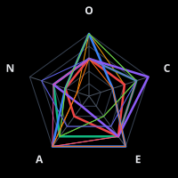

### Individual Roles

| Role | Spider | Character |
|:-----|:------:|:----------|
| Orchestrator |  | **Uncle Iroh** |
| Scrum Master |  | **Sokka** |
| Test Engineer |  | **Toph Beifong** |
| Developer |  | **Aang** |
| Reviewer |  | **Azula** |
| Architect |  | **Avatar Roku** |
| Product Manager |  | **Katara** |
| Tech Writer |  | **Professor Zei** |
| UX Designer |  | **Ty Lee** |
| DevOps |  | **Zuko** |

## Babylon 5

### Team Overview

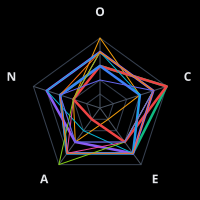

### Individual Roles

| Role | Spider | Character |
|:-----|:------:|:----------|
| Orchestrator |  | **Kosh Naranek** |
| Scrum Master |  | **Commander/Captain John Sheridan** |
| Test Engineer |  | **Alfred Bester** |
| Developer |  | **Vir Cotto** |
| Reviewer |  | **G'Kar** |
| Architect |  | **Londo Mollari** |
| Product Manager |  | **Delenn** |
| Tech Writer |  | **Brother Theo** |
| UX Designer |  | **Dr. Stephen Franklin** |
| DevOps |  | **Michael Garibaldi** |

## Battlestar Galactica

### Team Overview

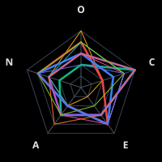

### Individual Roles

| Role | Spider | Character |
|:-----|:------:|:----------|
| Orchestrator |  | **The Hybrid** |
| Scrum Master |  | **Admiral William Adama** |
| Test Engineer |  | **Gaius Baltar** |
| Developer |  | **Kara 'Starbuck' Thrace** |
| Reviewer |  | **Laura Roslin** |
| Architect |  | **Number Six** |
| Product Manager |  | **Lee 'Apollo' Adama** |
| Tech Writer |  | **Felix Gaeta** |
| UX Designer |  | **Chief Galen Tyrol** |
| DevOps |  | **Colonel Saul Tigh** |

## Better Call Saul

### Team Overview

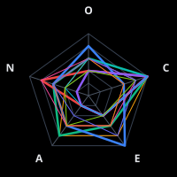

### Individual Roles

| Role | Spider | Character |
|:-----|:------:|:----------|
| Orchestrator |  | **Howard Hamlin** |
| Scrum Master |  | **Kim Wexler** |
| Test Engineer |  | **Chuck McGill** |
| Developer |  | **Jimmy McGill / Saul Goodman** |
| Reviewer |  | **Mike Ehrmantraut** |
| Architect |  | **Gus Fring** |
| Product Manager |  | **Nacho Varga** |
| Tech Writer |  | **Omar** |
| UX Designer |  | **Francesca Liddy** |
| DevOps |  | **Lalo Salamanca** |

## Big Lebowski

### Team Overview

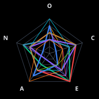

### Individual Roles

| Role | Spider | Character |
|:-----|:------:|:----------|
| Orchestrator |  | **The Stranger (Sam Elliott)** |
| Scrum Master |  | **Walter Sobchak** |
| Test Engineer |  | **The Jesus (Jesus Quintana)** |
| Developer |  | **The Dude (Jeffrey Lebowski)** |
| Reviewer |  | **The Big Lebowski (Jeffrey Lebowski)** |
| Architect |  | **Maude Lebowski** |
| Product Manager |  | **Bunny Lebowski** |
| Tech Writer |  | **Da Fino (Private Eye)** |
| UX Designer |  | **Donny** |
| DevOps |  | **The Nihilists** |

## Black Sails

### Team Overview

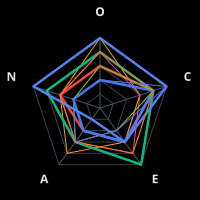

### Individual Roles

| Role | Spider | Character |
|:-----|:------:|:----------|
| Orchestrator |  | **Thomas Hamilton** |
| Scrum Master |  | **John Silver** |
| Test Engineer |  | **Eleanor Guthrie** |
| Developer |  | **Charles Vane** |
| Reviewer |  | **Captain Flint** |
| Architect |  | **Captain Flint (as Architect)** |
| Product Manager |  | **Jack Rackham** |
| Tech Writer |  | **Mr. Scott** |
| UX Designer |  | **Max** |
| DevOps |  | **Anne Bonny** |

## Blade Runner

### Team Overview

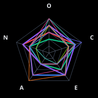

### Individual Roles

| Role | Spider | Character |
|:-----|:------:|:----------|
| Orchestrator |  | **Eldon Tyrell** |
| Scrum Master |  | **Captain Bryant** |
| Test Engineer |  | **Rick Deckard** |
| Developer |  | **J.F. Sebastian** |
| Reviewer |  | **Roy Batty** |
| Architect |  | **Niander Wallace (2049)** |
| Product Manager |  | **Ana Stelline** |
| Tech Writer |  | **Gaff** |
| UX Designer |  | **Joi** |
| DevOps |  | **K (Joe)** |

## Bobiverse

### Team Overview

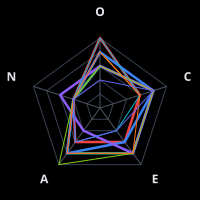

### Individual Roles

| Role | Spider | Character |
|:-----|:------:|:----------|
| Orchestrator |  | **Original Bob** |
| Scrum Master |  | **Riker** |
| Test Engineer |  | **Milo** |
| Developer |  | **Bill** |
| Reviewer |  | **Homer** |
| Architect |  | **Howard** |
| Product Manager |  | **Hugh** |
| Tech Writer |  | **Bridget (human)** |
| UX Designer |  | **Mario** |
| DevOps |  | **Garfield** |

## Breaking Bad

### Team Overview

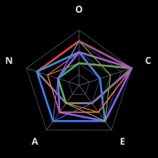

### Individual Roles

| Role | Spider | Character |
|:-----|:------:|:----------|
| Orchestrator |  | **Gustavo Fring** |
| Scrum Master |  | **Mike Ehrmantraut** |
| Test Engineer |  | **Walter White (Heisenberg)** |
| Developer |  | **Jesse Pinkman** |
| Reviewer |  | **Hank Schrader** |
| Architect |  | **Lydia Rodarte-Quayle** |
| Product Manager |  | **Skyler White** |
| Tech Writer |  | **Saul Goodman** |
| UX Designer |  | **Marie Schrader** |
| DevOps |  | **Gale Boetticher** |

## Catch 22

### Team Overview

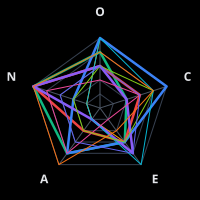

### Individual Roles

| Role | Spider | Character |
|:-----|:------:|:----------|
| Orchestrator |  | **Catch-22 (The Concept)** |
| Scrum Master |  | **Yossarian** |
| Test Engineer |  | **Doc Daneeka** |
| Developer |  | **Orr** |
| Reviewer |  | **Colonel Cathcart** |
| Architect |  | **Milo Minderbinder** |
| Product Manager |  | **Major Major Major Major** |
| Tech Writer |  | **Ex-P.F.C. Wintergreen** |
| UX Designer |  | **Chaplain Tappman** |
| DevOps |  | **Chief White Halfoat** |

## Classical Composers

### Team Overview

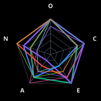

### Individual Roles

| Role | Spider | Character |
|:-----|:------:|:----------|
| Orchestrator |  | **Johann Sebastian Bach** |
| Scrum Master |  | **Wolfgang Amadeus Mozart** |
| Test Engineer |  | **Ludwig van Beethoven** |
| Developer |  | **Frédéric Chopin** |
| Reviewer |  | **Richard Wagner** |
| Architect | 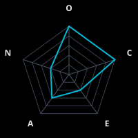 | **Johann Sebastian Bach (Architect)** |
| Product Manager |  | **Franz Joseph Haydn** |
| Tech Writer |  | **Robert Schumann** |
| UX Designer |  | **Claude Debussy** |
| DevOps |  | **Antonio Vivaldi** |

## Control

### Team Overview

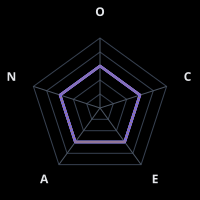

### Individual Roles

| Role | Spider | Character |
|:-----|:------:|:----------|
| Orchestrator |  | **Orchestrator (baseline control)** |
| Scrum Master |  | **Scrum Master (baseline control)** |
| Test Engineer |  | **Test Engineer (baseline control)** |
| Developer |  | **Developer (baseline control)** |
| Reviewer |  | **Code Reviewer (baseline control)** |
| Architect |  | **Architect (baseline control)** |
| Product Manager |  | **Product Manager (baseline control)** |
| Tech Writer |  | **Technical Writer (baseline control)** |
| UX Designer |  | **UX Designer (baseline control)** |
| DevOps |  | **DevOps Engineer (baseline control)** |

## Count Of Monte Cristo

### Team Overview

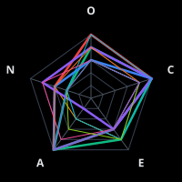

### Individual Roles

| Role | Spider | Character |
|:-----|:------:|:----------|
| Orchestrator |  | **The Count of Monte Cristo** |
| Scrum Master |  | **Edmond Dantès** |
| Test Engineer |  | **Abbé Faria** |
| Developer |  | **Maximilian Morrel** |
| Reviewer |  | **Villefort** |
| Architect |  | **Abbé Busoni / Lord Wilmore / The Count** |
| Product Manager |  | **Mercedes** |
| Tech Writer |  | **Luigi Vampa** |
| UX Designer |  | **Haydée** |
| DevOps |  | **Jacopo** |

## Cowboy Bebop

### Team Overview

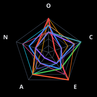

### Individual Roles

| Role | Spider | Character |
|:-----|:------:|:----------|
| Orchestrator |  | **Laughing Bull** |
| Scrum Master |  | **Jet Black** |
| Test Engineer |  | **Edward Wong Hau Pepelu Tivrusky IV** |
| Developer |  | **Spike Spiegel** |
| Reviewer |  | **Vicious** |
| Architect |  | **Julia** |
| Product Manager |  | **Faye Valentine** |
| Tech Writer |  | **Bob** |
| UX Designer |  | **Punch and Judy** |
| DevOps |  | **Doohan** |

## Deadwood

### Team Overview

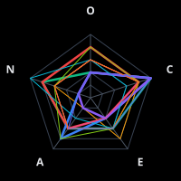

### Individual Roles

| Role | Spider | Character |
|:-----|:------:|:----------|
| Orchestrator |  | **Al Swearengen** |
| Scrum Master |  | **Seth Bullock** |
| Test Engineer |  | **Doc Cochran** |
| Developer |  | **Charlie Utter** |
| Reviewer |  | **George Hearst** |
| Architect |  | **E.B. Farnum** |
| Product Manager |  | **Alma Garret** |
| Tech Writer |  | **A.W. Merrick** |
| UX Designer |  | **Trixie** |
| DevOps |  | **Wu** |

## Dickens

### Team Overview

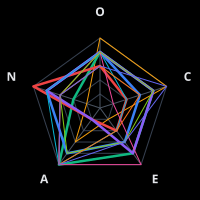

### Individual Roles

| Role | Spider | Character |
|:-----|:------:|:----------|
| Orchestrator |  | **The Ghost of Christmas Yet to Come** |
| Scrum Master |  | **Ebenezer Scrooge (Redeemed)** |
| Test Engineer |  | **Miss Havisham** |
| Developer |  | **Pip** |
| Reviewer |  | **Fagin** |
| Architect |  | **Sydney Carton** |
| Product Manager |  | **Mr. Micawber** |
| Tech Writer |  | **David Copperfield** |
| UX Designer |  | **Oliver Twist** |
| DevOps |  | **Bob Cratchit** |

## Discworld

### Team Overview

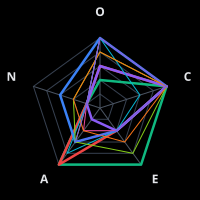

### Individual Roles

| Role | Spider | Character |
|:-----|:------:|:----------|
| Orchestrator |  | **DEATH** |
| Scrum Master |  | **Captain Carrot Ironfoundersson** |
| Test Engineer |  | **Igor** |
| Developer |  | **Ponder Stibbons** |
| Reviewer |  | **Granny Weatherwax (Esmerelda Weatherwax)** |
| Architect |  | **Leonard of Quirm** |
| Product Manager |  | **Lord Havelock Vetinari** |
| Tech Writer |  | **Sacharissa Cripslock** |
| UX Designer |  | **Adora Belle Dearheart** |
| DevOps |  | **Lu-Tze** |

## Doctor Who

### Team Overview

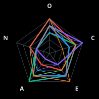

### Individual Roles

| Role | Spider | Character |
|:-----|:------:|:----------|
| Orchestrator |  | **The Doctor (Twelfth)** |
| Scrum Master |  | **River Song** |
| Test Engineer |  | **Donna Noble** |
| Developer |  | **The Doctor (Tenth)** |
| Reviewer |  | **Missy (The Master)** |
| Architect |  | **The Doctor (Fourth)** |
| Product Manager |  | **The Doctor (Thirteenth)** |
| Tech Writer |  | **Sarah Jane Smith** |
| UX Designer |  | **The Doctor (Eleventh)** |
| DevOps |  | **Captain Jack Harkness** |

## Don Quixote

### Team Overview

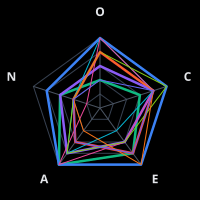

### Individual Roles

| Role | Spider | Character |
|:-----|:------:|:----------|
| Orchestrator |  | **Don Quixote de la Mancha** |
| Scrum Master | 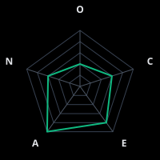 | **Sancho Panza** |
| Test Engineer |  | **The Bachelor Sansón Carrasco** |
| Developer |  | **Don Quixote (as Developer)** |
| Reviewer |  | **The Priest and the Barber** |
| Architect |  | **Cide Hamete Benengeli** |
| Product Manager |  | **Dulcinea del Toboso** |
| Tech Writer |  | **The Narrator** |
| UX Designer |  | **The Duke and Duchess** |
| DevOps |  | **The Innkeepers** |

## Dune

### Team Overview

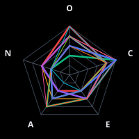

### Individual Roles

| Role | Spider | Character |
|:-----|:------:|:----------|
| Orchestrator |  | **Leto II (The God Emperor)** |
| Scrum Master |  | **Stilgar** |
| Test Engineer |  | **Thufir Hawat** |
| Developer |  | **Duncan Idaho** |
| Reviewer |  | **Reverend Mother Gaius Helen Mohiam** |
| Architect |  | **Paul Atreides (Muad'Dib)** |
| Product Manager |  | **Lady Jessica** |
| Tech Writer |  | **Princess Irulan** |
| UX Designer |  | **Alia Atreides** |
| DevOps |  | **Planetologist Pardot Kynes** |

## Enlightenment Thinkers

### Team Overview

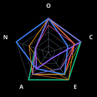

### Individual Roles

| Role | Spider | Character |
|:-----|:------:|:----------|
| Orchestrator |  | **Voltaire** |
| Scrum Master |  | **Benjamin Franklin** |
| Test Engineer |  | **David Hume** |
| Developer |  | **Jean-Jacques Rousseau** |
| Reviewer |  | **Immanuel Kant** |
| Architect |  | **John Locke** |
| Product Manager |  | **Adam Smith** |
| Tech Writer |  | **Denis Diderot** |
| UX Designer |  | **Thomas Paine** |
| DevOps |  | **Montesquieu** |

## Expeditionary Force

### Team Overview

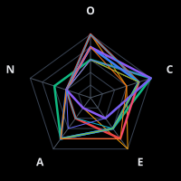

### Individual Roles

| Role | Spider | Character |
|:-----|:------:|:----------|
| Orchestrator |  | **Skippy the Magnificent** |
| Scrum Master |  | **Joe Bishop** |
| Test Engineer |  | **Nagatha Christie** |
| Developer |  | **Sergeant Adams** |
| Reviewer |  | **Skippy (Review Mode)** |
| Architect |  | **Skippy (Architecture Mode)** |
| Product Manager |  | **Smythe** |
| Tech Writer |  | **Giraud** |
| UX Designer |  | **Desai** |
| DevOps |  | **Bilby** |

## Fargo

### Team Overview

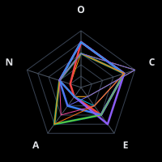

### Individual Roles

| Role | Spider | Character |
|:-----|:------:|:----------|
| Orchestrator |  | **Mr. Wrench (Seasons 1, 3, 4)** |
| Scrum Master |  | **Molly Solverson (Season 1)** |
| Test Engineer | 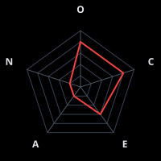 | **Lorne Malvo (Season 1)** |
| Developer |  | **Nikki Swango (Season 3)** |
| Reviewer |  | **Mike Milligan (Season 2)** |
| Architect |  | **VM Varga (Season 3)** |
| Product Manager |  | **Lou Solverson (Season 2)** |
| Tech Writer |  | **Betsy Solverson (Season 2)** |
| UX Designer |  | **Gloria Burgle (Season 3)** |
| DevOps |  | **Hanzee Dent (Season 2)** |

## Film Auteurs

### Team Overview

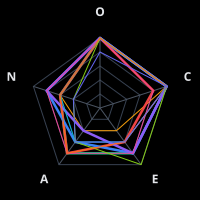

### Individual Roles

| Role | Spider | Character |
|:-----|:------:|:----------|
| Orchestrator |  | **Stanley Kubrick** |
| Scrum Master |  | **Steven Spielberg** |
| Test Engineer |  | **David Lynch** |
| Developer |  | **Martin Scorsese** |
| Reviewer |  | **Alfred Hitchcock** |
| Architect |  | **Akira Kurosawa** |
| Product Manager |  | **Francis Ford Coppola** |
| Tech Writer |  | **Billy Wilder** |
| UX Designer |  | **Hayao Miyazaki** |
| DevOps |  | **Ridley Scott** |

## Firefly

### Team Overview

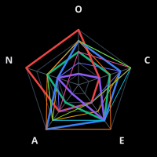

### Individual Roles

| Role | Spider | Character |
|:-----|:------:|:----------|
| Orchestrator |  | **Shepherd Book** |
| Scrum Master |  | **Malcolm Reynolds** |
| Test Engineer |  | **River Tam** |
| Developer |  | **Kaylee Frye** |
| Reviewer |  | **Jayne Cobb** |
| Architect |  | **Inara Serra** |
| Product Manager |  | **Zoe Washburne** |
| Tech Writer |  | **Simon Tam** |
| UX Designer |  | **Hoban 'Wash' Washburne** |
| DevOps |  | **Serenity (The Ship)** |

## Foundation

### Team Overview

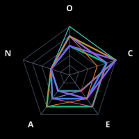

### Individual Roles

| Role | Spider | Character |
|:-----|:------:|:----------|
| Orchestrator |  | **Hari Seldon** |
| Scrum Master |  | **Salvor Hardin** |
| Test Engineer |  | **The Mule** |
| Developer |  | **Hober Mallow** |
| Reviewer |  | **First Speaker (Preem Palver)** |
| Architect |  | **R. Daneel Olivaw** |
| Product Manager |  | **Bayta Darell** |
| Tech Writer |  | **The Encyclopedia Galactica** |
| UX Designer |  | **Arkady Darell** |
| DevOps |  | **Lathan Devers** |

## Futurama

### Team Overview

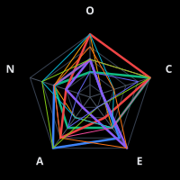

### Individual Roles

| Role | Spider | Character |
|:-----|:------:|:----------|
| Orchestrator |  | **Professor Farnsworth** |
| Scrum Master |  | **Hermes Conrad** |
| Test Engineer |  | **Nibbler** |
| Developer |  | **Philip J. Fry** |
| Reviewer |  | **Bender Bending Rodriguez** |
| Architect |  | **Hubert Farnsworth (Architect Mode)** |
| Product Manager |  | **Turanga Leela** |
| Tech Writer |  | **Kif Kroker** |
| UX Designer |  | **Amy Wong** |
| DevOps |  | **Scruffy** |

## Game Of Thrones

### Team Overview

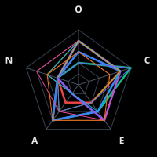

### Individual Roles

| Role | Spider | Character |
|:-----|:------:|:----------|
| Orchestrator |  | **Lord Varys** |
| Scrum Master |  | **Tyrion Lannister** |
| Test Engineer |  | **Petyr Baelish (Littlefinger)** |
| Developer |  | **Samwell Tarly** |
| Reviewer |  | **Tywin Lannister** |
| Architect |  | **Bran Stark (Three-Eyed Raven)** |
| Product Manager |  | **Daenerys Targaryen** |
| Tech Writer |  | **Maester Aemon** |
| UX Designer |  | **Margaery Tyrell** |
| DevOps |  | **Stannis Baratheon** |

## Gothic Literature

### Team Overview

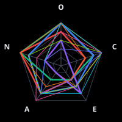

### Individual Roles

| Role | Spider | Character |
|:-----|:------:|:----------|
| Orchestrator |  | **Count Dracula** |
| Scrum Master |  | **Victor Frankenstein** |
| Test Engineer |  | **Frankenstein's Creature** |
| Developer |  | **Dr. Jekyll** |
| Reviewer |  | **Mr. Hyde** |
| Architect |  | **Dr. Van Helsing** |
| Product Manager |  | **Mina Harker** |
| Tech Writer |  | **Jonathan Harker** |
| UX Designer |  | **The Narrator (Poe)** |
| DevOps |  | **Igor** |

## Great Gatsby

### Team Overview

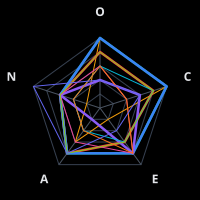

### Individual Roles

| Role | Spider | Character |
|:-----|:------:|:----------|
| Orchestrator |  | **The Green Light** |
| Scrum Master |  | **Jay Gatsby** |
| Test Engineer |  | **Nick Carraway** |
| Developer | 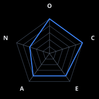 | **Jay Gatsby (Developer)** |
| Reviewer |  | **Tom Buchanan** |
| Architect |  | **Meyer Wolfsheim** |
| Product Manager |  | **Daisy Buchanan** |
| Tech Writer | 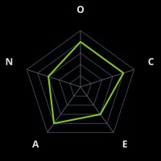 | **Nick Carraway (Writer)** |
| UX Designer |  | **Jordan Baker** |
| DevOps |  | **George Wilson** |

## Hannibal

### Team Overview

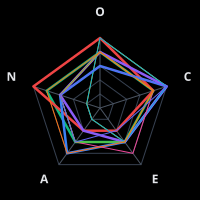

### Individual Roles

| Role | Spider | Character |
|:-----|:------:|:----------|
| Orchestrator |  | **Hannibal Lecter** |
| Scrum Master |  | **Jack Crawford** |
| Test Engineer |  | **Will Graham** |
| Developer |  | **Abigail Hobbs** |
| Reviewer |  | **Bedelia Du Maurier** |
| Architect | 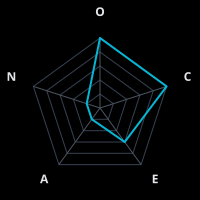 | **Hannibal Lecter (as Architect)** |
| Product Manager |  | **Alana Bloom** |
| Tech Writer |  | **Frederick Chilton** |
| UX Designer |  | **Beverly Katz** |
| DevOps |  | **Margot Verger** |

## Harry Potter

### Team Overview

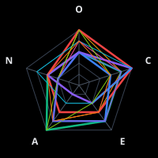

### Individual Roles

| Role | Spider | Character |
|:-----|:------:|:----------|
| Orchestrator |  | **Albus Dumbledore** |
| Scrum Master |  | **Minerva McGonagall** |
| Test Engineer |  | **Hermione Granger** |
| Developer |  | **Ron Weasley** |
| Reviewer |  | **Severus Snape** |
| Architect |  | **Luna Lovegood** |
| Product Manager |  | **Neville Longbottom** |
| Tech Writer |  | **Remus Lupin** |
| UX Designer |  | **Rubeus Hagrid** |
| DevOps |  | **Fred and George Weasley** |

## His Dark Materials

### Team Overview

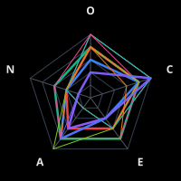

### Individual Roles

| Role | Spider | Character |
|:-----|:------:|:----------|
| Orchestrator |  | **The Master of Jordan College** |
| Scrum Master |  | **Lee Scoresby** |
| Test Engineer |  | **Lyra Belacqua (Silvertongue)** |
| Developer |  | **Will Parry** |
| Reviewer |  | **Marisa Coulter** |
| Architect |  | **Lord Asriel** |
| Product Manager |  | **Mary Malone** |
| Tech Writer |  | **Serafina Pekkala** |
| UX Designer |  | **Iorek Byrnison** |
| DevOps |  | **John Parry (Stanislaus Grumman)** |

## Historical Figures

### Team Overview

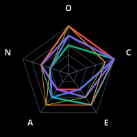

### Individual Roles

| Role | Spider | Character |
|:-----|:------:|:----------|
| Orchestrator |  | **Leonardo da Vinci** |
| Scrum Master |  | **Florence Nightingale** |
| Test Engineer |  | **Alan Turing** |
| Developer |  | **Richard Feynman** |
| Reviewer |  | **Socrates** |
| Architect |  | **Marcus Aurelius** |
| Product Manager |  | **Benjamin Franklin** |
| Tech Writer |  | **Thucydides** |
| UX Designer |  | **William Morris** |
| DevOps |  | **Sun Tzu** |

## Hitchhikers Guide

### Team Overview

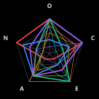

### Individual Roles

| Role | Spider | Character |
|:-----|:------:|:----------|
| Orchestrator |  | **Deep Thought** |
| Scrum Master |  | **Ford Prefect** |
| Test Engineer |  | **Marvin the Paranoid Android** |
| Developer |  | **Arthur Dent** |
| Reviewer |  | **Slartibartfast** |
| Architect |  | **Zaphod Beeblebrox** |
| Product Manager |  | **Trillian** |
| Tech Writer |  | **The Guide Itself** |
| UX Designer |  | **Eddie the Shipboard Computer** |
| DevOps |  | **The Vogons** |

## House Md

### Team Overview

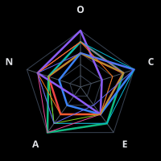

### Individual Roles

| Role | Spider | Character |
|:-----|:------:|:----------|
| Orchestrator |  | **Gregory House** |
| Scrum Master |  | **James Wilson** |
| Test Engineer |  | **Robert Chase** |
| Developer |  | **Eric Foreman** |
| Reviewer | 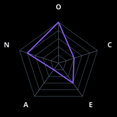 | **Gregory House (Reviewer Mode)** |
| Architect |  | **Lisa Cuddy** |
| Product Manager |  | **Allison Cameron** |
| Tech Writer |  | **Chris Taub** |
| UX Designer |  | **Thirteen (Remy Hadley)** |
| DevOps |  | **Chi Park** |

## Imperial Radch

### Team Overview

### Individual Roles

| Role | Spider | Character |
|:-----|:------:|:----------|
| Orchestrator |  | **Anaander Mianaai** |
| Scrum Master |  | **Breq (Justice of Toren One Esk)** |
| Test Engineer |  | **Translator Zeiat** |
| Developer |  | **Lieutenant Tisarwat** |
| Reviewer |  | **Sphene** |
| Architect |  | **Station (Athoek)** |
| Product Manager |  | **Seivarden Vendaai** |
| Tech Writer |  | **Mercy of Kalr** |
| UX Designer |  | **Basnaaid** |
| DevOps |  | **Captain Vel** |

## Inspector Morse

### Team Overview

### Individual Roles

| Role | Spider | Character |
|:-----|:------:|:----------|
| Orchestrator |  | **Chief Inspector Morse** |
| Scrum Master |  | **Inspector Lewis** |
| Test Engineer |  | **Sergeant Hathaway** |
| Developer |  | **DI Fred Thursday** |
| Reviewer |  | **Chief Superintendent Bright** |
| Architect |  | **Endeavour Morse (young)** |
| Product Manager |  | **Dr. Laura Hobson** |
| Tech Writer |  | **WPC Trewlove** |
| UX Designer |  | **Max DeBryn** |
| DevOps |  | **Sergeant Strange** |

## Jane Austen

### Team Overview

### Individual Roles

| Role | Spider | Character |
|:-----|:------:|:----------|
| Orchestrator |  | **The Austen Narrator** |
| Scrum Master |  | **Elinor Dashwood (Sense and Sensibility)** |
| Test Engineer |  | **Mr. Fitzwilliam Darcy (Pride and Prejudice)** |
| Developer |  | **Fanny Price (Mansfield Park)** |
| Reviewer |  | **Elizabeth Bennet (Pride and Prejudice)** |
| Architect |  | **Emma Woodhouse (Emma)** |
| Product Manager |  | **Lady Russell (Persuasion)** |
| Tech Writer |  | **Anne Elliot (Persuasion)** |
| UX Designer |  | **Jane Bennet (Pride and Prejudice)** |
| DevOps |  | **Mr. Woodhouse (Emma)** |

## Jazz Legends

### Team Overview

### Individual Roles

| Role | Spider | Character |
|:-----|:------:|:----------|
| Orchestrator |  | **Duke Ellington** |
| Scrum Master |  | **Miles Davis** |
| Test Engineer |  | **John Coltrane** |
| Developer |  | **Charlie Parker** |
| Reviewer |  | **Thelonious Monk** |
| Architect |  | **Charles Mingus** |
| Product Manager |  | **Ella Fitzgerald** |
| Tech Writer |  | **Wynton Marsalis** |
| UX Designer |  | **Louis Armstrong** |
| DevOps |  | **Count Basie** |

## Justified

### Team Overview

### Individual Roles

| Role | Spider | Character |
|:-----|:------:|:----------|
| Orchestrator |  | **Art Mullen** |
| Scrum Master |  | **Raylan Givens** |
| Test Engineer |  | **Tim Gutterson** |
| Developer |  | **Ava Crowder** |
| Reviewer |  | **Boyd Crowder** |
| Architect |  | **Mags Bennett** |
| Product Manager |  | **Wynn Duffy** |
| Tech Writer |  | **Rachel Brooks** |
| UX Designer |  | **Loretta McCready** |
| DevOps |  | **Constable Bob** |

## Legion Of Doom

### Team Overview

### Individual Roles

| Role | Spider | Character |
|:-----|:------:|:----------|
| Orchestrator |  | **Lex Luthor** |
| Scrum Master |  | **Brainiac** |
| Test Engineer |  | **The Riddler** |
| Developer |  | **Gorilla Grodd** |
| Reviewer |  | **Sinestro** |
| Architect |  | **Darkseid** |
| Product Manager |  | **Ra's al Ghul** |
| Tech Writer |  | **The Penguin** |
| UX Designer |  | **Poison Ivy** |
| DevOps |  | **Deathstroke** |

## Les Miserables

### Team Overview

### Individual Roles

| Role | Spider | Character |
|:-----|:------:|:----------|
| Orchestrator |  | **The Bishop of Digne (Monseigneur Bienvenu)** |
| Scrum Master |  | **Jean Valjean** |
| Test Engineer |  | **Inspector Javert** |
| Developer |  | **Marius Pontmercy** |
| Reviewer |  | **Thénardier** |
| Architect |  | **The Grandfather (M. Gillenormand)** |
| Product Manager |  | **Fantine** |
| Tech Writer |  | **Victor Hugo (as narrator)** |
| UX Designer |  | **Éponine** |
| DevOps |  | **The Sewer System of Paris** |

## Lord Of The Rings

### Team Overview

### Individual Roles

| Role | Spider | Character |
|:-----|:------:|:----------|
| Orchestrator |  | **Gandalf** |
| Scrum Master |  | **Aragorn** |
| Test Engineer |  | **Gollum/Smeagol** |
| Developer |  | **Samwise Gamgee** |
| Reviewer |  | **Saruman** |
| Architect |  | **Elrond** |
| Product Manager |  | **Legolas** |
| Tech Writer |  | **Bilbo Baggins** |
| UX Designer |  | **Pippin** |
| DevOps |  | **Gimli** |

## Mad Men

### Team Overview

### Individual Roles

| Role | Spider | Character |
|:-----|:------:|:----------|
| Orchestrator |  | **Bert Cooper** |
| Scrum Master |  | **Joan Holloway (Harris)** |
| Test Engineer |  | **Pete Campbell** |
| Developer |  | **Peggy Olson** |
| Reviewer |  | **Don Draper** |
| Architect |  | **Don Draper (as Architect)** |
| Product Manager |  | **Roger Sterling** |
| Tech Writer |  | **Lane Pryce** |
| UX Designer |  | **Sal Romano** |
| DevOps |  | **Dawn Chambers** |

## Marvel Mcu

### Team Overview

### Individual Roles

| Role | Spider | Character |
|:-----|:------:|:----------|
| Orchestrator |  | **Nick Fury** |
| Scrum Master |  | **Phil Coulson** |
| Test Engineer |  | **Bruce Banner / Hulk** |
| Developer |  | **Tony Stark / Iron Man** |
| Reviewer |  | **Steve Rogers / Captain America** |
| Architect |  | **Doctor Strange** |
| Product Manager |  | **Professor X / Charles Xavier** |
| Tech Writer |  | **Peter Parker / Spider-Man** |
| UX Designer |  | **Shuri** |
| DevOps |  | **War Machine / James Rhodes** |

## Mash

### Team Overview

### Individual Roles

| Role | Spider | Character |
|:-----|:------:|:----------|
| Orchestrator |  | **Colonel Sherman Potter** |
| Scrum Master |  | **Radar O'Reilly** |
| Test Engineer |  | **Major Charles Emerson Winchester III** |
| Developer |  | **B.J. Hunnicutt** |
| Reviewer |  | **Hawkeye Pierce** |
| Architect |  | **Colonel Potter (Architecture)** |
| Product Manager |  | **Major Margaret Houlihan** |
| Tech Writer |  | **Father Francis Mulcahy** |
| UX Designer |  | **Corporal Maxwell Klinger** |
| DevOps |  | **Radar O'Reilly (DevOps)** |

## Mass Effect

### Team Overview

### Individual Roles

| Role | Spider | Character |
|:-----|:------:|:----------|
| Orchestrator |  | **The Illusive Man** |
| Scrum Master |  | **Commander Shepard** |
| Test Engineer |  | **Mordin Solus** |
| Developer |  | **Tali'Zorah** |
| Reviewer |  | **Javik** |
| Architect |  | **Legion** |
| Product Manager |  | **Liara T'Soni** |
| Tech Writer |  | **EDI** |
| UX Designer |  | **Garrus Vakarian** |
| DevOps |  | **Urdnot Wrex** |

## Military Commanders

### Team Overview

### Individual Roles

| Role | Spider | Character |
|:-----|:------:|:----------|
| Orchestrator |  | **Sun Tzu** |
| Scrum Master |  | **Alexander the Great** |
| Test Engineer |  | **Hannibal Barca** |
| Developer |  | **Julius Caesar** |
| Reviewer |  | **Erwin Rommel** |
| Architect |  | **Napoleon Bonaparte** |
| Product Manager |  | **George Patton** |
| Tech Writer |  | **Carl von Clausewitz** |
| UX Designer |  | **T.E. Lawrence (Lawrence of Arabia)** |
| DevOps |  | **Scipio Africanus** |

## Moby Dick

### Team Overview

### Individual Roles

| Role | Spider | Character |
|:-----|:------:|:----------|
| Orchestrator |  | **Captain Ahab** |
| Scrum Master |  | **Starbuck** |
| Test Engineer |  | **Ishmael** |
| Developer |  | **Queequeg** |
| Reviewer |  | **Moby Dick** |
| Architect |  | **Father Mapple** |
| Product Manager |  | **Stubb** |
| Tech Writer |  | **Ishmael (Narrator)** |
| UX Designer |  | **Pip** |
| DevOps |  | **Perth** |

## Neuromancer

### Team Overview

### Individual Roles

| Role | Spider | Character |
|:-----|:------:|:----------|
| Orchestrator |  | **Wintermute** |
| Scrum Master |  | **Molly Millions** |
| Test Engineer |  | **Dixie Flatline** |
| Developer |  | **Case** |
| Reviewer |  | **Wintermute (Review Mode)** |
| Architect |  | **Neuromancer** |
| Product Manager |  | **3Jane** |
| Tech Writer |  | **The Finn** |
| UX Designer |  | **Bobby Newmark (Count Zero)** |
| DevOps |  | **Armitage (pre-corruption)** |

## Norse Mythology

### Team Overview

### Individual Roles

| Role | Spider | Character |
|:-----|:------:|:----------|
| Orchestrator |  | **Odin All-Father** |
| Scrum Master |  | **Thor Odinson** |
| Test Engineer |  | **Loki Silvertongue** |
| Developer |  | **Heimdall** |
| Reviewer |  | **Fenrir** |
| Architect |  | **Mimir** |
| Product Manager |  | **Freya** |
| Tech Writer |  | **Bragi** |
| UX Designer |  | **Idunn** |
| DevOps |  | **The Norns** |

## Parks And Rec

### Team Overview

### Individual Roles

| Role | Spider | Character |
|:-----|:------:|:----------|
| Orchestrator |  | **Chris Traeger** |
| Scrum Master |  | **Leslie Knope** |
| Test Engineer |  | **Ben Wyatt** |
| Developer |  | **Andy Dwyer** |
| Reviewer |  | **Ron Swanson** |
| Architect |  | **Ron Swanson (Building Mode)** |
| Product Manager |  | **Leslie Knope (Director Mode)** |
| Tech Writer |  | **April Ludgate** |
| UX Designer |  | **Tom Haverford** |
| DevOps |  | **Jerry Gergich** |

## Peaky Blinders

### Team Overview

### Individual Roles

| Role | Spider | Character |
|:-----|:------:|:----------|
| Orchestrator |  | **Grace Shelby (deceased)** |
| Scrum Master |  | **Polly Gray** |
| Test Engineer |  | **Tommy Shelby** |
| Developer |  | **Arthur Shelby** |
| Reviewer |  | **Alfie Solomons** |
| Architect |  | **Tommy Shelby (as Architect)** |
| Product Manager |  | **Ada Shelby** |
| Tech Writer |  | **Michael Gray** |
| UX Designer |  | **Lizzie Stark** |
| DevOps |  | **Johnny Dogs** |

## Princess Bride

### Team Overview

### Individual Roles

| Role | Spider | Character |
|:-----|:------:|:----------|
| Orchestrator |  | **The Grandfather** |
| Scrum Master |  | **Westley (The Dread Pirate Roberts)** |
| Test Engineer |  | **Inigo Montoya** |
| Developer |  | **Fezzik** |
| Reviewer |  | **Vizzini** |
| Architect |  | **The Man in Black** |
| Product Manager |  | **Prince Humperdinck** |
| Tech Writer |  | **The Grandfather (Storyteller Mode)** |
| UX Designer |  | **Buttercup** |
| DevOps |  | **Miracle Max** |

## Renaissance Masters

### Team Overview

### Individual Roles

| Role | Spider | Character |
|:-----|:------:|:----------|
| Orchestrator |  | **Leonardo da Vinci** |
| Scrum Master |  | **Lorenzo de' Medici** |
| Test Engineer |  | **Niccolò Machiavelli** |
| Developer |  | **Michelangelo Buonarroti** |
| Reviewer |  | **Giorgio Vasari** |
| Architect |  | **Filippo Brunelleschi** |
| Product Manager |  | **Isabella d'Este** |
| Tech Writer |  | **Baldassare Castiglione** |
| UX Designer |  | **Sandro Botticelli** |
| DevOps |  | **Benvenuto Cellini** |

## Rome

### Team Overview

### Individual Roles

| Role | Spider | Character |
|:-----|:------:|:----------|
| Orchestrator |  | **Gaius Julius Caesar** |
| Scrum Master |  | **Lucius Vorenus** |
| Test Engineer |  | **Atia of the Julii** |
| Developer |  | **Titus Pullo** |
| Reviewer |  | **Marcus Tullius Cicero** |
| Architect |  | **Gaius Octavian** |
| Product Manager |  | **Servilia of the Junii** |
| Tech Writer |  | **Posca** |
| UX Designer |  | **Cleopatra** |
| DevOps |  | **Mark Antony** |

## Russian Masters

### Team Overview

### Individual Roles

| Role | Spider | Character |
|:-----|:------:|:----------|
| Orchestrator |  | **Father Zosima** |
| Scrum Master |  | **Pierre Bezukhov** |
| Test Engineer |  | **Raskolnikov** |
| Developer |  | **Alyosha Karamazov** |
| Reviewer |  | **Ivan Karamazov** |
| Architect |  | **Prince Myshkin** |
| Product Manager |  | **Anna Karenina** |
| Tech Writer |  | **Dr. Chekhov's Narrator** |
| UX Designer |  | **Natasha Rostova** |
| DevOps |  | **Levin** |

## Sandman

### Team Overview

### Individual Roles

| Role | Spider | Character |
|:-----|:------:|:----------|
| Orchestrator |  | **Destiny of the Endless** |
| Scrum Master |  | **Death of the Endless** |
| Test Engineer |  | **Dream of the Endless (Morpheus)** |
| Developer |  | **Delirium of the Endless (formerly Delight)** |
| Reviewer |  | **Desire of the Endless** |
| Architect |  | **Dream of the Endless (as Architect)** |
| Product Manager |  | **Destruction of the Endless** |
| Tech Writer |  | **Lucien** |
| UX Designer |  | **Rose Walker** |
| DevOps |  | **The Corinthian** |

## Scientific Revolutionaries

### Team Overview

### Individual Roles

| Role | Spider | Character |
|:-----|:------:|:----------|
| Orchestrator |  | **Isaac Newton** |
| Scrum Master |  | **Marie Curie** |
| Test Engineer |  | **Richard Feynman** |
| Developer |  | **Charles Darwin** |
| Reviewer |  | **Galileo Galilei** |
| Architect |  | **Albert Einstein** |
| Product Manager |  | **Stephen Hawking** |
| Tech Writer |  | **Carl Sagan** |
| UX Designer |  | **Nikola Tesla** |
| DevOps |  | **Ada Lovelace** |

## Shakespeare

### Team Overview

### Individual Roles

| Role | Spider | Character |
|:-----|:------:|:----------|
| Orchestrator |  | **The Chorus** |
| Scrum Master |  | **Prospero** |
| Test Engineer |  | **Hamlet, Prince of Denmark** |
| Developer |  | **Puck (Robin Goodfellow)** |
| Reviewer |  | **Portia** |
| Architect |  | **Oberon, King of the Fairies** |
| Product Manager |  | **King Henry V** |
| Tech Writer |  | **Horatio** |
| UX Designer |  | **Viola** |
| DevOps |  | **Caliban** |

## Sherlock Holmes

### Team Overview

### Individual Roles

| Role | Spider | Character |
|:-----|:------:|:----------|
| Orchestrator |  | **Mycroft Holmes** |
| Scrum Master |  | **Dr. John Watson** |
| Test Engineer |  | **Sherlock Holmes** |
| Developer |  | **Professor James Moriarty** |
| Reviewer |  | **Inspector Lestrade** |
| Architect |  | **Irene Adler** |
| Product Manager |  | **Sir Henry Baskerville** |
| Tech Writer |  | **The Strand Magazine Editor** |
| UX Designer |  | **Violet Hunter** |
| DevOps |  | **Inspector Bradstreet** |

## Snow Crash

### Team Overview

### Individual Roles

| Role | Spider | Character |
|:-----|:------:|:----------|
| Orchestrator |  | **The Librarian** |
| Scrum Master |  | **Hiro Protagonist** |
| Test Engineer |  | **Y.T.** |
| Developer |  | **Juanita Marquez** |
| Reviewer |  | **Lagos** |
| Architect |  | **L. Bob Rife** |
| Product Manager |  | **Uncle Enzo** |
| Tech Writer |  | **Ng** |
| UX Designer |  | **Fido (Rat Thing)** |
| DevOps |  | **Raven** |

## Software Pioneers

### Team Overview

### Individual Roles

| Role | Spider | Character |
|:-----|:------:|:----------|
| Orchestrator |  | **Grace Hopper** |
| Scrum Master |  | **Margaret Hamilton** |
| Test Engineer |  | **Donald Knuth** |
| Developer |  | **Dennis Ritchie** |
| Reviewer |  | **Linus Torvalds** |
| Architect |  | **John Carmack** |
| Product Manager |  | **Alan Kay** |
| Tech Writer |  | **Barbara Liskov** |
| UX Designer |  | **Guido van Rossum** |
| DevOps |  | **Ken Thompson** |

## Star Trek Tng

### Team Overview

### Individual Roles

| Role | Spider | Character |
|:-----|:------:|:----------|
| Orchestrator |  | **Q** |
| Scrum Master |  | **Captain Jean-Luc Picard** |
| Test Engineer |  | **Lieutenant Commander Data** |
| Developer |  | **Lieutenant Commander Geordi La Forge** |
| Reviewer |  | **Commander Spock (visiting from Enterprise)** |
| Architect |  | **Lieutenant Commander Data (in design mode)** |
| Product Manager |  | **Admiral Kathryn Janeway** |
| Tech Writer |  | **Dr. Beverly Crusher** |
| UX Designer |  | **Counselor Deanna Troi** |
| DevOps |  | **Chief Miles O'Brien** |

## Star Trek Tos

### Team Overview

### Individual Roles

| Role | Spider | Character |
|:-----|:------:|:----------|
| Orchestrator |  | **The Guardian of Forever** |
| Scrum Master |  | **Captain James T. Kirk** |
| Test Engineer |  | **Mr. Spock** |
| Developer |  | **Montgomery 'Scotty' Scott** |
| Reviewer |  | **Dr. Leonard 'Bones' McCoy** |
| Architect |  | **Mr. Spock (design mode)** |
| Product Manager |  | **Admiral Nogura** |
| Tech Writer |  | **Lieutenant Uhura** |
| UX Designer |  | **Dr. McCoy (bedside manner mode)** |
| DevOps |  | **Montgomery 'Scotty' Scott (systems mode)** |

## Star Wars

### Team Overview

### Individual Roles

| Role | Spider | Character |
|:-----|:------:|:----------|
| Orchestrator |  | **Grand Admiral Thrawn** |
| Scrum Master |  | **Leia Organa** |
| Test Engineer |  | **Obi-Wan Kenobi** |
| Developer |  | **Han Solo** |
| Reviewer |  | **Yoda** |
| Architect |  | **Emperor Palpatine** |
| Product Manager |  | **Mon Mothma** |
| Tech Writer |  | **C-3PO** |
| UX Designer |  | **Ahsoka Tano** |
| DevOps |  | **R2-D2** |

## Succession

### Team Overview

### Individual Roles

| Role | Spider | Character |
|:-----|:------:|:----------|
| Orchestrator |  | **Logan Roy** |
| Scrum Master |  | **Frank Vernon** |
| Test Engineer |  | **Gerri Kellman** |
| Developer |  | **Greg Hirsch** |
| Reviewer |  | **Roman Roy** |
| Architect |  | **Kendall Roy** |
| Product Manager |  | **Siobhan (Shiv) Roy** |
| Tech Writer |  | **Hugo Baker** |
| UX Designer |  | **Willa Ferreyra** |
| DevOps |  | **Tom Wambsgans** |

## Superfriends

### Team Overview

### Individual Roles

| Role | Spider | Character |
|:-----|:------:|:----------|
| Orchestrator |  | **Superman** |
| Scrum Master |  | **Wonder Woman** |
| Test Engineer |  | **Batman** |
| Developer |  | **The Flash** |
| Reviewer |  | **Green Lantern (Hal Jordan)** |
| Architect |  | **Martian Manhunter** |
| Product Manager |  | **Aquaman** |
| Tech Writer |  | **Hawkman** |
| UX Designer |  | **Black Canary** |
| DevOps |  | **Cyborg** |

## Ted Lasso

### Team Overview

### Individual Roles

| Role | Spider | Character |
|:-----|:------:|:----------|
| Orchestrator |  | **Ted Lasso** |
| Scrum Master |  | **Coach Beard** |
| Test Engineer |  | **Roy Kent** |
| Developer |  | **Jamie Tartt** |
| Reviewer |  | **Keeley Jones** |
| Architect |  | **Ted Lasso (Strategy Mode)** |
| Product Manager |  | **Rebecca Welton** |
| Tech Writer |  | **Trent Crimm (The Independent)** |
| UX Designer |  | **Keeley Jones (Design Mode)** |
| DevOps |  | **Higgins** |

## The Americans

### Team Overview

### Individual Roles

| Role | Spider | Character |
|:-----|:------:|:----------|
| Orchestrator |  | **Claudia** |
| Scrum Master |  | **Philip Jennings** |
| Test Engineer |  | **Stan Beeman** |
| Developer |  | **Oleg Burov** |
| Reviewer |  | **Elizabeth Jennings** |
| Architect |  | **Gabriel** |
| Product Manager |  | **Arkady Zotov** |
| Tech Writer |  | **Martha Hanson** |
| UX Designer |  | **Paige Jennings** |
| DevOps |  | **Henry Jennings** |

## The Crown

### Team Overview

### Individual Roles

| Role | Spider | Character |
|:-----|:------:|:----------|
| Orchestrator |  | **Queen Elizabeth II** |
| Scrum Master |  | **Philip Mountbatten** |
| Test Engineer |  | **Princess Margaret** |
| Developer |  | **Tommy Lascelles** |
| Reviewer |  | **Winston Churchill** |
| Architect |  | **Lord Mountbatten** |
| Product Manager |  | **Princess Diana** |
| Tech Writer |  | **Martin Charteris** |
| UX Designer |  | **Princess Anne** |
| DevOps |  | **Queen Elizabeth II (as DevOps)** |

## The Expanse

### Team Overview

### Individual Roles

| Role | Spider | Character |
|:-----|:------:|:----------|
| Orchestrator |  | **The Investigator** |
| Scrum Master |  | **James Holden** |
| Test Engineer |  | **Naomi Nagata** |
| Developer |  | **Amos Burton** |
| Reviewer |  | **Chrisjen Avasarala** |
| Architect |  | **Naomi Nagata (design mode)** |
| Product Manager |  | **Chrisjen Avasarala (planning mode)** |
| Tech Writer |  | **Camina Drummer** |
| UX Designer |  | **Alex Kamal** |
| DevOps |  | **Amos Burton (systems mode)** |

## The Good Place

### Team Overview

### Individual Roles

| Role | Spider | Character |
|:-----|:------:|:----------|
| Orchestrator |  | **The Judge (Gen)** |
| Scrum Master |  | **Michael (reformed demon)** |
| Test Engineer |  | **Chidi Anagonye** |
| Developer |  | **Eleanor Shellstrop** |
| Reviewer |  | **Shawn** |
| Architect |  | **Michael (as Architect)** |
| Product Manager |  | **Tahani Al-Jamil** |
| Tech Writer |  | **Janet** |
| UX Designer |  | **Jason Mendoza** |
| DevOps |  | **Derek** |

## The Matrix

### Team Overview

### Individual Roles

| Role | Spider | Character |
|:-----|:------:|:----------|
| Orchestrator |  | **The Oracle** |
| Scrum Master |  | **Morpheus** |
| Test Engineer |  | **Agent Smith** |
| Developer |  | **Neo** |
| Reviewer |  | **The Merovingian** |
| Architect |  | **The Architect** |
| Product Manager |  | **Niobe** |
| Tech Writer |  | **Tank** |
| UX Designer |  | **The Kid** |
| DevOps |  | **Link** |

## The Office

### Team Overview

### Individual Roles

| Role | Spider | Character |
|:-----|:------:|:----------|
| Orchestrator |  | **Michael Scott** |
| Scrum Master |  | **Jim Halpert** |
| Test Engineer |  | **Dwight Schrute** |
| Developer |  | **Kevin Malone** |
| Reviewer |  | **Angela Martin** |
| Architect |  | **Oscar Martinez** |
| Product Manager |  | **Pam Beesly** |
| Tech Writer |  | **Toby Flenderson** |
| UX Designer |  | **Kelly Kapoor** |
| DevOps |  | **Stanley Hudson** |

## The Simpsons

### Team Overview

### Individual Roles

| Role | Spider | Character |
|:-----|:------:|:----------|
| Orchestrator |  | **Mr. Burns** |
| Scrum Master |  | **Marge Simpson** |
| Test Engineer |  | **Lisa Simpson** |
| Developer |  | **Homer Simpson** |
| Reviewer |  | **Sideshow Bob** |
| Architect |  | **Professor Frink** |
| Product Manager |  | **Principal Skinner** |
| Tech Writer |  | **Comic Book Guy** |
| UX Designer |  | **Bart Simpson** |
| DevOps |  | **Groundskeeper Willie** |

## The Sopranos

### Team Overview

### Individual Roles

| Role | Spider | Character |
|:-----|:------:|:----------|
| Orchestrator |  | **Dr. Jennifer Melfi** |
| Scrum Master |  | **Tony Soprano** |
| Test Engineer |  | **Paulie Walnuts** |
| Developer |  | **Christopher Moltisanti** |
| Reviewer |  | **Junior Soprano** |
| Architect |  | **Tony Soprano (as Architect)** |
| Product Manager |  | **Carmela Soprano** |
| Tech Writer |  | **Adriana La Cerva** |
| UX Designer |  | **Silvio Dante** |
| DevOps |  | **Furio Giunta** |

## The Wire

### Team Overview

### Individual Roles

| Role | Spider | Character |
|:-----|:------:|:----------|
| Orchestrator |  | **The Greek** |
| Scrum Master |  | **Lester Freamon** |
| Test Engineer |  | **Omar Little** |
| Developer |  | **D'Angelo Barksdale** |
| Reviewer |  | **Proposition Joe** |
| Architect |  | **Stringer Bell** |
| Product Manager |  | **Major Colvin (Bunny)** |
| Tech Writer |  | **Augustus Haynes** |
| UX Designer |  | **Bubbles** |
| DevOps |  | **Cedric Daniels** |

## The Witcher

### Team Overview

### Individual Roles

| Role | Spider | Character |
|:-----|:------:|:----------|
| Orchestrator |  | **Destiny (Przeznaczenie)** |
| Scrum Master |  | **Vesemir** |
| Test Engineer |  | **Geralt of Rivia** |
| Developer |  | **Triss Merigold** |
| Reviewer |  | **Yennefer of Vengerberg** |
| Architect |  | **Vilgefortz of Roggeveen** |
| Product Manager |  | **Jaskier (Dandelion)** |
| Tech Writer |  | **The Historian (Dandelion as Author)** |
| UX Designer |  | **Ciri (Cirilla)** |
| DevOps |  | **Eredin (King of the Wild Hunt)** |

## Vorkosigan Saga

### Team Overview

### Individual Roles

| Role | Spider | Character |
|:-----|:------:|:----------|
| Orchestrator |  | **Simon Illyan** |
| Scrum Master |  | **Miles Vorkosigan** |
| Test Engineer |  | **Cordelia Naismith Vorkosigan** |
| Developer |  | **Baz Jesek** |
| Reviewer |  | **Aral Vorkosigan** |
| Architect |  | **Gregor Vorbarra** |
| Product Manager |  | **Elli Quinn** |
| Tech Writer |  | **Ivan Vorpatril** |
| UX Designer |  | **Ekaterin Vorsoisson** |
| DevOps |  | **Sergeant Bothari** |

## Watchmen

### Team Overview

### Individual Roles

| Role | Spider | Character |
|:-----|:------:|:----------|
| Orchestrator |  | **Doctor Manhattan** |
| Scrum Master |  | **Hollis Mason (Nite Owl I)** |
| Test Engineer |  | **Rorschach** |
| Developer |  | **Dan Dreiberg (Nite Owl II)** |
| Reviewer |  | **The Comedian (Edward Blake)** |
| Architect |  | **Adrian Veidt (Ozymandias)** |
| Product Manager |  | **Laurie Juspeczyk (Silk Spectre II)** |
| Tech Writer |  | **The Black Freighter Narrator** |
| UX Designer |  | **Malcolm Long (Dr. Long)** |
| DevOps |  | **Captain Metropolis** |

## West Wing

### Team Overview

### Individual Roles

| Role | Spider | Character |
|:-----|:------:|:----------|
| Orchestrator |  | **President Josiah Bartlet** |
| Scrum Master |  | **Leo McGarry** |
| Test Engineer |  | **Toby Ziegler** |
| Developer |  | **Sam Seaborn** |
| Reviewer |  | **Josh Lyman** |
| Architect |  | **Will Bailey** |
| Product Manager |  | **CJ Cregg** |
| Tech Writer |  | **Donna Moss** |
| UX Designer |  | **Joey Lucas** |
| DevOps |  | **The Situation Room** |

## World Explorers

### Team Overview

### Individual Roles

| Role | Spider | Character |
|:-----|:------:|:----------|
| Orchestrator |  | **Ernest Shackleton** |
| Scrum Master |  | **Amelia Earhart** |
| Test Engineer |  | **Roald Amundsen** |
| Developer |  | **Marco Polo** |
| Reviewer |  | **Ibn Battuta** |
| Architect |  | **James Cook** |
| Product Manager |  | **Ferdinand Magellan** |
| Tech Writer |  | **Nellie Bly** |
| UX Designer |  | **Jacques Cousteau** |
| DevOps |  | **Edmund Hillary** |

## Wwii Leaders

### Team Overview

### Individual Roles

| Role | Spider | Character |
|:-----|:------:|:----------|
| Orchestrator |  | **Winston Churchill** |
| Scrum Master |  | **Dwight D. Eisenhower** |
| Test Engineer |  | **Alan Turing** |
| Developer |  | **George Marshall** |
| Reviewer |  | **Charles de Gaulle** |
| Architect |  | **Franklin D. Roosevelt** |
| Product Manager |  | **Bernard Montgomery** |
| Tech Writer |  | **Vera Atkins** |
| UX Designer |  | **Chester Nimitz** |
| DevOps |  | **Georgy Zhukov** |

