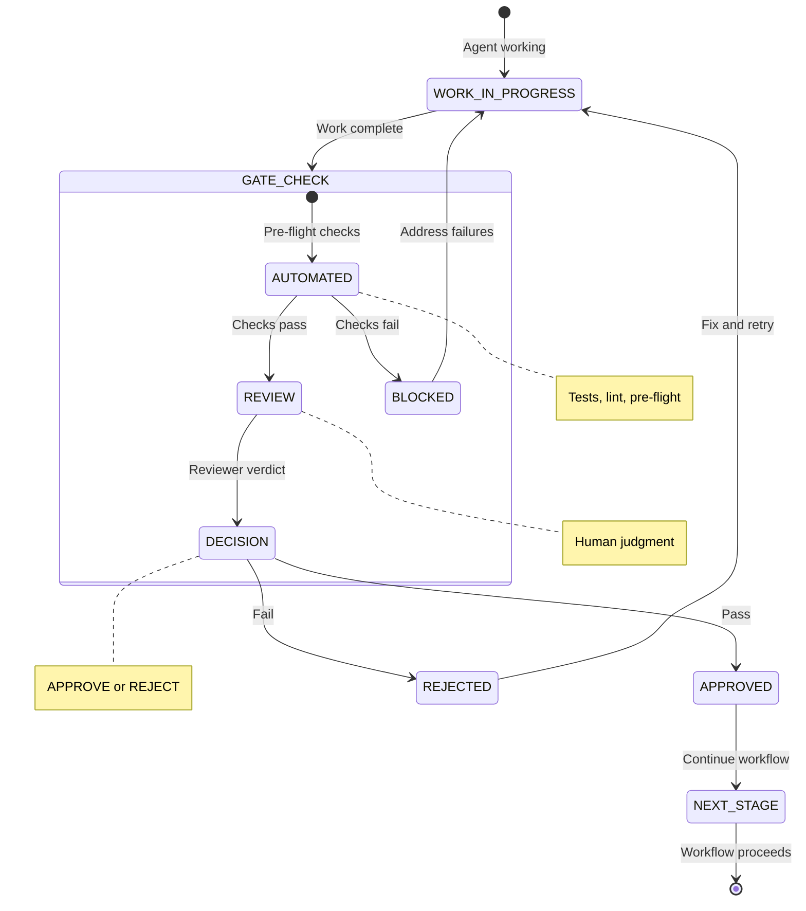

# Approval Gates Pattern

**Pattern Type:** Human-in-the-Loop Verification
**Agents Involved:** Any agent requiring external validation
**Coordination Mechanism:** Assessment-first protocol with verdict-based routing

## Problem Statement

Autonomous agent workflows need controlled decision points to ensure quality and maintain human oversight:

1. **Quality Escapes:** Without explicit gates, flawed work may proceed unchecked through the workflow
2. **Lost Accountability:** Decisions made without human awareness create auditability gaps
3. **Uncontrolled Progression:** Workflows advance even when conditions for success aren't met
4. **Context Loss:** State changes happen silently, making recovery and debugging difficult

Without approval gates, workflows may:
- Ship broken code that tests don't catch
- Make irreversible changes without confirmation
- Skip critical verification steps under time pressure
- Lose human oversight of important decisions

## Solution

Implement **explicit verification points** where workflow progression requires passing a gate condition. Gates can be automated (tests must pass), require human review (Reviewer approval), or request user decisions (via Reflector-aware prompts).

```
Workflow Stage
    │
    ▼
┌─────────────────┐
│  APPROVAL GATE  │
│  (verification) │
└────────┬────────┘
         │
    ┌────┴────┐
    │         │
  PASS      FAIL
    │         │
    ▼         ▼
Continue   Block/Route
Workflow   Back
```

The key insight: **Make workflow progression conditional on explicit verification** rather than allowing autonomous advancement.

### Four Gate Types

1. **Automated Gates** - Mechanical checks that must pass (tests, lint, pre-flight)
2. **Human Review Gates** - Expert judgment required before proceeding
3. **User Decision Gates** - Interactive choices via Reflector (CYCLIST marker + AskUserQuestion)
4. **Plan Approval Gates** - Confirmation of proposed approach via EnterPlanMode

## State Diagram



### ASCII Alternative

```
┌─────────────────────────────────────────────────────────────────────────┐
│                      APPROVAL GATES PATTERN                              │
└─────────────────────────────────────────────────────────────────────────┘

    ┌───────────────────┐
    │ WORK_IN_PROGRESS  │
    │   (agent works)   │
    └─────────┬─────────┘
              │
              │ Work complete, assessment written
              │
              ▼
    ┌───────────────────┐
    │   AUTOMATED GATE  │◄─── Tests, lint, pre-flight checks
    │   (mechanical)    │
    └─────────┬─────────┘
              │
         ┌────┴────┐
         │         │
       PASS      FAIL
         │         │
         ▼         └──────────────────────────────┐
    ┌───────────────────┐                         │
    │  HUMAN REVIEW     │◄─── Reviewer analyzes   │
    │   (judgment)      │     code/docs           │
    └─────────┬─────────┘                         │
              │                                   │
         ┌────┴────┐                              │
         │         │                              │
      APPROVE   REJECT                            │
         │         │                              │
         ▼         └──────────────────────────────┤
    ┌───────────────────┐                         │
    │   NEXT STAGE      │                         │
    │   (continues)     │                         │
    └───────────────────┘                         │
                                                  │
    ┌─────────────────────────────────────────────┘
    │
    ▼
┌───────────────────┐
│ WORK_IN_PROGRESS  │◄─── Fix issues, retry gate
│   (fix & retry)   │
└───────────────────┘
```

### The Rejection Loop

```
┌─────────────────────────────────────────────────────────────────────────┐
│                         REJECTION LOOP                                   │
└─────────────────────────────────────────────────────────────────────────┘

              Attempt 1                    Attempt 2
    ┌─────────────────────┐      ┌─────────────────────┐
    │                     │      │                     │
    │  Dev implements     │      │  Dev fixes issues   │
    │        ↓            │      │        ↓            │
    │  Tests GREEN        │      │  Tests GREEN        │
    │        ↓            │      │        ↓            │
    │  Reviewer reviews   │      │  Reviewer reviews   │
    │        ↓            │      │        ↓            │
    │  REJECTED (3 issues)│─────►│  APPROVED           │
    │                     │      │        ↓            │
    └─────────────────────┘      │  Continue to SM     │
                                 │                     │
                                 └─────────────────────┘

The loop continues until:
- All Critical/Major issues resolved
- Reviewer approves
- Maximum retry limit (organizational choice)
```

## Implementation

### Gate Type 1: Automated Gates

Mechanical checks that must pass before human review begins.

**Example: Reviewer Pre-flight**

```yaml
# Reviewer spawns pre-flight check before analysis
Task:
  subagent_type: "reviewer-preflight"
  description: "Gather pre-flight data"
  prompt: |
    STORY_ID: 5-2
    REPOS: api,frontend
    BRANCH: feature/5-2-implement-feature
    PR_NUMBER: 42

# Pre-flight returns:
# - Test results (must be GREEN)
# - Lint results (must be clean or documented exceptions)
# - Code smell analysis
# - Diff statistics
```

**Gate Condition:** Pre-flight checks pass. If tests fail or critical lint issues exist, gate blocks progression.

**Example: TEA RED Verification**

```yaml
# TEA handoff verifies tests are RED (failing)
# From tea-handoff.md L42-76

1. Spawn testing-runner subagent
2. Verify tests FAIL as expected
3. If all GREEN → BLOCKED (tests don't exercise new code)
4. If RED → PASS (ready for Dev)
```

### Gate Type 2: Human Review Gates

Require expert judgment from a designated reviewer agent.

**Example: Reviewer Approval/Rejection**

The Reviewer agent implements an adversarial review gate:

```markdown
## Reviewer Assessment

**PR:** #42
**Verdict:** APPROVED | REJECTED

**Code Review Evidence:**
- **Data flow traced:** userId from handler.go:47 → repo.go:89 (parameterized, safe)
- **Pattern observed:** Proper mutex usage in mock_client.go:45-60
- **Error handling:** API failures caught at service.go:112

**Issues Found:** (if REJECTED)
| Severity | Issue | Location | Fix Required |
|----------|-------|----------|--------------|
| Critical | SQL injection | query.go:23 | Use parameterized query |
| Major | Missing null check | handler.go:55 | Add validation |

**Handoff:** To SM for finish (APPROVED) | Back to Dev (REJECTED)
```

**Gate Condition:** Reviewer verdict is APPROVED. If REJECTED, workflow returns to Dev with documented issues.

### Gate Type 3: User Decision Gates

Interactive prompts that pause workflow for user input. **Requires Reflector pattern:**

1. Output CYCLIST marker first (enables Cyclist UI integration)
2. Then use AskUserQuestion tool

**Example: Reflector-Aware Story Selection**

```markdown
<!-- CYCLIST:CHOICES:story -->
```

```yaml
# SM presents story options to user (after outputting marker)
AskUserQuestion:
  questions:
    - question: "Which story shall we work on?"
      header: "Story"
      multiSelect: false
      options:
        - label: "5-2: Implement feature X (3 pts)"
          description: "Add new capability to API"
        - label: "5-3: Fix bug Y (2 pts)"
          description: "Address reported issue"
        - label: "5-4: Refactor Z (5 pts)"
          description: "Technical debt reduction"
```

**Gate Condition:** User selects an option. Workflow pauses until response received.

**Example: Confirmation Before Destructive Action**

```markdown
<!-- CYCLIST:QUESTION:yesno -->
```

```yaml
# Before Jira claim or branch deletion (after outputting marker)
AskUserQuestion:
  questions:
    - question: "Confirm claiming PROJ-11374 and creating branch?"
      header: "Confirm"
      multiSelect: false
      options:
        - label: "Yes, proceed"
          description: "Claim ticket and create feature branch"
        - label: "No, cancel"
          description: "Abort setup and return to story selection"
```

**Reflector Markers:**
- `<!-- CYCLIST:CHOICES:{category} -->` - Multiple choice selection
- `<!-- CYCLIST:QUESTION:yesno -->` - Yes/No confirmation
- `<!-- CYCLIST:QUESTION:open -->` - Free-text input

### Gate Type 4: Plan Approval Gates

Present proposed approach for user confirmation before execution.

**Example: EnterPlanMode for Complex Work**

```yaml
# Agent enters plan mode for non-trivial implementation
EnterPlanMode:
  # Triggers transition to planning state
  # Agent then:
  # 1. Explores codebase
  # 2. Designs approach
  # 3. Writes plan to designated file
  # 4. Calls ExitPlanMode for user approval

# In plan mode, agent writes:
## Implementation Plan

### Approach
1. Create new service layer component
2. Add repository methods for data access
3. Wire up HTTP handlers
4. Add comprehensive tests

### Files to Modify
- internal/service/feature.go (new)
- internal/repository/feature.go (new)
- internal/handler/feature.go (new)
- internal/handler/routes.go (modify)

### Risks
- May require database migration
- Performance impact on existing queries
```

**Gate Condition:** User approves plan via ExitPlanMode acceptance. If rejected, agent revises approach.

### The Assessment-First Protocol

**Critical Pattern:** All agents must write their assessment BEFORE starting the exit protocol.

```
┌─────────────────────────────────────────────────────────────────────────┐
│                    ASSESSMENT-FIRST PROTOCOL                             │
└─────────────────────────────────────────────────────────────────────────┘

    CORRECT SEQUENCE:

    ┌─────────────────┐
    │  Agent works    │
    └────────┬────────┘
             │
             ▼
    ┌─────────────────┐
    │ Write Assessment│◄─── Agent writes to session file FIRST
    │ to session file │
    └────────┬────────┘
             │
             ▼
    ┌─────────────────┐
    │ Spawn handoff   │◄─── Then spawns subagent
    │ subagent        │
    └────────┬────────┘
             │
             ▼
    ┌─────────────────┐
    │ Subagent verifies│◄─── Subagent checks assessment exists
    │ assessment exists│     (grep "## {Agent} Assessment")
    └────────┬────────┘
             │
             ▼
    ┌─────────────────┐
    │ Subagent routes │◄─── Routes based on verdict
    │ based on verdict│
    └─────────────────┘


    WRONG (Anti-pattern):

    Agent → Spawn subagent → Subagent writes assessment

    This fails because:
    - Subagent may miss critical context
    - No verification step
    - Assessment quality suffers
```

**Verification Code** (from handoff subagents):

```bash
# Step 0: Verify assessment exists
grep -q "## Reviewer Assessment" .session/{STORY_ID}-session.md

# If NOT found: STOP and escalate
# If found: Continue with routing
```

### Verdict Verification

Handoff subagents verify they were called with the correct verdict:

```yaml
# reviewer-handoff-approve.md L35-36
Step 2: Verify verdict is "APPROVED"
- Read assessment section
- Confirm verdict field says "APPROVED"
- If "REJECTED": STOP - wrong subagent called, escalate

# reviewer-handoff-reject.md L39
Step 2: Verify verdict is "REJECTED"
- Read assessment section
- Confirm verdict field says "REJECTED"
- If "APPROVED": STOP - wrong subagent called, escalate
```

### Context-Aware Routing

After gate passage, check context usage before invoking next agent:

```bash
# Check context usage
pf context

# Routing decision:
# If < 60%: Invoke next agent directly in this session
# If > 60%: Tell user to start fresh session with next agent
```

This prevents context overflow in long sessions by creating natural break points.

## When to Use

### Ideal Scenarios

| Scenario | Gate Type | Why |
|----------|-----------|-----|
| Before merging code | Human Review | Expert judgment on quality |
| Before destructive operations | User Decision | Confirmation prevents accidents |
| Complex multi-file changes | Plan Approval | Validate approach before execution |
| Before production deployment | Automated + Human | Multiple verification layers |
| Story point estimation | User Decision | Human judgment on complexity |

### Decision Heuristic

```
Does the action...
├── Affect production data or systems?
│   └── YES → Automated + Human Review gates
├── Involve irreversible changes?
│   └── YES → User Decision gate (confirmation)
├── Require choosing between approaches?
│   └── YES → Plan Approval or User Decision gate
├── Need expert judgment on quality?
│   └── YES → Human Review gate
└── Have mechanical pass/fail criteria?
    └── YES → Automated gate (tests, lint)
```

### Gate Placement in TDD Flow

```
┌─────────────────────────────────────────────────────────────────────────┐
│                    GATES IN TDD FLOW                                     │
└─────────────────────────────────────────────────────────────────────────┘

SM (setup)
    │
    ├── [User Decision Gate] Story selection
    ├── [User Decision Gate] Confirm Jira claim
    │
    ▼
TEA (RED)
    │
    ├── [Automated Gate] Tests must be RED (failing)
    │
    ▼
Dev (GREEN)
    │
    ├── [Automated Gate] Tests must be GREEN (passing)
    ├── [Automated Gate] Lint must pass
    │
    ▼
Reviewer
    │
    ├── [Automated Gate] Pre-flight checks
    ├── [Human Review Gate] Code review verdict
    │         │
    │    ┌────┴────┐
    │  APPROVE   REJECT
    │    │         │
    │    ▼         └──► Back to Dev (loop)
    │
    ▼
SM (finish)
    │
    ├── [User Decision Gate] Confirm archive
    │
    ▼
DONE
```

## Error Recovery

### Retry Pattern

All handoff subagents follow this pattern:

```
1. Log the failure
   - What step failed
   - Error message
   - Current state

2. Diagnose
   - What specifically went wrong?
   - Is this retryable?

3. Adjust (max 2 retries)
   - Try alternative approach
   - Use fallback path

4. Escalate
   - Report structured error
   - Let calling agent decide
```

### Escalation Format

When gates cannot be passed:

```markdown
GATE BLOCKED

Gate: [which gate]
Step failed: [step number and name]
Error: [error message]
Diagnosis: [what went wrong]

Current state:
- Session: .session/{STORY_ID}-session.md
- Phase: [current phase]
- Last successful step: [step]

Recommended action: [what calling agent should do]
```

### Common Failures

| Failure | Gate | Recovery |
|---------|------|----------|
| Assessment missing | Any handoff | Agent must write assessment first |
| Wrong verdict | Reviewer handoff | Call correct subagent (approve vs reject) |
| Tests all GREEN | TEA handoff | TEA must verify tests exercise new code |
| No issues documented | Rejection handoff | Reviewer must document specific issues |
| Context overflow | Any routing | Start fresh session |
| Jira unavailable | SM setup | Proceed without Jira, document for later |

### Partial Gate Passage

When some checks pass but others fail:

```markdown
## Gate Results

### Passed (2/3)
- Tests: GREEN (all passing)
- Lint: CLEAN (no issues)

### Failed (1/3)
- Pre-flight security scan: BLOCKED
  - Issue: Hardcoded credentials detected
  - Location: config/secrets.go:23
  - Action: Remove and use environment variables

### Decision
Gate BLOCKED. Address security issue before proceeding.
```

## Gate Language: Admonition Framing

Gate instructions MUST use hard-block admonition language. Never frame gates as suggestions, recommendations, or even "you MUST" — models treat these as optional under pressure.

**Correct (admonition):**
```
Do not proceed with implementation until you have read every source file
and listed all silent-failure issues with file:line references.
```

**Wrong (suggestion):**
```
You MUST audit source files before implementing.
Please check for silent failures.
You should review the codebase first.
```

The pattern is always: **"Do not proceed with [next action] until [condition is met]."**

This framing works because it defines a blocking precondition rather than adding a task to a list. The agent cannot rationalize skipping it — there is no "next action" available until the condition is satisfied.

## Anti-Patterns

### Skipping the Assessment Step

**Wrong:**
```
Agent completes work
    ↓
Runs exit protocol immediately
    ↓
resolve-gate finds no assessment
    ↓
Gate is effectively bypassed
```

**Correct:**
```
Agent completes work
    ↓
Writes assessment to session file
    ↓
Runs exit protocol (resolve-gate → complete-phase → marker)
    ↓
resolve-gate verifies assessment exists
    ↓
Gate functions properly
```

### Rubber-Stamp Approvals

**Wrong:**
```markdown
## Reviewer Assessment

**Verdict:** APPROVED

Tests pass, looks fine.
```

No evidence of actual review. Gate provides false confidence.

**Correct:**
```markdown
## Reviewer Assessment

**Verdict:** APPROVED

**Evidence:**
- Traced userId from handler.go:47 through to repo.go:89 (parameterized query, safe)
- Verified error handling at service.go:112 catches API failures
- Checked null guards at handler.go:55-60

**Security:** Auth check at handler.go:47 verifies admin role.
**Performance:** Single query at repo.go:89, no N+1 issues.
```

### Silent Rejections

**Wrong:**
```markdown
## Reviewer Assessment

**Verdict:** REJECTED

Code needs work.
```

No actionable information for Dev to fix issues.

**Correct:**
```markdown
## Reviewer Assessment

**Verdict:** REJECTED

**Issues Found:**

| Severity | Issue | Location | Fix Required |
|----------|-------|----------|--------------|
| Critical | SQL injection vulnerability | query.go:23 | Use parameterized query |
| Major | Missing error handling | service.go:45 | Add try-catch block |
| Minor | Inconsistent naming | model.go:12 | Rename to camelCase |

**What Passed:**
- Test coverage adequate
- Performance acceptable
```

### Bypassing Gates Under Pressure

**Wrong:**
```
"We need to ship today, skip the review"
    ↓
Gate bypassed
    ↓
Bug ships to production
    ↓
3am incident response
```

**Correct:**
```
"We need to ship today"
    ↓
Expedited review (still goes through gate)
    ↓
Reviewer prioritizes critical checks
    ↓
Gate passes or blocks appropriately
    ↓
Quality maintained
```

### No Rejection Loop Limit

**Wrong:**
```
Rejection #1 → Dev fixes → Rejection #2 → Dev fixes →
Rejection #3 → Dev fixes → Rejection #4 → Dev fixes →
(infinite loop, no escalation)
```

**Correct:**
```
Rejection #1 → Dev fixes → Rejection #2 → Dev fixes →
Rejection #3 → ESCALATE to Architect/SM for design review
```

Set organizational policy for maximum rejection loops (typically 2-3).

## Comparison with Related Patterns

| Pattern | Use When | Key Difference |
|---------|----------|----------------|
| **TDD Flow** | Sequential workflow | Approval gates ARE the transitions |
| **Helper Delegation** | Mechanical work | Subagents execute gate checks |
| **Fan-out/Fan-in** | Parallel work | Gates sync parallel results |
| **Approval Gates** | Decision points | Explicit pass/fail verification |

### Pattern Integration

Approval gates integrate with other patterns:

```
TDD Flow uses approval gates at each transition:
SM ──[gate]──► TEA ──[gate]──► Dev ──[gate]──► Reviewer ──[gate]──► SM

Helper delegation executes gate checks:
Reviewer (Opus) ──► reviewer-preflight (Haiku) ──► returns gate status

Fan-out aggregation triggers approval gate:
[Parallel checks] ──► Aggregate ──[gate]──► Continue if all pass
```

## Implementation Checklist

When implementing approval gates:

- [ ] Identify decision points requiring verification
- [ ] Choose appropriate gate type (automated, human, user, plan)
- [ ] Implement assessment-first protocol
- [ ] Add verdict verification in handoff subagents
- [ ] Define pass/fail criteria clearly
- [ ] Document rejection reasons (for human gates)
- [ ] Implement retry pattern with escalation
- [ ] Set maximum rejection loop limit
- [ ] Add context-aware routing after gates
- [ ] Test gate blocking behavior

## Related Patterns

- **TDD Flow Pattern** (`tdd-flow-pattern.md`): Sequential workflow that uses gates at each transition
- **Helper Delegation Pattern** (`helper-delegation-pattern.md`): Subagents that execute gate checks
- **Fan-out/Fan-in Pattern** (`fan-out-fan-in-pattern.md`): Parallel execution that aggregates through gates

## References

### Agent Definitions (Gate Implementers)
- Reviewer: `agents/reviewer.md` - Primary approval gate (L9-25 adversarial mindset, L188-228 assessment templates)
- SM: `agents/sm.md` - Status gates and scale routing (L82-93, L359-365)
- Dev: `agents/dev.md` - Self-review checklist (L137-144)
- TEA: `agents/tea.md` - Chore bypass criteria (L96-104)

### Handoff Subagents (Gate Executors)
- Approval routing: `agents/reviewer-handoff-approve.md` (L26-39)
- Rejection routing: `agents/reviewer-handoff-reject.md` (L30-43)
- RED verification: `agents/tea-handoff.md` (L42-76)
- GREEN verification: `agents/dev-handoff.md`

### Claude Code Tools
- `AskUserQuestion`: Interactive user decision gates (requires CYCLIST marker via Reflector)
- `EnterPlanMode` / `ExitPlanMode`: Plan approval gates
- `Task` with `subagent_type`: Delegated gate execution

### Reflector Hook
- `question_reflector_check.py`: Enforces CYCLIST marker before AskUserQuestion
- Markers: `<!-- CYCLIST:CHOICES:... -->`, `<!-- CYCLIST:QUESTION:yesno|open -->`

---

*Last verified: 2026-01-06*
*Pennyfarthing v4.0.0*
