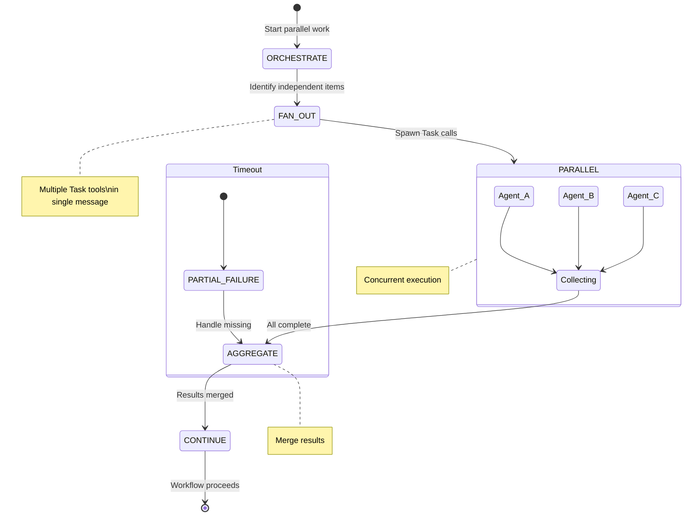

# Fan-out/Fan-in Pattern

**Pattern Type:** Parallel Execution with Aggregation
**Agents Involved:** Orchestrating agent + multiple parallel workers
**Coordination Mechanism:** Task tool with `run_in_background` + TaskOutput

## Problem Statement

Sequential agent workflows create bottlenecks when processing independent work items:

1. **Time Waste:** Waiting for each agent to complete before starting the next, even when work is independent
2. **Underutilization:** Compute resources sit idle while one agent runs
3. **Scaling Limits:** Total time grows linearly with work item count
4. **Unnecessary Coupling:** Independent operations blocked by unrelated predecessors

Without parallel execution, workflows may:
- Take N times longer for N independent items
- Miss opportunities for concurrent data gathering
- Create artificial dependencies between unrelated work
- Limit throughput when coordinating across multiple repositories

## Solution

Use **parallel Task invocations** to fan work out to multiple agents, then **aggregate results** when they complete. This creates a scatter-gather architecture:

```
Orchestrator
    │
    ├───► Agent A ──┐
    ├───► Agent B ──┼──► Collect Results ──► Continue
    └───► Agent C ──┘
```

The key insight: **Independent work items can execute concurrently** using Claude Code's Task tool parallelism.

### Two Parallelism Modes

1. **Implicit Parallelism:** Multiple Task calls in a single message execute concurrently
2. **Explicit Background:** Use `run_in_background: true` for long-running tasks with manual result collection

## State Diagram



### ASCII Alternative

```
┌─────────────────────────────────────────────────────────────────────────┐
│                      FAN-OUT/FAN-IN PATTERN                             │
└─────────────────────────────────────────────────────────────────────────┘

    ┌─────────────┐
    │ ORCHESTRATE │
    │  (decide    │
    │   work)     │
    └──────┬──────┘
           │
           │ Identify N independent work items
           │
           ▼
    ┌─────────────┐
    │  FAN-OUT    │
    │  (spawn)    │
    └──────┬──────┘
           │
     ┌─────┼─────┬─────┐
     │     │     │     │
     ▼     ▼     ▼     ▼
   ┌───┐ ┌───┐ ┌───┐ ┌───┐
   │ A │ │ B │ │ C │ │ D │  ◄── Parallel agents
   └─┬─┘ └─┬─┘ └─┬─┘ └─┬─┘
     │     │     │     │
     │     │     │     │      Work executes concurrently
     ▼     ▼     ▼     ▼
   ┌───┐ ┌───┐ ┌───┐ ┌───┐
   │ ✓ │ │ ✓ │ │ ✗ │ │ ✓ │  ◄── Results (may have failures)
   └─┬─┘ └─┬─┘ └─┬─┘ └─┬─┘
     │     │     │     │
     └─────┴─────┴─────┘
               │
               ▼
    ┌─────────────────┐
    │    FAN-IN       │
    │   (collect)     │
    └────────┬────────┘
             │
             │ Aggregate results, handle partial failures
             │
             ▼
    ┌─────────────────┐
    │    CONTINUE     │
    │   (proceed)     │
    └─────────────────┘
```

### Timing Comparison

```
Sequential (without pattern):
┌──────────────────────────────────────────────────────────────────────┐
│ Agent A │        │ Agent B │        │ Agent C │        │ Agent D │  │
│  (5s)   │ wait   │  (3s)   │ wait   │  (4s)   │ wait   │  (2s)   │  │
└──────────────────────────────────────────────────────────────────────┘
Total: 14 seconds + wait overhead

Parallel (with pattern):
┌──────────────────────────────────────────────────────────────────────┐
│ Agent A │████████████                                                │
│ Agent B │██████                                                      │
│ Agent C │████████                                                    │
│ Agent D │████                                                        │
└──────────────────────────────────────────────────────────────────────┘
Total: 5 seconds (longest task)
```

## Implementation

### Method 1: Implicit Parallelism (Multiple Task Calls)

When you include multiple Task tool invocations in a single response, Claude Code executes them concurrently:

```yaml
# In a single agent response, call multiple Tasks
# All three execute in parallel automatically

Task:
  subagent_type: "Explore"
  description: "Check frontend repo"
  prompt: |
    Scan frontend/ directory for TypeScript errors.
    Report count and severity.

Task:
  subagent_type: "Explore"
  description: "Check backend repo"
  prompt: |
    Scan api/ directory for Go lint issues.
    Report count and severity.

Task:
  subagent_type: "Explore"
  description: "Check shared libs"
  prompt: |
    Scan libs/ directory for outdated dependencies.
    Report count and severity.
```

Results return when all tasks complete. The agent then aggregates them.

### Method 2: Explicit Background Execution

For long-running tasks or when you need to do work while waiting:

```yaml
# Fan-out: Start background tasks
Task:
  subagent_type: "testing-runner"
  description: "Run backend tests"
  run_in_background: true
  prompt: |
    REPOS: api
    Execute test suite and report results.

Task:
  subagent_type: "testing-runner"
  description: "Run frontend tests"
  run_in_background: true
  prompt: |
    REPOS: frontend
    Execute test suite and report results.
```

This returns immediately with task IDs. To collect results:

```yaml
# Fan-in: Collect results (blocking)
TaskOutput:
  task_id: "abc123"  # ID from first Task result
  block: true
  timeout: 120000    # 2 minute timeout

TaskOutput:
  task_id: "def456"  # ID from second Task result
  block: true
  timeout: 120000
```

### Result Aggregation Pattern

After collecting results, merge them into a unified structure:

```markdown
## Multi-Repo Status Report

### Summary
| Repo | Status | Issues | Time |
|------|--------|--------|------|
| frontend | PASS | 0 | 3.2s |
| api | FAIL | 3 | 5.1s |
| libs | PASS | 0 | 1.8s |

### Total Issues: 3
### Overall Status: FAILING

### Details
[Aggregated from individual reports...]
```

### Real Example: Parallel Repo Status Check

**Use Case:** Check git status across multiple repositories simultaneously

```yaml
# Orchestrator spawns parallel status checks
Task:
  subagent_type: "Explore"
  description: "Check pennyfarthing status"
  prompt: |
    REPO: pennyfarthing
    PROJECT_ROOT: /Users/dev/Projects/pennyfarthing
    Report git status, branch, and uncommitted changes.

Task:
  subagent_type: "Explore"
  description: "Check API status"
  prompt: |
    REPO: api
    PROJECT_ROOT: /Users/dev/Projects/api
    Report git status, branch, and uncommitted changes.

Task:
  subagent_type: "Explore"
  description: "Check UI status"
  prompt: |
    REPO: ui
    PROJECT_ROOT: /Users/dev/Projects/ui
    Report git status, branch, and uncommitted changes.
```

### Real Example: Parallel File Analysis

**Use Case:** Analyze multiple files to build context for a story

```yaml
# SM agent gathers context from multiple files in parallel
Task:
  subagent_type: "sm-file-summary"
  description: "Summarize service layer"
  prompt: |
    FILES: internal/service/*.go
    Create condensed summary focusing on public interfaces.

Task:
  subagent_type: "sm-file-summary"
  description: "Summarize handlers"
  prompt: |
    FILES: internal/handlers/*.go
    Create condensed summary focusing on HTTP endpoints.

Task:
  subagent_type: "sm-file-summary"
  description: "Summarize models"
  prompt: |
    FILES: internal/models/*.go
    Create condensed summary focusing on data structures.
```

## When to Use

### Ideal Scenarios

| Scenario | Why Fan-out/Fan-in Works |
|----------|--------------------------|
| Multi-repo operations | Each repo is independent |
| Gathering diverse data | File scans don't affect each other |
| Running test suites | Tests across repos/packages run independently |
| Status checks | Checking N things concurrently |
| Independent file processing | Batch processing without dependencies |

### Decision Heuristic

```
Is the work...
├── Truly independent (no shared state)?
│   └── YES → Fan-out is safe
├── Using shared resources (same files, DB)?
│   └── CAUTION → May need synchronization
├── Order-dependent (A before B)?
│   └── NO fan-out → Use sequential
├── Aggregatable (results can be merged)?
│   └── YES → Fan-in will work
└── Failure-tolerant (partial success OK)?
    └── YES → Fan-out with error handling
```

### Concurrency Guidelines

| Work Items | Recommendation |
|------------|----------------|
| 2-5 | Implicit parallelism (multiple Task calls) |
| 5-10 | Explicit background with batching |
| 10+ | Consider chunking into batches |

## Error Recovery

### Partial Failure Handling

When some parallel tasks fail while others succeed:

```markdown
## Aggregated Results

### Successful (3/4)
| Task | Status | Result |
|------|--------|--------|
| Frontend check | SUCCESS | Clean |
| Backend check | SUCCESS | Clean |
| Lib check | SUCCESS | Clean |

### Failed (1/4)
| Task | Status | Error |
|------|--------|-------|
| DB check | TIMEOUT | Connection refused |

### Decision
**Proceeding with partial results.** DB check can be retried independently.
```

### Timeout Strategy

```yaml
# Set appropriate timeouts based on expected work
TaskOutput:
  task_id: "task-123"
  block: true
  timeout: 30000   # 30s for quick tasks

TaskOutput:
  task_id: "task-456"
  block: true
  timeout: 300000  # 5min for test suites
```

### Retry Pattern

```
For each failed task:
1. Log failure reason
2. Determine if retryable (timeout vs. permanent error)
3. Retry up to 2 times with backoff
4. If still failing, mark as failed in aggregate
5. Continue with successful results if acceptable
```

### Graceful Degradation

When complete failure is unacceptable:

```markdown
## Fallback Strategy

If parallel execution fails completely:
1. Fall back to sequential execution
2. Log degradation for monitoring
3. Continue workflow with slower path
```

## Anti-Patterns

### Dependent Tasks in Parallel

**Wrong:**
```yaml
# These have a dependency - B needs A's output!
Task:
  subagent_type: "analyzer"
  prompt: "Analyze the codebase and identify modules"

Task:
  subagent_type: "reporter"
  prompt: "Report on the modules identified above"  # Can't access A's output!
```

**Correct:**
```yaml
# Sequential for dependent work
Task:
  subagent_type: "analyzer"
  prompt: "Analyze the codebase and identify modules"
# Wait for result, then:
Task:
  subagent_type: "reporter"
  prompt: "Report on these modules: {modules_from_A}"
```

### Too Many Parallel Tasks

**Wrong:**
```yaml
# Spawning 50 parallel tasks overwhelms resources
for file in all_files:
    Task:
      prompt: "Process {file}"
      run_in_background: true
```

**Correct:**
```yaml
# Batch into manageable chunks
Task:
  prompt: "Process files 1-10: {batch_1}"
  run_in_background: true

Task:
  prompt: "Process files 11-20: {batch_2}"
  run_in_background: true
# ... continue with reasonable batch sizes
```

### Ignoring Failed Tasks

**Wrong:**
```markdown
# Silently proceeding despite failures
All tasks returned. Continuing with workflow...
```

**Correct:**
```markdown
# Explicit failure handling
## Task Results
- 3/4 tasks succeeded
- 1/4 tasks failed (timeout on repo-c)

## Decision
Partial failure is acceptable for status check.
Proceeding with available data.
```

### No Timeout on Background Tasks

**Wrong:**
```yaml
TaskOutput:
  task_id: "task-123"
  block: true
  # No timeout - could hang forever
```

**Correct:**
```yaml
TaskOutput:
  task_id: "task-123"
  block: true
  timeout: 60000  # Always set appropriate timeout
```

### Mixing Parallel and Sequential Without Awareness

**Wrong:**
```yaml
# A and B are parallel, but developer thinks B waits for A
Task:
  description: "Create branch"  # A
  prompt: "Create feature branch"

Task:
  description: "Commit to branch"  # B - races with A!
  prompt: "Commit initial files"
```

**Correct:**
```yaml
# Make dependency explicit
Task:
  description: "Create branch and commit"
  prompt: |
    1. Create feature branch
    2. Commit initial files
    # Sequential within single task
```

## Comparison with Related Patterns

| Pattern | Use When | Key Difference |
|---------|----------|----------------|
| **TDD Flow** | Sequential handoffs needed | One agent at a time |
| **Helper Delegation** | Strategic/tactical split | Opus delegates to Haiku |
| **Fan-out/Fan-in** | Independent parallel work | Multiple agents simultaneously |
| **Approval Gates** | Human decision points | Blocking on external input |

### Pattern Combinations

Fan-out/fan-in works well with other patterns:

```
TDD Flow with parallel repo checks:
SM ──► [Parallel status checks] ──► TEA ──► Dev ──► Reviewer ──► SM

Helper delegation with parallel subagents:
Opus ──► [Parallel Haiku tasks] ──► Opus continues
```

## Implementation Checklist

When implementing fan-out/fan-in:

- [ ] Verify work items are truly independent
- [ ] Choose implicit vs. explicit parallelism
- [ ] Set appropriate timeouts for each task type
- [ ] Plan result aggregation format
- [ ] Handle partial failures gracefully
- [ ] Consider batch size for many items
- [ ] Test timeout and failure scenarios
- [ ] Log parallel execution for debugging

## Related Patterns

- **TDD Flow Pattern** (`tdd-flow-pattern.md`): Sequential coordination that may use fan-out for status checks
- **Helper Delegation Pattern** (`helper-delegation-pattern.md`): Can be combined with parallel subagent spawning
- **Approval Gates Pattern** (`approval-gates-pattern.md`): May pause fan-out for human decision points

## References

### Claude Code Task Tool
- `Task`: Spawns agents, supports `run_in_background` for async execution
- `TaskOutput`: Collects results from background tasks
- Multiple Task calls in single message execute concurrently

### Agent Definitions
- Orchestrator: `agents/orchestrator.md` - Multi-agent coordination
- SM: `agents/sm.md` - Story workflow orchestration
- Testing Runner: `agents/testing-runner.md` - Parallel test execution candidate

### Current Usage Opportunities

| Component | Current | Parallel Opportunity |
|-----------|---------|---------------------|
| SM file summaries | Sequential | Parallel file analysis |
| Repo status checks | Sequential | Simultaneous repo scanning |
| Testing runner | Sequential per-repo | Parallel test suites |
| Multi-repo PR creation | Sequential | Parallel branch operations |

---

*Last verified: 2026-01-06*
*Pennyfarthing v4.0.0*
