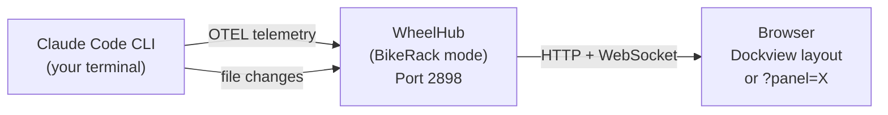
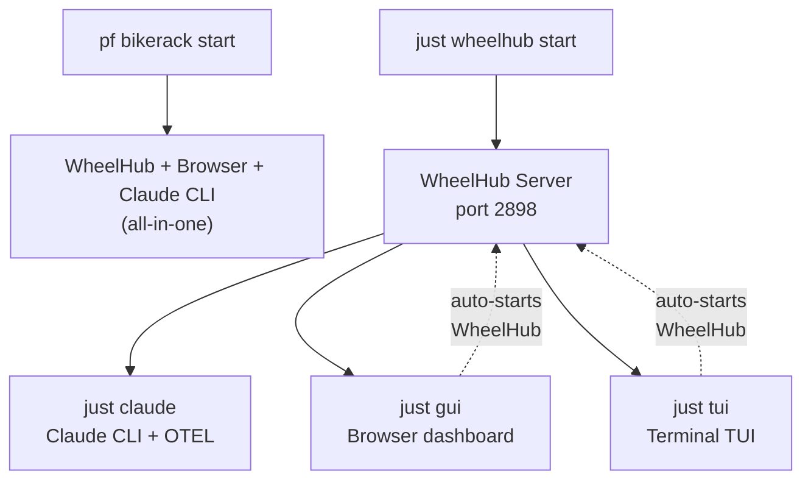
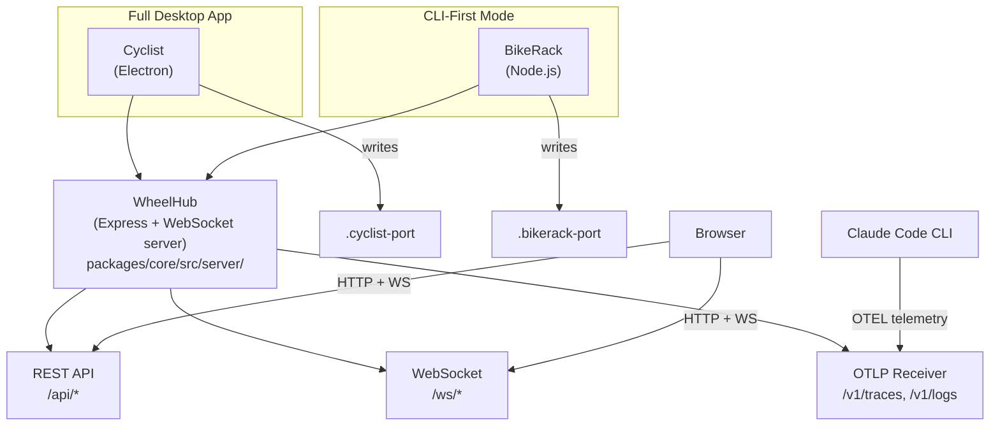
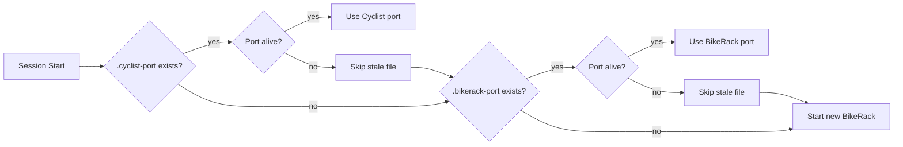

# BikeRack

<info>
Standalone panel viewer for CLI-first developers. BikeRack runs WheelHub (the Express/WebSocket server) without Cyclist's conversation UI, serving dashboard panels in a browser while Claude Code runs in your own terminal.
</info>

## Overview

Cyclist bundles the conversation UI and dashboard panels into one Electron app. BikeRack decouples them: you get the panels (sprint status, git diffs, workflow state, etc.) in a browser, and Claude Code stays in your terminal.



## Choose Your Path

| I want to... | Use | Terminals |
|--------------|-----|-----------|
| Get started fast, don't care about details | `pf bikerack start` | 1 |
| See dashboards in my browser while I work | `just gui` then `just claude` | 2 |
| Stay fully in the terminal (no browser) | `just tui` then `just claude` | 2 |
| Run the server headless for scripting/CI | `just wheelhub start` | 1 |
| Use the full Electron desktop app | Cyclist (separate install) | 1 |

## Quick Start

Pick your path and follow the steps below.

### Path A: All-in-one (recommended for first use)

```bash
pf bikerack start
```

One command. Starts WheelHub, opens the browser dashboard, launches Claude CLI in the foreground with OTEL telemetry pre-configured. When Claude exits, BikeRack shuts down automatically.

### Path B: Browser dashboard + Claude CLI

```bash
# Terminal 1: Start server + open browser
just gui

# Terminal 2: Launch Claude with telemetry
just claude
```

`just gui` auto-starts WheelHub if it isn't running, then opens Chrome to the Dockview dashboard. Run `just claude` in a second terminal to get OTEL telemetry flowing to the dashboard panels.

### Path C: Terminal TUI + Claude CLI

```bash
# Terminal 1: Start server + launch TUI
just tui

# Terminal 2: Launch Claude with telemetry
just claude
```

`just tui` auto-starts WheelHub if it isn't running, then launches a Textual-based TUI in your terminal. Requires `uv` for Python dependency management. Run `just claude` in a second terminal.

### Path D: Headless server (advanced)

```bash
# Start/stop/check the server independently
just wheelhub start
just wheelhub status
just wheelhub stop

# Then attach whatever you want
just claude          # Claude CLI with OTEL
just gui             # Browser dashboard
just tui             # Terminal TUI
```

Use this when you want full control over the server lifecycle, or when scripting.

### Launch Mode Relationships



### Command Reference

| Command | What it does |
|---------|-------------|
| `pf bikerack start` | All-in-one: WheelHub + browser + Claude CLI with OTEL |
| `pf bikerack stop` | Stop a running BikeRack instance |
| `pf bikerack status` | Check if BikeRack is running |
| `just wheelhub start` | Start WheelHub server only (port 2898) |
| `just wheelhub stop` | Stop the WheelHub server |
| `just wheelhub status` | Show server status and port |
| `just claude` | Launch Claude CLI with all 5 OTEL env vars pre-set |
| `just tui` | Auto-start WheelHub + launch Textual TUI (requires `uv`) |
| `just gui` | Auto-start WheelHub + open browser to dashboard |

### OTEL Telemetry Note

**Why `just claude` instead of bare `claude`?** Claude Code's OTEL SDK initializes before session hooks run. The `CLAUDE_ENV_FILE` hook mechanism injects vars into Bash subshells, not into Claude's own process. `just claude` sets all 5 OTEL vars (`CLAUDE_CODE_ENABLE_TELEMETRY`, `OTEL_EXPORTER_OTLP_PROTOCOL`, `OTEL_EXPORTER_OTLP_ENDPOINT`, `OTEL_LOGS_EXPORTER`, `OTEL_METRICS_EXPORTER`) in the process environment *before* `exec claude`, ensuring the SDK picks them up at startup.

`pf bikerack start` handles this automatically.

## Panel Routing

BikeRack supports two modes:

**Dockview layout** (default) — full multi-panel workspace at `http://localhost:{port}/bikerack`

**Standalone panel** — single panel full-screen via query param:

| URL | Panel |
|-----|-------|
| `?panel=sprint` | Sprint status |
| `?panel=git` | Git operations |
| `?panel=diffs` | Diff viewer |
| `?panel=workflow` | Workflow state |
| `?panel=changed` | Changed files |
| `?panel=ac` | Acceptance criteria |
| `?panel=todos` | Task list |
| `?panel=audit` | Audit log |
| `?panel=background` | Background jobs |
| `?panel=debug` | Debug/prime context |
| `?panel=bikelane` | BikeLane workflow |
| `?panel=settings` | Settings |
| `?panel=portrait` | Agent portrait |

## Architecture

WheelHub is the shared Express/WebSocket server that powers both Cyclist and BikeRack. It is a library, not a standalone process — it always runs inside one of these two wrappers:



WheelHub itself never writes a port file — the wrapper that starts it does. This matters for OTEL auto-configuration: hooks must check `.cyclist-port` and `.bikerack-port`, not a `.wheelhub-port` (which doesn't exist).

## How It Works

1. **Launcher** (`pf bikerack start`) starts WheelHub with `IS_BIKERACK=1`
2. **WheelHub** listens on port 2898 (separate from Cyclist's 1898)
3. **Launcher writes `.bikerack-port`** after `server.listen()` — readiness signal
4. **ClaudeService is skipped** — no `/ws/claude` WebSocket channel
5. **OTEL telemetry** flows from Claude CLI to WheelHub's OTLP receiver
6. **File watchers** detect changes to `.session/`, `sprint/`, and git state
7. **Panels** render as React components consuming WebSocket data — identical components to Cyclist

### Mode Detection

```typescript
// Server-side
import { isBikeRackMode } from './server.js';
if (isBikeRackMode()) { /* skip Claude-specific setup */ }
```

Client-side detection is URL-based: the presence of `?panel=X` triggers standalone rendering.

### Port and PID Files

Each wrapper writes its own port file on startup and deletes it on clean shutdown:

| Mode | Port File | PID File | Default Port |
|------|-----------|----------|--------------|
| Cyclist (Electron) | `.cyclist-port` | — | 1898 |
| BikeRack (CLI) | `.bikerack-port` | `.wheelhub-pid` | 2898 |

**Stale port files:** If a process crashes or is force-killed, the port file survives. The session start hook verifies ports are alive (socket liveness check) before trusting port files, and falls back to the next candidate if a port is stale.



## Layout Persistence

Save and restore BikeRack panel layouts:

```bash
pf bc save my-layout      # Save current layout
pf bc load my-layout      # Restore a saved layout
pf bc list                 # List saved layouts
```

## Key Files

| File | Purpose |
|------|---------|
| `packages/cyclist/src/bikerack.ts` | BikeRack WheelHub entry point |
| `packages/core/src/public/components/BikeRackWorkspace.tsx` | Dockview layout for BikeRack |
| `packages/core/src/public/components/BikeRackIndex.tsx` | Panel listing index page |
| `packages/core/src/public/components/StandalonePanel.tsx` | `?panel=X` routing + `PANEL_REGISTRY` |
| `pennyfarthing_scripts/bikerack/cli.py` | `pf bikerack` launcher CLI |

## Constraints

- **No MessagePanel** — Claude conversation stays in your terminal. This is intentional.
- **Single session** — one Claude CLI per BikeRack instance (multi-session is deferred).
- **Bell/Relay/Reflector are dormant** — these features require ClaudeService and are skipped in BikeRack mode.

<info>
**ADR:** `docs/adr/0024-bikerack-mode.md`
</info>
