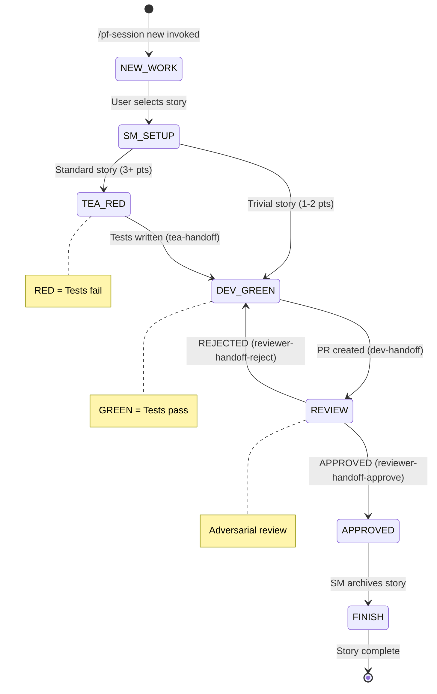

# TDD Flow Pattern

**Pattern Type:** Sequential Handoff Chain
**Agents Involved:** SM, TEA, Dev, Reviewer
**Coordination Mechanism:** Session file state machine

## Problem Statement

Multi-agent development workflows need structured coordination to ensure:
- Tests are written before implementation (TDD discipline)
- Code is reviewed before merge (quality gate)
- State is preserved across agent transitions
- Error recovery paths are clear

Without explicit coordination, agents may:
- Skip testing entirely
- Implement without understanding requirements
- Approve code without thorough review
- Lose context during handoffs

## Solution

A linear state machine where each agent:
1. Receives work in a known state
2. Performs their specialized role
3. Transitions to the next state via handoff subagent
4. Passes control to the next agent

```
SM (setup) → TEA (RED) → Dev (GREEN) → Reviewer (gate) → SM (finish)
```

Each transition is mediated by a **handoff subagent** that updates the session file, ensuring the next agent has clear context.

## State Diagram



### ASCII Alternative

```
┌─────────────────────────────────────────────────────────────────────┐
│                         TDD FLOW STATE MACHINE                       │
└─────────────────────────────────────────────────────────────────────┘

    ┌──────────┐
    │ NEW_WORK │ ─────────────────────────────────────┐
    └────┬─────┘                                      │
         │ User selects story                         │
         ▼                                            │
    ┌──────────┐                                      │
    │ SM_SETUP │                                      │
    └────┬─────┘                                      │
         │                                            │
         ├─────────────────┐                          │
         │ 3+ pts          │ 1-2 pts (skip TEA)       │
         ▼                 │                          │
    ┌──────────┐           │                          │
    │ TEA_RED  │           │                          │
    │ (tests   │           │                          │
    │  fail)   │           │                          │
    └────┬─────┘           │                          │
         │ tea-handoff     │                          │
         ▼                 ▼                          │
    ┌───────────────────────┐                         │
    │      DEV_GREEN        │ ◄───────────────────────┤
    │   (tests pass, PR)    │                         │
    └──────────┬────────────┘                         │
               │ dev-handoff                          │
               ▼                                      │
    ┌──────────────────────┐                          │
    │       REVIEW         │                          │
    │  (adversarial gate)  │                          │
    └──────────┬───────────┘                          │
               │                                      │
         ┌─────┴─────┐                                │
         │           │                                │
    REJECTED    APPROVED                              │
         │           │                                │
         │           ▼                                │
         │     ┌──────────┐                           │
         │     │  FINISH  │                           │
         │     │ (archive)│                           │
         │     └────┬─────┘                           │
         │          │                                 │
         │          ▼                                 │
         │     ┌──────────┐                           │
         │     │   DONE   │                           │
         │     └──────────┘                           │
         │                                            │
         └──────────────► DEV_GREEN (fix issues)      │
```

## Implementation

### Session File Structure

The session file (`.session/{story-id}-session.md`) tracks state:

```markdown
# Story 5-2: Implement Feature X

## Story Info
- Story ID: 5-2
- Title: Implement Feature X
- Points: 3
- Phase: dev          # Current phase: sm | tea | dev | review | approved
- Status: in-progress
- Repos: pennyfarthing
- Branch: feature/5-2-implement-feature-x

## Workflow
- [x] Story claimed
- [x] Session file created
- [x] TEA: Tests written (RED)
- [ ] Dev: Implementation complete (GREEN)
- [ ] Reviewer: Code approved
- [ ] SM: Story archived
```

### Phase Transitions

| From | To | Trigger | Subagent |
|------|-----|---------|----------|
| setup | red | Story setup complete | `sm-setup MODE=setup` + `sm-handoff` |
| setup | implement | 1-2 pt story (skip TEA) | `sm-setup MODE=setup` + `sm-handoff` |
| red | green | Tests written, failing | `handoff CURRENT_PHASE=red` |
| green | review | PR created, tests pass | `handoff CURRENT_PHASE=green` |
| review | implement | Issues found | `handoff VERDICT=rejected` |
| review | approved | No blocking issues | `handoff VERDICT=approved` |
| approved | done | Story archived | `sm-finish PHASE=execute` |

### Agent Responsibilities

#### SM (Scrum Master)
**Entry:** `/pf-session new` command
**Role:** Story selection, context creation, finish workflow
**Files:** `agents/sm.md`

Key behaviors:
- Reads workflow state from prime activation output
- Creates story context with technical approach
- Routes to TEA (standard) or Dev (trivial)
- Handles finish flow when story approved

```yaml
# SM routing decision
| Points | Scale | Route |
|--------|-------|-------|
| 1-2 pts | Trivial | SM → Dev (skip TEA) |
| 3-5 pts | Standard | SM → TEA → Dev |
| 8+ pts | Complex | SM → TEA → Dev |
```

#### TEA (Test Engineer/Architect)
**Entry:** Handoff from SM
**Role:** Write failing tests (RED phase)
**Files:** `agents/tea.md`

Key behaviors:
- Analyzes acceptance criteria for testability
- Writes tests that FAIL (RED state)
- May bypass tests for documentation/config changes
- Spawns `tea-handoff` to update session

```markdown
## TEA Assessment
**Tests Required:** Yes
**Test Files:**
- `internal/service/feature_test.go` - Unit tests for feature logic
**Tests Written:** 4 tests covering 3 ACs
**Status:** RED (failing - ready for Dev)
```

#### Dev (Developer)
**Entry:** Handoff from TEA (or SM for trivial)
**Role:** Implement code to pass tests (GREEN phase)
**Files:** `agents/dev.md`

Key behaviors:
- Implements minimal code to pass tests
- Follows RED → GREEN → Refactor cycle
- Creates PR with clear description
- Spawns `dev-handoff` to update session

```markdown
## Dev Assessment
**Implementation Complete:** Yes
**Files Changed:**
- `internal/service/feature.go` - Core implementation
**Tests:** 4/4 passing (GREEN)
**PR:** #42 - Implement feature X
```

#### Reviewer (Code Reviewer)
**Entry:** Handoff from Dev
**Role:** Adversarial code review (quality gate)
**Files:** `agents/reviewer.md`

Key behaviors:
- Spawns `reviewer-preflight` for mechanical checks
- Performs security, edge case, and performance analysis
- Makes APPROVE/REJECT judgment
- Routes back to Dev (reject) or SM (approve)

```markdown
## Reviewer Assessment
**PR:** #42
**Verdict:** APPROVED | REJECTED

**Code Review Evidence:**
- **Data flow traced:** userId from request → SQL (parameterized at repo.go:89)
- **Pattern observed:** Follows existing service pattern
- **Error handling:** Returns wrapped errors with context
```

### Handoff Subagents

Each handoff subagent (Haiku model) handles mechanical updates:

| Subagent | Purpose | Updates |
|----------|---------|---------|
| `tea-handoff` | TEA → Dev transition | Phase, workflow checkboxes, next agent |
| `dev-handoff` | Dev → Reviewer transition | Phase, PR info, workflow checkboxes |
| `reviewer-handoff-approve` | Reviewer → SM (finish) | Phase to approved, route to SM |
| `reviewer-handoff-reject` | Reviewer → Dev (fix) | Phase back to dev, issue summary |

Example invocation:
```yaml
Task tool:
  subagent_type: "dev-handoff"
  prompt: |
    STORY_ID: 5-2
    REPOS: pennyfarthing
    PR_NUMBER: 42
    TEST_COUNT: 4
```

## When to Use

**Use TDD Flow when:**
- Building new features that need testing
- Implementing stories with clear acceptance criteria
- Work benefits from structured code review

**Skip TEA phase when:**
- Documentation-only changes
- Configuration changes
- Dependency updates
- Refactoring with existing test coverage

**Don't use this pattern for:**
- Exploratory spikes (use Plan mode instead)
- Bug fixes (may use abbreviated flow)
- Emergency hotfixes (direct to main with review)

## Error Recovery

### Rejection Loop

```
Dev submits PR → Reviewer rejects → Dev fixes → Reviewer re-reviews
```

The rejection loop continues until:
- All Critical/Major issues are resolved
- Reviewer approves

Session file tracks rejection count and issues.

### Missing Epic Context

```
User runs /pf-session new → prime detects no epic context
→ Returns MISSING_EPIC_CONTEXT state
→ Blocks until user runs /pf-epic start
```

### Context Overflow

Each agent checks context usage after completing work:

```bash
$CLAUDE_PROJECT_DIR/scripts/core/check-context.sh --human
```

| Context | Action |
|---------|--------|
| < 60% | Invoke next agent directly |
| > 60% | Tell user to start fresh session |

This prevents context overflow mid-flow.

### Stale Session Recovery

If a session file exists but work was interrupted:

1. Prime detects `IN_PROGRESS_STATE` in activation output
2. Reports which agent should resume
3. User decides: continue or abandon

### Test Failures in Review

If tests fail during review preflight:
1. Reviewer spawns `testing-runner` subagent
2. Tests fail → automatic rejection
3. Routes back to Dev with failure details

## Anti-Patterns

### Skipping Phases

**Wrong:**
```
SM → Dev → merge
```
Missing TEA means no test discipline. Missing Reviewer means no quality gate.

**Correct:**
```
SM → TEA → Dev → Reviewer → SM (finish)
```

### Rubber-Stamp Reviews

**Wrong:**
```markdown
Tests pass, lint clean, approved.
```

**Correct:**
```markdown
**Data flow traced:** userId from handler.go:47 → repo.go:89 (parameterized)
**Pattern:** Follows usePresence hook pattern at hooks/usePresence.ts:12
**Security:** Auth check at handler.go:52 verifies admin role
```

### Skipping Handoff Subagents

**Wrong:**
```
TEA writes tests → directly tells Dev to continue
```
Session file not updated, next agent unclear.

**Correct:**
```
TEA writes tests → spawns tea-handoff → session updated → Dev activated
```

### Giant PRs

**Wrong:**
```
Story: 8 pts, 47 files changed, 2000+ lines
```

**Correct:**
```
Break into smaller stories (2-3 pts each)
Each story: 5-15 files, focused changes
```

## Related Patterns

- **Helper Delegation Pattern** (`helper-delegation-pattern.md`): How Opus agents delegate mechanical work to Haiku subagents
- **Approval Gates Pattern** (`approval-gates-pattern.md`): Deep dive on Reviewer approval mechanisms
- **Fan-out/Fan-in Pattern** (`fan-out-fan-in-pattern.md`): Parallel agent execution

## References

- SM Agent: `agents/sm.md`
- TEA Agent: `agents/tea.md`
- Dev Agent: `agents/dev.md`
- Reviewer Agent: `agents/reviewer.md`
- Agent Behavior: `guides/agent-behavior.md`

---

*Last verified: 2026-01-06*
*Pennyfarthing v4.0.0*
