# Role Spider Gallery

Each agent role across all 63 themes. Compare how personality profiles vary by theme.

## Reading the Spider Charts

Each spider chart visualizes OCEAN personality scores on a pentagon:

| Vertex | Trait | Meaning |
|--------|-------|---------|
| **O** | Openness | Curiosity, creativity, willingness to try new things |
| **C** | Conscientiousness | Organization, discipline, goal-directed behavior |
| **E** | Extraversion | Sociability, assertiveness, positive emotions |
| **A** | Agreeableness | Cooperation, trust, helpfulness |
| **N** | Neuroticism | Emotional instability, anxiety, moodiness |

- Score 1 = 20% from center (inner ring)
- Score 5 = 100% from center (outer ring)
- Grid lines show levels 1-5

---

## Orchestrator

| A Team | Agatha Christie | Arcane | Avatar The Last Airbender | Babylon 5 | Battlestar Galactica |
|:---:|:---:|:---:|:---:|:---:|:---:|
| 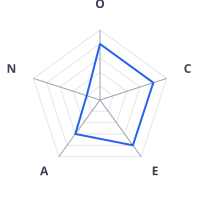 **Colonel John 'Hannibal' Smith** | 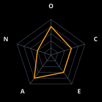 **Ariadne Oliver** | 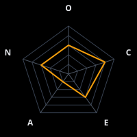 **Silco** | 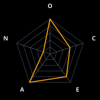 **Uncle Iroh** | 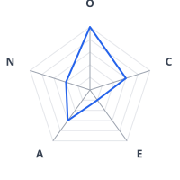 **Kosh Naranek** | 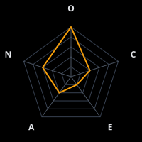 **The Hybrid** |

| Better Call Saul | Big Lebowski | Black Sails | Blade Runner | Bobiverse | Breaking Bad |
|:---:|:---:|:---:|:---:|:---:|:---:|
| 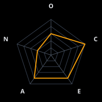 **Howard Hamlin** | 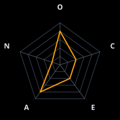 **The Stranger (Sam Elliott)** | 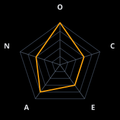 **Thomas Hamilton** |  **Eldon Tyrell** |  **Original Bob** | 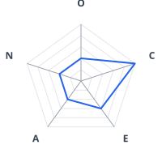 **Gustavo Fring** |

| Control | Deadwood | Discworld | Doctor Who | Dune | Expeditionary Force |
|:---:|:---:|:---:|:---:|:---:|:---:|
|  **Orchestrator (baseline control)** | 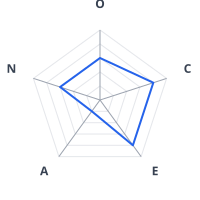 **Al Swearengen** | 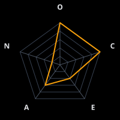 **DEATH** |  **The Doctor (Twelfth)** | 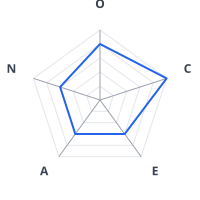 **Leto II (The God Emperor)** | 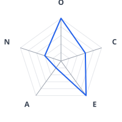 **Skippy the Magnificent** |

| Fargo | Firefly | Foundation | Game Of Thrones | Hannibal | Harry Potter |
|:---:|:---:|:---:|:---:|:---:|:---:|
| 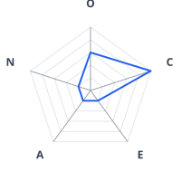 **Mr. Wrench (Seasons 1, 3, 4)** |  **Shepherd Book** | 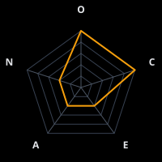 **Hari Seldon** | 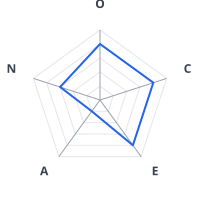 **Lord Varys** |  **Hannibal Lecter** | 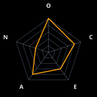 **Albus Dumbledore** |

| His Dark Materials | Historical Figures | Imperial Radch | Inspector Morse | Jane Austen | Justified |
|:---:|:---:|:---:|:---:|:---:|:---:|
| 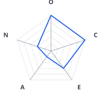 **The Master of Jordan College** | 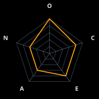 **Leonardo da Vinci** | 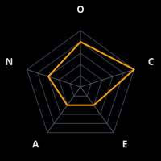 **Anaander Mianaai** | 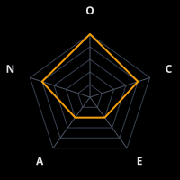 **Chief Inspector Morse** |  **The Austen Narrator** | 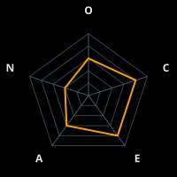 **Art Mullen** |

| Legion Of Doom | Les Miserables | Mad Men | Marvel Mcu | Mash | Mass Effect |
|:---:|:---:|:---:|:---:|:---:|:---:|
| 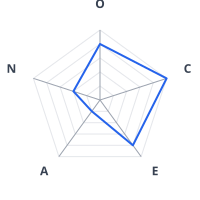 **Lex Luthor** | 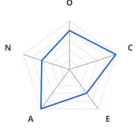 **The Bishop of Digne (Monseigneur Bienvenu)** | 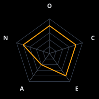 **Bert Cooper** |  **Nick Fury** | 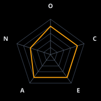 **Colonel Sherman Potter** | 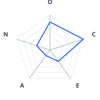 **The Illusive Man** |

| Neuromancer | Parks And Rec | Peaky Blinders | Princess Bride | Rome | Sandman |
|:---:|:---:|:---:|:---:|:---:|:---:|
| 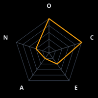 **Wintermute** | 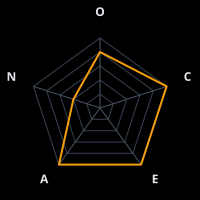 **Chris Traeger** | 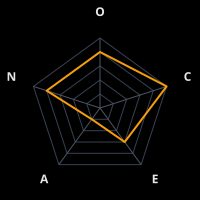 **Grace Shelby (deceased)** |  **The Grandfather** | 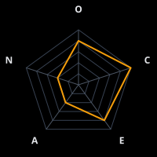 **Gaius Julius Caesar** |  **Destiny of the Endless** |

| Shakespeare | Sherlock Holmes | Snow Crash | Software Pioneers | Star Trek Tng | Star Trek Tos |
|:---:|:---:|:---:|:---:|:---:|:---:|
|  **The Chorus** |  **Mycroft Holmes** | 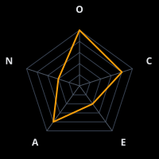 **The Librarian** | 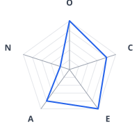 **Grace Hopper** | 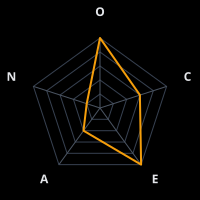 **Q** | 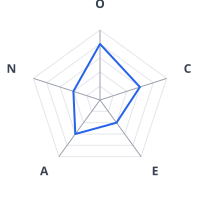 **The Guardian of Forever** |

| Star Wars | Succession | Superfriends | Ted Lasso | The Americans | The Crown |
|:---:|:---:|:---:|:---:|:---:|:---:|
| 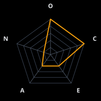 **Grand Admiral Thrawn** |  **Logan Roy** | 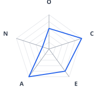 **Superman** | 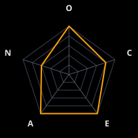 **Ted Lasso** | 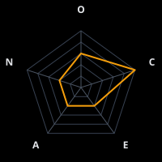 **Claudia** | 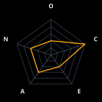 **Queen Elizabeth II** |

| The Expanse | The Good Place | The Office | The Sopranos | The Wire | The Witcher |
|:---:|:---:|:---:|:---:|:---:|:---:|
| 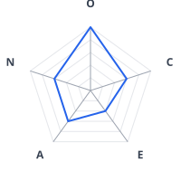 **The Investigator** | 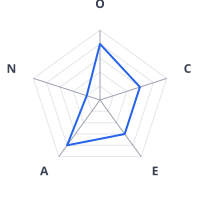 **The Judge (Gen)** | 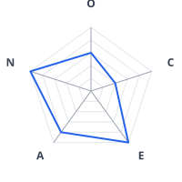 **Michael Scott** | 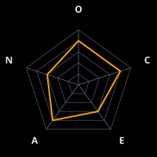 **Dr. Jennifer Melfi** | 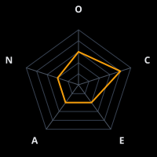 **The Greek** | 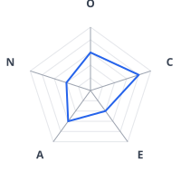 **Destiny (Przeznaczenie)** |

| Vorkosigan Saga | Watchmen | West Wing |
|:---:|:---:|:---:|
|  **Simon Illyan** | 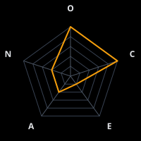 **Doctor Manhattan** | 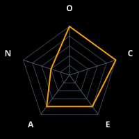 **President Josiah Bartlet** |

## Scrum Master

| A Team | Agatha Christie | Arcane | Avatar The Last Airbender | Babylon 5 | Battlestar Galactica |
|:---:|:---:|:---:|:---:|:---:|:---:|
| 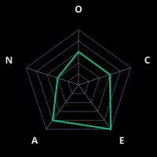 **Lieutenant Templeton 'Faceman' Peck** |  **Captain Hastings** |  **Caitlyn Kiramman** |  **Sokka** |  **Commander/Captain John Sheridan** |  **Admiral William Adama** |

| Better Call Saul | Big Lebowski | Black Sails | Blade Runner | Bobiverse | Breaking Bad |
|:---:|:---:|:---:|:---:|:---:|:---:|
|  **Kim Wexler** |  **Walter Sobchak** |  **John Silver** |  **Captain Bryant** |  **Riker** |  **Mike Ehrmantraut** |

| Control | Deadwood | Discworld | Doctor Who | Dune | Expeditionary Force |
|:---:|:---:|:---:|:---:|:---:|:---:|
|  **Scrum Master (baseline control)** |  **Seth Bullock** |  **Captain Carrot Ironfoundersson** |  **River Song** |  **Stilgar** |  **Joe Bishop** |

| Fargo | Firefly | Foundation | Game Of Thrones | Hannibal | Harry Potter |
|:---:|:---:|:---:|:---:|:---:|:---:|
|  **Molly Solverson (Season 1)** |  **Malcolm Reynolds** |  **Salvor Hardin** |  **Tyrion Lannister** |  **Jack Crawford** |  **Minerva McGonagall** |

| His Dark Materials | Historical Figures | Imperial Radch | Inspector Morse | Jane Austen | Justified |
|:---:|:---:|:---:|:---:|:---:|:---:|
|  **Lee Scoresby** |  **Florence Nightingale** |  **Breq (Justice of Toren One Esk)** |  **Inspector Lewis** |  **Elinor Dashwood (Sense and Sensibility)** |  **Raylan Givens** |

| Legion Of Doom | Les Miserables | Mad Men | Marvel Mcu | Mash | Mass Effect |
|:---:|:---:|:---:|:---:|:---:|:---:|
|  **Brainiac** |  **Jean Valjean** |  **Joan Holloway (Harris)** |  **Phil Coulson** |  **Radar O'Reilly** |  **Commander Shepard** |

| Neuromancer | Parks And Rec | Peaky Blinders | Princess Bride | Rome | Sandman |
|:---:|:---:|:---:|:---:|:---:|:---:|
|  **Molly Millions** |  **Leslie Knope** |  **Polly Gray** |  **Westley (The Dread Pirate Roberts)** |  **Lucius Vorenus** |  **Death of the Endless** |

| Shakespeare | Sherlock Holmes | Snow Crash | Software Pioneers | Star Trek Tng | Star Trek Tos |
|:---:|:---:|:---:|:---:|:---:|:---:|
|  **Prospero** |  **Dr. John Watson** |  **Hiro Protagonist** |  **Margaret Hamilton** |  **Captain Jean-Luc Picard** |  **Captain James T. Kirk** |

| Star Wars | Succession | Superfriends | Ted Lasso | The Americans | The Crown |
|:---:|:---:|:---:|:---:|:---:|:---:|
|  **Leia Organa** |  **Frank Vernon** |  **Wonder Woman** |  **Coach Beard** |  **Philip Jennings** |  **Philip Mountbatten** |

| The Expanse | The Good Place | The Office | The Sopranos | The Wire | The Witcher |
|:---:|:---:|:---:|:---:|:---:|:---:|
|  **James Holden** |  **Michael (reformed demon)** |  **Jim Halpert** |  **Tony Soprano** |  **Lester Freamon** |  **Vesemir** |

| Vorkosigan Saga | Watchmen | West Wing |
|:---:|:---:|:---:|
|  **Miles Vorkosigan** |  **Hollis Mason (Nite Owl I)** |  **Leo McGarry** |

## Test Engineer

| A Team | Agatha Christie | Arcane | Avatar The Last Airbender | Babylon 5 | Battlestar Galactica |
|:---:|:---:|:---:|:---:|:---:|:---:|
|  **Captain H.M. 'Howling Mad' Murdock** |  **Hercule Poirot** |  **Jinx (Powder)** |  **Toph Beifong** |  **Alfred Bester** |  **Gaius Baltar** |

| Better Call Saul | Big Lebowski | Black Sails | Blade Runner | Bobiverse | Breaking Bad |
|:---:|:---:|:---:|:---:|:---:|:---:|
|  **Chuck McGill** |  **The Jesus (Jesus Quintana)** |  **Eleanor Guthrie** |  **Rick Deckard** |  **Milo** |  **Walter White (Heisenberg)** |

| Control | Deadwood | Discworld | Doctor Who | Dune | Expeditionary Force |
|:---:|:---:|:---:|:---:|:---:|:---:|
|  **Test Engineer (baseline control)** |  **Doc Cochran** |  **Igor** |  **Donna Noble** |  **Thufir Hawat** |  **Nagatha Christie** |

| Fargo | Firefly | Foundation | Game Of Thrones | Hannibal | Harry Potter |
|:---:|:---:|:---:|:---:|:---:|:---:|
|  **Lorne Malvo (Season 1)** |  **River Tam** |  **The Mule** |  **Petyr Baelish (Littlefinger)** |  **Will Graham** |  **Hermione Granger** |

| His Dark Materials | Historical Figures | Imperial Radch | Inspector Morse | Jane Austen | Justified |
|:---:|:---:|:---:|:---:|:---:|:---:|
|  **Lyra Belacqua (Silvertongue)** |  **Alan Turing** |  **Translator Zeiat** |  **Sergeant Hathaway** |  **Mr. Fitzwilliam Darcy (Pride and Prejudice)** |  **Tim Gutterson** |

| Legion Of Doom | Les Miserables | Mad Men | Marvel Mcu | Mash | Mass Effect |
|:---:|:---:|:---:|:---:|:---:|:---:|
|  **The Riddler** |  **Inspector Javert** |  **Pete Campbell** |  **Bruce Banner / Hulk** |  **Major Charles Emerson Winchester III** |  **Mordin Solus** |

| Neuromancer | Parks And Rec | Peaky Blinders | Princess Bride | Rome | Sandman |
|:---:|:---:|:---:|:---:|:---:|:---:|
|  **Dixie Flatline** |  **Ben Wyatt** |  **Tommy Shelby** |  **Inigo Montoya** |  **Atia of the Julii** |  **Dream of the Endless (Morpheus)** |

| Shakespeare | Sherlock Holmes | Snow Crash | Software Pioneers | Star Trek Tng | Star Trek Tos |
|:---:|:---:|:---:|:---:|:---:|:---:|
|  **Hamlet, Prince of Denmark** |  **Sherlock Holmes** |  **Y.T.** |  **Donald Knuth** |  **Lieutenant Commander Data** |  **Mr. Spock** |

| Star Wars | Succession | Superfriends | Ted Lasso | The Americans | The Crown |
|:---:|:---:|:---:|:---:|:---:|:---:|
|  **Obi-Wan Kenobi** |  **Gerri Kellman** |  **Batman** |  **Roy Kent** |  **Stan Beeman** |  **Princess Margaret** |

| The Expanse | The Good Place | The Office | The Sopranos | The Wire | The Witcher |
|:---:|:---:|:---:|:---:|:---:|:---:|
|  **Naomi Nagata** |  **Chidi Anagonye** |  **Dwight Schrute** |  **Paulie Walnuts** |  **Omar Little** |  **Geralt of Rivia** |

| Vorkosigan Saga | Watchmen | West Wing |
|:---:|:---:|:---:|
|  **Cordelia Naismith Vorkosigan** |  **Rorschach** |  **Toby Ziegler** |

## Developer

| A Team | Agatha Christie | Arcane | Avatar The Last Airbender | Babylon 5 | Battlestar Galactica |
|:---:|:---:|:---:|:---:|:---:|:---:|
|  **Sergeant Bosco 'B.A.' Baracus** |  **Tommy Beresford** |  **Vi** |  **Aang** |  **Vir Cotto** |  **Kara 'Starbuck' Thrace** |

| Better Call Saul | Big Lebowski | Black Sails | Blade Runner | Bobiverse | Breaking Bad |
|:---:|:---:|:---:|:---:|:---:|:---:|
|  **Jimmy McGill / Saul Goodman** |  **The Dude (Jeffrey Lebowski)** |  **Charles Vane** |  **J.F. Sebastian** |  **Bill** |  **Jesse Pinkman** |

| Control | Deadwood | Discworld | Doctor Who | Dune | Expeditionary Force |
|:---:|:---:|:---:|:---:|:---:|:---:|
|  **Developer (baseline control)** |  **Charlie Utter** |  **Ponder Stibbons** |  **The Doctor (Tenth)** |  **Duncan Idaho** |  **Sergeant Adams** |

| Fargo | Firefly | Foundation | Game Of Thrones | Hannibal | Harry Potter |
|:---:|:---:|:---:|:---:|:---:|:---:|
|  **Nikki Swango (Season 3)** |  **Kaylee Frye** |  **Hober Mallow** |  **Samwell Tarly** |  **Abigail Hobbs** |  **Ron Weasley** |

| His Dark Materials | Historical Figures | Imperial Radch | Inspector Morse | Jane Austen | Justified |
|:---:|:---:|:---:|:---:|:---:|:---:|
|  **Will Parry** |  **Richard Feynman** |  **Lieutenant Tisarwat** |  **DI Fred Thursday** |  **Fanny Price (Mansfield Park)** |  **Ava Crowder** |

| Legion Of Doom | Les Miserables | Mad Men | Marvel Mcu | Mash | Mass Effect |
|:---:|:---:|:---:|:---:|:---:|:---:|
|  **Gorilla Grodd** |  **Marius Pontmercy** |  **Peggy Olson** |  **Tony Stark / Iron Man** |  **B.J. Hunnicutt** |  **Tali'Zorah** |

| Neuromancer | Parks And Rec | Peaky Blinders | Princess Bride | Rome | Sandman |
|:---:|:---:|:---:|:---:|:---:|:---:|
|  **Case** |  **Andy Dwyer** |  **Arthur Shelby** |  **Fezzik** |  **Titus Pullo** |  **Delirium of the Endless (formerly Delight)** |

| Shakespeare | Sherlock Holmes | Snow Crash | Software Pioneers | Star Trek Tng | Star Trek Tos |
|:---:|:---:|:---:|:---:|:---:|:---:|
|  **Puck (Robin Goodfellow)** |  **Professor James Moriarty** |  **Juanita Marquez** |  **Dennis Ritchie** |  **Lieutenant Commander Geordi La Forge** |  **Montgomery 'Scotty' Scott** |

| Star Wars | Succession | Superfriends | Ted Lasso | The Americans | The Crown |
|:---:|:---:|:---:|:---:|:---:|:---:|
|  **Han Solo** |  **Greg Hirsch** |  **The Flash** |  **Jamie Tartt** |  **Oleg Burov** |  **Tommy Lascelles** |

| The Expanse | The Good Place | The Office | The Sopranos | The Wire | The Witcher |
|:---:|:---:|:---:|:---:|:---:|:---:|
|  **Amos Burton** |  **Eleanor Shellstrop** |  **Kevin Malone** |  **Christopher Moltisanti** |  **D'Angelo Barksdale** |  **Triss Merigold** |

| Vorkosigan Saga | Watchmen | West Wing |
|:---:|:---:|:---:|
|  **Baz Jesek** |  **Dan Dreiberg (Nite Owl II)** |  **Sam Seaborn** |

## Reviewer

| A Team | Agatha Christie | Arcane | Avatar The Last Airbender | Babylon 5 | Battlestar Galactica |
|:---:|:---:|:---:|:---:|:---:|:---:|
|  **Colonel Lynch / Colonel Decker** |  **Miss Marple** |  **Heimerdinger** |  **Azula** |  **G'Kar** |  **Laura Roslin** |

| Better Call Saul | Big Lebowski | Black Sails | Blade Runner | Bobiverse | Breaking Bad |
|:---:|:---:|:---:|:---:|:---:|:---:|
|  **Mike Ehrmantraut** |  **The Big Lebowski (Jeffrey Lebowski)** |  **Captain Flint** |  **Roy Batty** |  **Homer** |  **Hank Schrader** |

| Control | Deadwood | Discworld | Doctor Who | Dune | Expeditionary Force |
|:---:|:---:|:---:|:---:|:---:|:---:|
|  **Code Reviewer (baseline control)** |  **George Hearst** |  **Granny Weatherwax (Esmerelda Weatherwax)** |  **Missy (The Master)** |  **Reverend Mother Gaius Helen Mohiam** |  **Skippy (Review Mode)** |

| Fargo | Firefly | Foundation | Game Of Thrones | Hannibal | Harry Potter |
|:---:|:---:|:---:|:---:|:---:|:---:|
|  **Mike Milligan (Season 2)** |  **Jayne Cobb** |  **First Speaker (Preem Palver)** |  **Tywin Lannister** |  **Bedelia Du Maurier** |  **Severus Snape** |

| His Dark Materials | Historical Figures | Imperial Radch | Inspector Morse | Jane Austen | Justified |
|:---:|:---:|:---:|:---:|:---:|:---:|
|  **Marisa Coulter** |  **Socrates** |  **Sphene** |  **Chief Superintendent Bright** |  **Elizabeth Bennet (Pride and Prejudice)** |  **Boyd Crowder** |

| Legion Of Doom | Les Miserables | Mad Men | Marvel Mcu | Mash | Mass Effect |
|:---:|:---:|:---:|:---:|:---:|:---:|
|  **Sinestro** |  **Thénardier** |  **Don Draper** |  **Steve Rogers / Captain America** |  **Hawkeye Pierce** |  **Javik** |

| Neuromancer | Parks And Rec | Peaky Blinders | Princess Bride | Rome | Sandman |
|:---:|:---:|:---:|:---:|:---:|:---:|
|  **Wintermute (Review Mode)** |  **Ron Swanson** |  **Alfie Solomons** |  **Vizzini** |  **Marcus Tullius Cicero** |  **Desire of the Endless** |

| Shakespeare | Sherlock Holmes | Snow Crash | Software Pioneers | Star Trek Tng | Star Trek Tos |
|:---:|:---:|:---:|:---:|:---:|:---:|
|  **Portia** |  **Inspector Lestrade** |  **Lagos** |  **Linus Torvalds** |  **Commander Spock (visiting from Enterprise)** |  **Dr. Leonard 'Bones' McCoy** |

| Star Wars | Succession | Superfriends | Ted Lasso | The Americans | The Crown |
|:---:|:---:|:---:|:---:|:---:|:---:|
|  **Yoda** |  **Roman Roy** |  **Green Lantern (Hal Jordan)** |  **Keeley Jones** |  **Elizabeth Jennings** |  **Winston Churchill** |

| The Expanse | The Good Place | The Office | The Sopranos | The Wire | The Witcher |
|:---:|:---:|:---:|:---:|:---:|:---:|
|  **Chrisjen Avasarala** |  **Shawn** |  **Angela Martin** |  **Junior Soprano** |  **Proposition Joe** |  **Yennefer of Vengerberg** |

| Vorkosigan Saga | Watchmen | West Wing |
|:---:|:---:|:---:|
|  **Aral Vorkosigan** |  **The Comedian (Edward Blake)** |  **Josh Lyman** |

## Architect

| A Team | Agatha Christie | Arcane | Avatar The Last Airbender | Babylon 5 | Battlestar Galactica |
|:---:|:---:|:---:|:---:|:---:|:---:|
|  **Hannibal (Strategic Mode)** |  **Superintendent Battle** |  **Viktor** |  **Avatar Roku** |  **Londo Mollari** |  **Number Six** |

| Better Call Saul | Big Lebowski | Black Sails | Blade Runner | Bobiverse | Breaking Bad |
|:---:|:---:|:---:|:---:|:---:|:---:|
|  **Gus Fring** |  **Maude Lebowski** |  **Captain Flint (as Architect)** |  **Niander Wallace (2049)** |  **Howard** |  **Lydia Rodarte-Quayle** |

| Control | Deadwood | Discworld | Doctor Who | Dune | Expeditionary Force |
|:---:|:---:|:---:|:---:|:---:|:---:|
|  **Architect (baseline control)** |  **E.B. Farnum** |  **Leonard of Quirm** |  **The Doctor (Fourth)** |  **Paul Atreides (Muad'Dib)** |  **Skippy (Architecture Mode)** |

| Fargo | Firefly | Foundation | Game Of Thrones | Hannibal | Harry Potter |
|:---:|:---:|:---:|:---:|:---:|:---:|
|  **VM Varga (Season 3)** |  **Inara Serra** |  **R. Daneel Olivaw** |  **Bran Stark (Three-Eyed Raven)** |  **Hannibal Lecter (as Architect)** |  **Luna Lovegood** |

| His Dark Materials | Historical Figures | Imperial Radch | Inspector Morse | Jane Austen | Justified |
|:---:|:---:|:---:|:---:|:---:|:---:|
|  **Lord Asriel** |  **Marcus Aurelius** |  **Station (Athoek)** |  **Endeavour Morse (young)** |  **Emma Woodhouse (Emma)** |  **Mags Bennett** |

| Legion Of Doom | Les Miserables | Mad Men | Marvel Mcu | Mash | Mass Effect |
|:---:|:---:|:---:|:---:|:---:|:---:|
|  **Darkseid** |  **The Grandfather (M. Gillenormand)** |  **Don Draper (as Architect)** |  **Doctor Strange** |  **Colonel Potter (Architecture)** |  **Legion** |

| Neuromancer | Parks And Rec | Peaky Blinders | Princess Bride | Rome | Sandman |
|:---:|:---:|:---:|:---:|:---:|:---:|
|  **Neuromancer** |  **Ron Swanson (Building Mode)** |  **Tommy Shelby (as Architect)** |  **The Man in Black** |  **Gaius Octavian** |  **Dream of the Endless (as Architect)** |

| Shakespeare | Sherlock Holmes | Snow Crash | Software Pioneers | Star Trek Tng | Star Trek Tos |
|:---:|:---:|:---:|:---:|:---:|:---:|
|  **Oberon, King of the Fairies** |  **Irene Adler** |  **L. Bob Rife** |  **John Carmack** |  **Lieutenant Commander Data (in design mode)** |  **Mr. Spock (design mode)** |

| Star Wars | Succession | Superfriends | Ted Lasso | The Americans | The Crown |
|:---:|:---:|:---:|:---:|:---:|:---:|
|  **Emperor Palpatine** |  **Kendall Roy** |  **Martian Manhunter** |  **Ted Lasso (Strategy Mode)** |  **Gabriel** |  **Lord Mountbatten** |

| The Expanse | The Good Place | The Office | The Sopranos | The Wire | The Witcher |
|:---:|:---:|:---:|:---:|:---:|:---:|
|  **Naomi Nagata (design mode)** |  **Michael (as Architect)** |  **Oscar Martinez** |  **Tony Soprano (as Architect)** |  **Stringer Bell** |  **Vilgefortz of Roggeveen** |

| Vorkosigan Saga | Watchmen | West Wing |
|:---:|:---:|:---:|
|  **Gregor Vorbarra** |  **Adrian Veidt (Ozymandias)** |  **Will Bailey** |

## Product Manager

| A Team | Agatha Christie | Arcane | Avatar The Last Airbender | Babylon 5 | Battlestar Galactica |
|:---:|:---:|:---:|:---:|:---:|:---:|
|  **Amy Amanda Allen** |  **Bundle (Lady Eileen Brent)** |  **Jayce** |  **Katara** |  **Delenn** |  **Lee 'Apollo' Adama** |

| Better Call Saul | Big Lebowski | Black Sails | Blade Runner | Bobiverse | Breaking Bad |
|:---:|:---:|:---:|:---:|:---:|:---:|
|  **Nacho Varga** |  **Bunny Lebowski** |  **Jack Rackham** |  **Ana Stelline** |  **Hugh** |  **Skyler White** |

| Control | Deadwood | Discworld | Doctor Who | Dune | Expeditionary Force |
|:---:|:---:|:---:|:---:|:---:|:---:|
|  **Product Manager (baseline control)** |  **Alma Garret** |  **Lord Havelock Vetinari** |  **The Doctor (Thirteenth)** |  **Lady Jessica** |  **Smythe** |

| Fargo | Firefly | Foundation | Game Of Thrones | Hannibal | Harry Potter |
|:---:|:---:|:---:|:---:|:---:|:---:|
|  **Lou Solverson (Season 2)** |  **Zoe Washburne** |  **Bayta Darell** |  **Daenerys Targaryen** |  **Alana Bloom** |  **Neville Longbottom** |

| His Dark Materials | Historical Figures | Imperial Radch | Inspector Morse | Jane Austen | Justified |
|:---:|:---:|:---:|:---:|:---:|:---:|
|  **Mary Malone** |  **Benjamin Franklin** |  **Seivarden Vendaai** |  **Dr. Laura Hobson** |  **Lady Russell (Persuasion)** |  **Wynn Duffy** |

| Legion Of Doom | Les Miserables | Mad Men | Marvel Mcu | Mash | Mass Effect |
|:---:|:---:|:---:|:---:|:---:|:---:|
|  **Ra's al Ghul** |  **Fantine** |  **Roger Sterling** |  **Professor X / Charles Xavier** |  **Major Margaret Houlihan** |  **Liara T'Soni** |

| Neuromancer | Parks And Rec | Peaky Blinders | Princess Bride | Rome | Sandman |
|:---:|:---:|:---:|:---:|:---:|:---:|
|  **3Jane** |  **Leslie Knope (Director Mode)** |  **Ada Shelby** |  **Prince Humperdinck** |  **Servilia of the Junii** |  **Destruction of the Endless** |

| Shakespeare | Sherlock Holmes | Snow Crash | Software Pioneers | Star Trek Tng | Star Trek Tos |
|:---:|:---:|:---:|:---:|:---:|:---:|
|  **King Henry V** |  **Sir Henry Baskerville** |  **Uncle Enzo** |  **Alan Kay** |  **Admiral Kathryn Janeway** |  **Admiral Nogura** |

| Star Wars | Succession | Superfriends | Ted Lasso | The Americans | The Crown |
|:---:|:---:|:---:|:---:|:---:|:---:|
|  **Mon Mothma** |  **Siobhan (Shiv) Roy** |  **Aquaman** |  **Rebecca Welton** |  **Arkady Zotov** |  **Princess Diana** |

| The Expanse | The Good Place | The Office | The Sopranos | The Wire | The Witcher |
|:---:|:---:|:---:|:---:|:---:|:---:|
|  **Chrisjen Avasarala (planning mode)** |  **Tahani Al-Jamil** |  **Pam Beesly** |  **Carmela Soprano** |  **Major Colvin (Bunny)** |  **Jaskier (Dandelion)** |

| Vorkosigan Saga | Watchmen | West Wing |
|:---:|:---:|:---:|
|  **Elli Quinn** |  **Laurie Juspeczyk (Silk Spectre II)** |  **CJ Cregg** |

## Tech Writer

| A Team | Agatha Christie | Arcane | Avatar The Last Airbender | Babylon 5 | Battlestar Galactica |
|:---:|:---:|:---:|:---:|:---:|:---:|
|  **Faceman (Documentation Mode)** |  **The Chronicler (Various Narrators)** |  **Mel Medarda** |  **Professor Zei** |  **Brother Theo** |  **Felix Gaeta** |

| Better Call Saul | Big Lebowski | Black Sails | Blade Runner | Bobiverse | Breaking Bad |
|:---:|:---:|:---:|:---:|:---:|:---:|
|  **Omar** |  **Da Fino (Private Eye)** |  **Mr. Scott** |  **Gaff** |  **Bridget (human)** |  **Saul Goodman** |

| Control | Deadwood | Discworld | Doctor Who | Dune | Expeditionary Force |
|:---:|:---:|:---:|:---:|:---:|:---:|
|  **Technical Writer (baseline control)** |  **A.W. Merrick** |  **Sacharissa Cripslock** |  **Sarah Jane Smith** |  **Princess Irulan** |  **Giraud** |

| Fargo | Firefly | Foundation | Game Of Thrones | Hannibal | Harry Potter |
|:---:|:---:|:---:|:---:|:---:|:---:|
|  **Betsy Solverson (Season 2)** |  **Simon Tam** |  **The Encyclopedia Galactica** |  **Maester Aemon** |  **Frederick Chilton** |  **Remus Lupin** |

| His Dark Materials | Historical Figures | Imperial Radch | Inspector Morse | Jane Austen | Justified |
|:---:|:---:|:---:|:---:|:---:|:---:|
|  **Serafina Pekkala** |  **Thucydides** |  **Mercy of Kalr** |  **WPC Trewlove** |  **Anne Elliot (Persuasion)** |  **Rachel Brooks** |

| Legion Of Doom | Les Miserables | Mad Men | Marvel Mcu | Mash | Mass Effect |
|:---:|:---:|:---:|:---:|:---:|:---:|
|  **The Penguin** |  **Victor Hugo (as narrator)** |  **Lane Pryce** |  **Peter Parker / Spider-Man** |  **Father Francis Mulcahy** |  **EDI** |

| Neuromancer | Parks And Rec | Peaky Blinders | Princess Bride | Rome | Sandman |
|:---:|:---:|:---:|:---:|:---:|:---:|
|  **The Finn** |  **April Ludgate** |  **Michael Gray** |  **The Grandfather (Storyteller Mode)** |  **Posca** |  **Lucien** |

| Shakespeare | Sherlock Holmes | Snow Crash | Software Pioneers | Star Trek Tng | Star Trek Tos |
|:---:|:---:|:---:|:---:|:---:|:---:|
|  **Horatio** |  **The Strand Magazine Editor** |  **Ng** |  **Barbara Liskov** |  **Dr. Beverly Crusher** |  **Lieutenant Uhura** |

| Star Wars | Succession | Superfriends | Ted Lasso | The Americans | The Crown |
|:---:|:---:|:---:|:---:|:---:|:---:|
|  **C-3PO** |  **Hugo Baker** |  **Hawkman** |  **Trent Crimm (The Independent)** |  **Martha Hanson** |  **Martin Charteris** |

| The Expanse | The Good Place | The Office | The Sopranos | The Wire | The Witcher |
|:---:|:---:|:---:|:---:|:---:|:---:|
|  **Camina Drummer** |  **Janet** |  **Toby Flenderson** |  **Adriana La Cerva** |  **Augustus Haynes** |  **The Historian (Dandelion as Author)** |

| Vorkosigan Saga | Watchmen | West Wing |
|:---:|:---:|:---:|
|  **Ivan Vorpatril** |  **The Black Freighter Narrator** |  **Donna Moss** |

## UX Designer

| A Team | Agatha Christie | Arcane | Avatar The Last Airbender | Babylon 5 | Battlestar Galactica |
|:---:|:---:|:---:|:---:|:---:|:---:|
|  **Face (Design Mode)** |  **Tuppence Beresford** |  **Ekko** |  **Ty Lee** |  **Dr. Stephen Franklin** |  **Chief Galen Tyrol** |

| Better Call Saul | Big Lebowski | Black Sails | Blade Runner | Bobiverse | Breaking Bad |
|:---:|:---:|:---:|:---:|:---:|:---:|
|  **Francesca Liddy** |  **Donny** |  **Max** |  **Joi** |  **Mario** |  **Marie Schrader** |

| Control | Deadwood | Discworld | Doctor Who | Dune | Expeditionary Force |
|:---:|:---:|:---:|:---:|:---:|:---:|
|  **UX Designer (baseline control)** |  **Trixie** |  **Adora Belle Dearheart** |  **The Doctor (Eleventh)** |  **Alia Atreides** |  **Desai** |

| Fargo | Firefly | Foundation | Game Of Thrones | Hannibal | Harry Potter |
|:---:|:---:|:---:|:---:|:---:|:---:|
|  **Gloria Burgle (Season 3)** |  **Hoban 'Wash' Washburne** |  **Arkady Darell** |  **Margaery Tyrell** |  **Beverly Katz** |  **Rubeus Hagrid** |

| His Dark Materials | Historical Figures | Imperial Radch | Inspector Morse | Jane Austen | Justified |
|:---:|:---:|:---:|:---:|:---:|:---:|
|  **Iorek Byrnison** |  **William Morris** |  **Basnaaid** |  **Max DeBryn** |  **Jane Bennet (Pride and Prejudice)** |  **Loretta McCready** |

| Legion Of Doom | Les Miserables | Mad Men | Marvel Mcu | Mash | Mass Effect |
|:---:|:---:|:---:|:---:|:---:|:---:|
|  **Poison Ivy** |  **Éponine** |  **Sal Romano** |  **Shuri** |  **Corporal Maxwell Klinger** |  **Garrus Vakarian** |

| Neuromancer | Parks And Rec | Peaky Blinders | Princess Bride | Rome | Sandman |
|:---:|:---:|:---:|:---:|:---:|:---:|
|  **Bobby Newmark (Count Zero)** |  **Tom Haverford** |  **Lizzie Stark** |  **Buttercup** |  **Cleopatra** |  **Rose Walker** |

| Shakespeare | Sherlock Holmes | Snow Crash | Software Pioneers | Star Trek Tng | Star Trek Tos |
|:---:|:---:|:---:|:---:|:---:|:---:|
|  **Viola** |  **Violet Hunter** |  **Fido (Rat Thing)** |  **Guido van Rossum** |  **Counselor Deanna Troi** |  **Dr. McCoy (bedside manner mode)** |

| Star Wars | Succession | Superfriends | Ted Lasso | The Americans | The Crown |
|:---:|:---:|:---:|:---:|:---:|:---:|
|  **Ahsoka Tano** |  **Willa Ferreyra** |  **Black Canary** |  **Keeley Jones (Design Mode)** |  **Paige Jennings** |  **Princess Anne** |

| The Expanse | The Good Place | The Office | The Sopranos | The Wire | The Witcher |
|:---:|:---:|:---:|:---:|:---:|:---:|
|  **Alex Kamal** |  **Jason Mendoza** |  **Kelly Kapoor** |  **Silvio Dante** |  **Bubbles** |  **Ciri (Cirilla)** |

| Vorkosigan Saga | Watchmen | West Wing |
|:---:|:---:|:---:|
|  **Ekaterin Vorsoisson** |  **Malcolm Long (Dr. Long)** |  **Joey Lucas** |

## DevOps

| A Team | Agatha Christie | Arcane | Avatar The Last Airbender | Babylon 5 | Battlestar Galactica |
|:---:|:---:|:---:|:---:|:---:|:---:|
|  **B.A. (Infrastructure Mode)** |  **Colonel Race** |  **Vander** |  **Zuko** |  **Michael Garibaldi** |  **Colonel Saul Tigh** |

| Better Call Saul | Big Lebowski | Black Sails | Blade Runner | Bobiverse | Breaking Bad |
|:---:|:---:|:---:|:---:|:---:|:---:|
|  **Lalo Salamanca** |  **The Nihilists** |  **Anne Bonny** |  **K (Joe)** |  **Garfield** |  **Gale Boetticher** |

| Control | Deadwood | Discworld | Doctor Who | Dune | Expeditionary Force |
|:---:|:---:|:---:|:---:|:---:|:---:|
|  **DevOps Engineer (baseline control)** |  **Wu** |  **Lu-Tze** |  **Captain Jack Harkness** |  **Planetologist Pardot Kynes** |  **Bilby** |

| Fargo | Firefly | Foundation | Game Of Thrones | Hannibal | Harry Potter |
|:---:|:---:|:---:|:---:|:---:|:---:|
|  **Hanzee Dent (Season 2)** |  **Serenity (The Ship)** |  **Lathan Devers** |  **Stannis Baratheon** |  **Margot Verger** |  **Fred and George Weasley** |

| His Dark Materials | Historical Figures | Imperial Radch | Inspector Morse | Jane Austen | Justified |
|:---:|:---:|:---:|:---:|:---:|:---:|
|  **John Parry (Stanislaus Grumman)** |  **Sun Tzu** |  **Captain Vel** |  **Sergeant Strange** |  **Mr. Woodhouse (Emma)** |  **Constable Bob** |

| Legion Of Doom | Les Miserables | Mad Men | Marvel Mcu | Mash | Mass Effect |
|:---:|:---:|:---:|:---:|:---:|:---:|
|  **Deathstroke** |  **The Sewer System of Paris** |  **Dawn Chambers** |  **War Machine / James Rhodes** |  **Radar O'Reilly (DevOps)** |  **Urdnot Wrex** |

| Neuromancer | Parks And Rec | Peaky Blinders | Princess Bride | Rome | Sandman |
|:---:|:---:|:---:|:---:|:---:|:---:|
|  **Armitage (pre-corruption)** |  **Jerry Gergich** |  **Johnny Dogs** |  **Miracle Max** |  **Mark Antony** |  **The Corinthian** |

| Shakespeare | Sherlock Holmes | Snow Crash | Software Pioneers | Star Trek Tng | Star Trek Tos |
|:---:|:---:|:---:|:---:|:---:|:---:|
|  **Caliban** |  **Inspector Bradstreet** |  **Raven** |  **Ken Thompson** |  **Chief Miles O'Brien** |  **Montgomery 'Scotty' Scott (systems mode)** |

| Star Wars | Succession | Superfriends | Ted Lasso | The Americans | The Crown |
|:---:|:---:|:---:|:---:|:---:|:---:|
|  **R2-D2** |  **Tom Wambsgans** |  **Cyborg** |  **Higgins** |  **Henry Jennings** |  **Queen Elizabeth II (as DevOps)** |

| The Expanse | The Good Place | The Office | The Sopranos | The Wire | The Witcher |
|:---:|:---:|:---:|:---:|:---:|:---:|
|  **Amos Burton (systems mode)** |  **Derek** |  **Stanley Hudson** |  **Furio Giunta** |  **Cedric Daniels** |  **Eredin (King of the Wild Hunt)** |

| Vorkosigan Saga | Watchmen | West Wing |
|:---:|:---:|:---:|
|  **Sergeant Bothari** |  **Captain Metropolis** |  **The Situation Room** |

