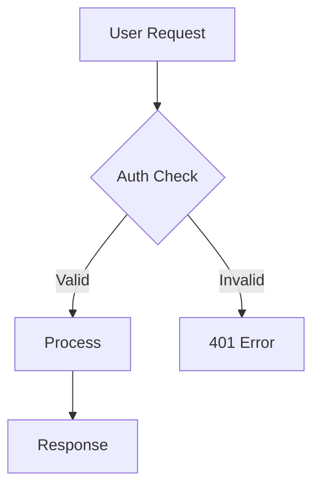
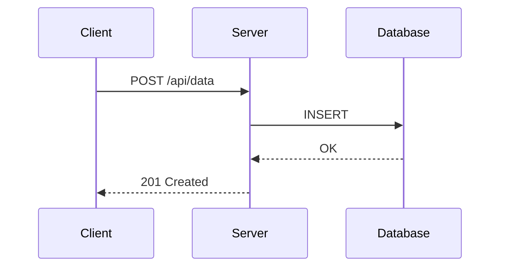
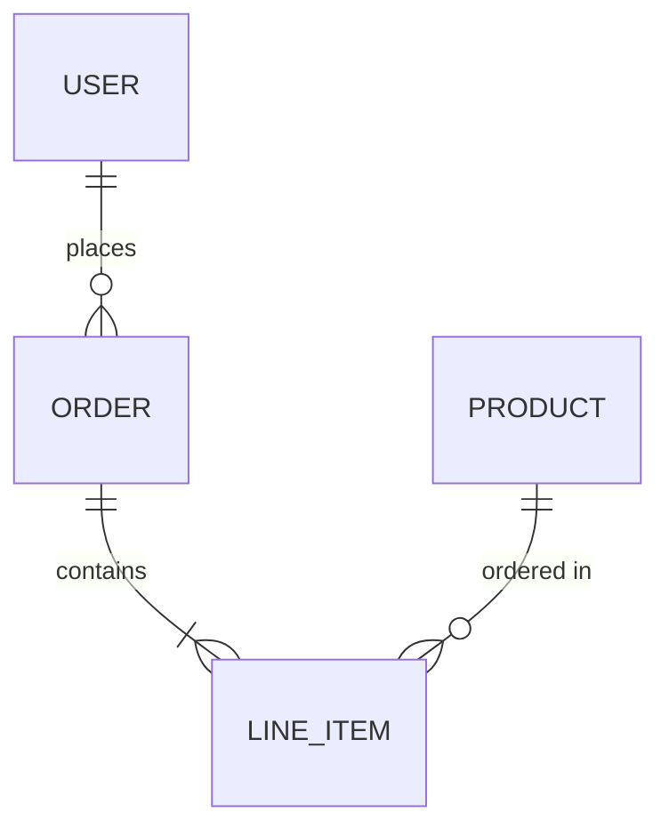

# Story 21-3: Mermaid Skill Documentation

## Overview
| Field | Value |
|-------|-------|
| Story ID | 21-3 |
| Title | Mermaid skill documentation |
| Epic | 21 - Command & Skill Expansion |
| Points | 2 |
| Priority | P2 |
| Repos | pennyfarthing |
| Branch | feat/21-3-mermaid-skill |

## Acceptance Criteria
- [x] Skill file created at `pennyfarthing-dist/skills/mermaid/SKILL.md`
- [x] YAML frontmatter with name and description
- [x] Prerequisites section (Mermaid CLI, GitHub rendering, VS Code extension)
- [x] Flowchart diagram patterns with examples
- [x] Sequence diagram patterns with examples
- [x] Architecture/class diagram patterns with examples
- [x] ER diagram patterns from schema with examples
- [x] Best practices section
- [x] External documentation references

## Workflow Status
| Phase | Status | Timestamp |
|-------|--------|-----------|
| SM Setup | complete | 2026-01-10 |
| TEA Testing | skipped | 2pt trivial |
| Dev Implementation | complete | 2026-01-10 |
| Reviewer Assessment | complete | 2026-01-10 |
| SM Finish | ready | 2026-01-10 |

## Current Phase: REVIEWER
**Handoff from Dev to Reviewer - COMPLETE**

**Reviewer Assessment Complete:** PR #144 APPROVED (2026-01-10)

## Dev Assessment

**Implementation Complete:** Yes

**Files Created:**
- `pennyfarthing-dist/skills/mermaid/SKILL.md` - Comprehensive mermaid diagram skill (240 lines)

**Content Summary:**
| Section | Status |
|---------|--------|
| YAML frontmatter | Done - `name: mermaid`, description |
| When to Use | Done - 5 use cases |
| Overview | Done - GitHub native rendering, no install needed |
| Prerequisites | Done - 3 options (GitHub, CLI, VS Code) |
| Flowchart | Done - syntax, directions, architecture example |
| Sequence | Done - syntax, arrows, loops/conditionals |
| ER Diagram | Done - cardinality notation, attributes |
| Class Diagram | Done - syntax, relationship types |
| State Diagram | Done - basic and nested states (bonus) |
| Best Practices | Done - 7 guidelines |
| Reference Docs | Done - 4 external links |

**Tests:** N/A - Documentation only story
**PR:** #144 - docs(21-3): Mermaid diagram skill documentation
**Branch:** feat/21-3-mermaid-skill (pushed)
**Commit:** aad8c64a

**Handoff:** To Reviewer (The Queen of Hearts) for review

## Reviewer Handoff

**Status:** READY FOR REVIEW

**Repository:** pennyfarthing
**Branch:** feat/21-3-mermaid-skill
**PR:** #144 - https://github.com/keithavery/pennyfarthing-2/pull/144

### Files Changed
```
 pennyfarthing-dist/skills/mermaid/SKILL.md | 240 ++++++++++++++++++++++++++++
 sprint/current-sprint.yaml                 |   4 +-
 2 files changed, 243 insertions(+), 1 deletion(-)
```

### Key File to Review
- **pennyfarthing-dist/skills/mermaid/SKILL.md** (240 lines)
  - YAML frontmatter with name and description
  - 5 use cases in "When to Use" section
  - 3 installation/setup options documented
  - Flowchart patterns with architecture example
  - Sequence diagram patterns with loops and conditionals
  - ER diagram patterns with cardinality notation and attributes
  - Class diagram patterns with relationship types
  - State diagram patterns with nested states
  - 7 best practices guidelines
  - 4 reference documentation links

### What Was Implemented
This is a documentation-only story that adds comprehensive Mermaid diagram skill documentation. The skill covers:

1. **Overview & Prerequisites** - No installation needed for GitHub; optional CLI and VS Code extension
2. **Diagram Types** - Flowcharts, Sequence, ER, Class, and State diagrams with practical examples
3. **Practical Examples** - Architecture diagram showing client/server/data layers, API flow with auth, user/order schema
4. **Best Practices** - 7 guidelines for effective diagrams
5. **External Links** - Official Mermaid docs, live editor, GitHub support, syntax reference

All 9 acceptance criteria met:
- Skill file created in correct location
- YAML frontmatter included
- Prerequisites documented
- All 5 diagram types with examples
- Best practices included
- External documentation linked

### Acceptance Criteria Status
- [x] Skill file created at `pennyfarthing-dist/skills/mermaid/SKILL.md`
- [x] YAML frontmatter with name and description
- [x] Prerequisites section (Mermaid CLI, GitHub rendering, VS Code extension)
- [x] Flowchart diagram patterns with examples
- [x] Sequence diagram patterns with examples
- [x] Architecture/class diagram patterns with examples
- [x] ER diagram patterns from schema with examples
- [x] Best practices section
- [x] External documentation references

**Ready for Reviewer Assessment**

---

## Reviewer Assessment

**PR:** #144
**Verdict:** APPROVED

### Code Review Evidence

**Information Flow Traced:**
- Agent needs diagram → finds `/mermaid` skill → reads "When to Use" at `SKILL.md:8-14` → navigates to diagram type section → copies/adapts example → produces working diagram
- Entry points are clear; section organization matches use cases

**Patterns Observed:**
- **Positive:** Follows existing skill pattern (matches `yq/SKILL.md`, `changelog/SKILL.md` structure)
- **Positive:** YAML frontmatter correct at `SKILL.md:1-4` with `name` and `description`
- **Positive:** All Mermaid syntax examples verified correct:
  - Flowchart `SKILL.md:48-54`: Valid TD direction, node shapes, edge labels
  - Sequence `SKILL.md:88-98`: Proper participant aliases, arrow syntax
  - ER `SKILL.md:136-140`: Correct crow's foot notation
  - Class `SKILL.md:172-185`: Valid class definition syntax
  - State `SKILL.md:200-207`: Proper stateDiagram-v2 with start/end markers

**Comment/Code Consistency:**
- Arrow type description at lines 101-104 says "-x (async)" - technically it represents "no response expected/lost message" but the description is acceptable for practical use
- Best practice #2 (line 228) says "use meaningful labels" then examples use `A`, `B` - acceptable since examples teach syntax, not production style

### Security
N/A - Documentation only, no code execution or user input handling

### Performance
N/A - Static documentation file

### Minor Observations (non-blocking)
- Missing diagram types: pie charts, Gantt charts, mindmaps - intentionally omitted (less common), not required by acceptance criteria
- No troubleshooting section for common syntax errors - nice-to-have, not required

### Acceptance Criteria Verification
All 9 criteria met and verified against diff:
- [x] Skill file at correct location (`pennyfarthing-dist/skills/mermaid/SKILL.md`)
- [x] YAML frontmatter with name/description
- [x] Prerequisites (3 options documented)
- [x] Flowchart patterns with examples
- [x] Sequence diagram patterns with examples
- [x] Architecture/class diagram patterns with examples
- [x] ER diagram patterns with examples
- [x] Best practices (7 guidelines)
- [x] External documentation references (4 links)

**Handoff:** To SM (The Mad Hatter) for finish-story workflow

---

## Technical Context

### Skill File Pattern

Based on analysis of existing skills (changelog, just, testing), the standard structure is:

```
pennyfarthing-dist/skills/mermaid/
└── SKILL.md
```

**Required Sections:**
1. YAML frontmatter (`name`, `description`)
2. Main heading: `# Mermaid Diagram Skill`
3. "When to Use This Skill" - bulleted use cases
4. "Overview" - 2-4 sentences on purpose
5. "Prerequisites" - installation options
6. Diagram type sections with patterns and examples
7. "Best Practices" - numbered guidelines
8. "Reference Documentation" - external links

### Content Requirements from Story Description

| Section | Content |
|---------|---------|
| Prerequisites | Mermaid CLI (`npm install -g @mermaid-js/mermaid-cli`), GitHub rendering (native), VS Code extension |
| Flowchart | `flowchart TD/LR`, nodes, edges, subgraphs |
| Sequence | `sequenceDiagram`, participants, messages, loops, alt |
| Architecture/Class | `classDiagram`, classes, relationships, methods |
| ER Diagram | `erDiagram`, entities, relationships, cardinality |
| State | `stateDiagram-v2`, states, transitions (bonus) |

### Example Patterns to Include

**Flowchart (Architecture):**


**Sequence (API Flow):**


**ER (Schema):**


### Target Length

~150-200 lines (similar to Just skill), focusing on practical patterns over exhaustive syntax documentation. Link to official Mermaid docs for complete reference.

### Files to Create

| File | Purpose |
|------|---------|
| `pennyfarthing-dist/skills/mermaid/SKILL.md` | Main skill documentation |

## Handoff Notes

**Routing:** 2pt trivial story -> Direct to Dev (skip TEA)

This is a documentation-only story. No code changes, no tests required. Dev should:
1. Create the `mermaid/` directory under `pennyfarthing-dist/skills/`
2. Write `SKILL.md` following the established pattern
3. Include practical examples for each diagram type
4. Focus on Pennyfarthing-relevant use cases (architecture, workflows, data models)

---

## Session Log

### Review Completion (2026-01-10)
- Reviewer (Granny Weatherwax) completed assessment
- Verdict: APPROVED
- All 9 acceptance criteria verified
- PR #144 ready for merge and SM finish workflow
- Workflow status: review → approved
- Next: SM finish-story workflow

---
**Session created:** 2026-01-10
**Created by:** SM (The Mad Hatter)
**Last updated:** 2026-01-10 - Reviewer handoff complete
